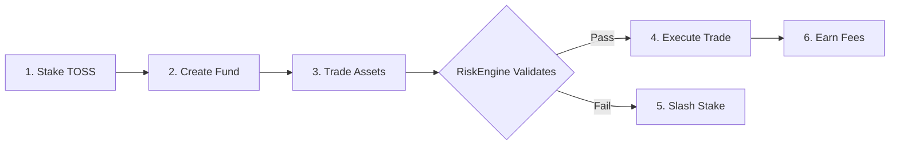
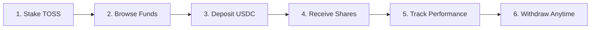

# Solution Overview

## What is TOSS?

TOSS is a **decentralized, transparent, risk-validated fund management protocol** built on zkSync Era that enables anyone to become a fund manager or invest in professionally managed crypto funds with full transparency and automatic risk enforcement.

### One-Sentence Pitch

*"Transparent, trustless hedge funds with algorithmic risk management"*

## How TOSS Works

### For Fund Managers



**Step-by-Step**:

1. **Stake TOSS Tokens**: Minimum 10,000 TOSS (~$1,000 at $0.10) based on fund size
2. **Create Fund**: Choose strategy, risk profile, fees (all on-chain)
3. **Trade Within Limits**: Execute trades validated by RiskEngine in real-time
4. **Earn Performance Fees**: 10-20% of profits above high water mark
5. **Build Reputation**: On-chain track record attracts more investors

**Key Feature**: Session keys enable automated trading without exposing main wallet

### For Investors



**Step-by-Step**:

1. **Stake TOSS**: 100-10,000+ TOSS unlocks different fund tiers
2. **Browse Funds**: Filter by risk, performance, strategy (all verified on-chain)
3. **Deposit Capital**: Instant deposits via zkSync L2
4. **Receive Fund Shares**: ERC-4626-like shares represent ownership
5. **Track Real-Time**: NAV, positions, trades all transparent
6. **Withdraw**: Instant withdrawals (subject to fund-specific rules)

**Key Feature**: Full transparency into all fund operations

### The Protocol Layer

```
Investor Capital → FundManagerVault → RiskEngine Validation → Trade Execution → NAV Update
                                              ↓
                                         Violation?
                                              ↓
                                    SlashingEngine → Burn + Compensate
```

## Core Innovations

### 1. Autonomous RiskEngine

**Problem Solved**: Manual risk limits are easily bypassed

**TOSS Solution**: Every trade validated against mathematical boundaries

```typescript
// Example: RiskEngine check
function validateTrade(fundId, trade) {
  // Check position size limit
  if (trade.size > fund.NAV * PSL) return REJECT;
  
  // Check concentration limit
  if (fund.exposure[asset] + trade.size > fund.NAV * PCL) return REJECT;
  
  // Check volatility limit
  if (calculateVolatility(fund) > fund.maxVolatility) return REJECT;
  
  // Check drawdown limit
  if (fund.currentDrawdown > fund.maxDrawdown) return REJECT;
  
  return APPROVE;
}
```

**Result**: Impossible to exceed risk limits (enforced by smart contract)

### 2. Economic Security via Staking

**Problem Solved**: No skin-in-the-game for fund managers

**TOSS Solution**: FM stakes TOSS tokens; violations trigger automatic slashing

```
FM Stake = BaseStake + (AUM × 0.1%)

Example: $1M fund requires 11,000 TOSS stake (~$1,100 at $0.10)

If violation detected:
→ Calculate FaultIndex (0-1 based on severity)
→ Slash 1-100% of stake
→ Burn 20% of slashed tokens
→ Compensate fund NAV with 80%
→ FM permanently banned if FI > 0.85
```

**Result**: Economic incentive to follow rules (attack costs more than profit)

### 3. Complete Transparency

**Problem Solved**: Opaque fund operations

**TOSS Solution**: All data on-chain and publicly verifiable

```
On-Chain Data:
├─ Fund Configuration (risk limits, fees, allowed assets)
├─ Real-Time NAV (updated every hour minimum)
├─ All Trades (asset, amount, price, timestamp)
├─ Portfolio Positions (current holdings by asset)
├─ Performance Metrics (returns, Sharpe ratio, drawdown)
├─ Slashing Events (if any violations occurred)
└─ Investor Flows (deposits, withdrawals)

All indexed and queryable via subgraph/API
```

**Result**: Investors can independently verify everything

### 4. zkSync Scalability

**Problem Solved**: High gas costs prevent frequent validation

**TOSS Solution**: zkSync L2 enables sub-cent transactions

```
Gas Cost Comparison:

Ethereum L1:
├─ Trade validation: $30-300
├─ NAV update: $20-200
└─ Deposit/Withdraw: $50-500

zkSync L2:
├─ Trade validation: $0.01-0.10
├─ NAV update: $0.01-0.05
└─ Deposit/Withdraw: $0.02-0.15

Savings: 99%+
```

**Result**: Real-time risk validation is economically viable

### 5. Account Abstraction

**Problem Solved**: Poor UX for automated trading

**TOSS Solution**: Session keys + paymasters enable seamless operations

```
Fund Manager Benefits:
├─ Session Keys: Automated trading without exposing main wallet
├─ Daily Rotation: Keys expire every 24 hours (security)
├─ Rate Limits: Maximum trades/day enforced
└─ Gas Sponsorship: RiskEngine calls sponsored (free for FM)

Investor Benefits:
├─ Smart Contract Wallets: Social recovery, multi-sig
├─ Gas Sponsorship: First deposit free (onboarding)
└─ Batched Operations: Deposit to multiple funds in one tx
```

**Result**: Web2-like UX with Web3 security

## Technical Architecture (Simplified)

```
┌─────────────────────────────────────────────────────────────┐
│                     Application Layer                        │
│   Investor Dashboard  │  FM Panel  │  Governance Portal     │
└─────────────────────────────────────────────────────────────┘
                            ↕
┌─────────────────────────────────────────────────────────────┐
│                    Off-Chain Services                        │
│   NAV Engine  │  Trade Router  │  Analytics  │  Compliance  │
└─────────────────────────────────────────────────────────────┘
                            ↕
┌─────────────────────────────────────────────────────────────┐
│                zkSync L2 (Smart Contracts)                   │
│  FundFactory  │  Vaults  │  RiskEngine  │  DAO Governance   │
└─────────────────────────────────────────────────────────────┘
                            ↕
┌─────────────────────────────────────────────────────────────┐
│                    Ethereum L1 (Settlement)                  │
│            State Roots  │  Bridge  │  Final Security        │
└─────────────────────────────────────────────────────────────┘
```

## Key Differentiators

| Feature | CEX Copy Trading | DeFi Vaults | Tokenized Funds | **TOSS** |
|---------|------------------|-------------|-----------------|---------|
| Decentralized | ❌ | ✅ | ❌ | ✅ |
| Transparent | ❌ | ⚠️ Partial | ❌ | ✅ |
| Active Management | ✅ | ❌ | ✅ | ✅ |
| Algorithmic Risk Enforcement | ❌ | ⚠️ Basic | ❌ | ✅ |
| Economic Security | ❌ | ❌ | ❌ | ✅ |
| Low Fees (under $0.10/tx) | ❌ | ✅ | ❌ | ✅ |
| Instant Settlement | ⚠️ Within CEX | ✅ | ❌ | ✅ |
| Permissionless FM | ❌ | ✅ | ❌ | ✅ |
| Real-Time Validation | ❌ | ❌ | ❌ | ✅ |

**TOSS is the only solution with all features**

## Go-to-Market Strategy

### Phase 1: Crypto-Native Early Adopters (Month 1-3)

**Target**: Crypto traders with proven track records

- Launch with 10-20 hand-picked FMs (veted track records)
- $10-50M initial AUM
- Focus on Tier 1-2 risk funds
- Intensive feedback loop for product iteration

### Phase 2: Expansion (Month 4-12)

**Target**: Broader crypto community

- Onboard 50-100 FMs
- $100-500M AUM
- Launch FM education program
- Integration with portfolio tracking tools

### Phase 3: Institutional (Year 2)

**Target**: TradFi fund managers, family offices

- Institutional compliance features
- White-glove onboarding
- $1-5B AUM
- Strategic partnerships with prime brokers

### Phase 4: Mass Market (Year 3+)

**Target**: Retail investors globally

- Mobile app
- Simplified interfaces
- Localized versions
- $5B+ AUM

## Success Metrics (3-Year Goals)

| Metric | Year 1 | Year 2 | Year 3 |
|--------|--------|--------|--------|
| Total AUM | $100M | $1B | $5B |
| Active Funds | 50 | 200 | 500 |
| Active Investors | 1,000 | 10,000 | 50,000 |
| Protocol Revenue | $500K | $5M | $15M |
| TOSS Price | $0.10 | $0.25 | $0.50+ |

## Why TOSS Will Win

1. **First Mover**: No competitor has transparent + algorithmic risk + economic security
2. **Network Effects**: More FMs → more funds → more investors → more FMs
3. **Technical Moat**: zkSync expertise, RiskEngine IP, 2+ years development lead
4. **Superior Economics**: 99% lower costs than L1, enabling real-time validation
5. **Team Execution**: Proven DeFi + TradFi experience

---

**Next**: [Market Opportunity](/investor-deck/market-size) | [Platform Overview](/investor-deck/platform-overview)

**Back**: [Problem Statement](/investor-deck/problem-statement) | [Executive Summary](/investor-deck/executive-summary)

