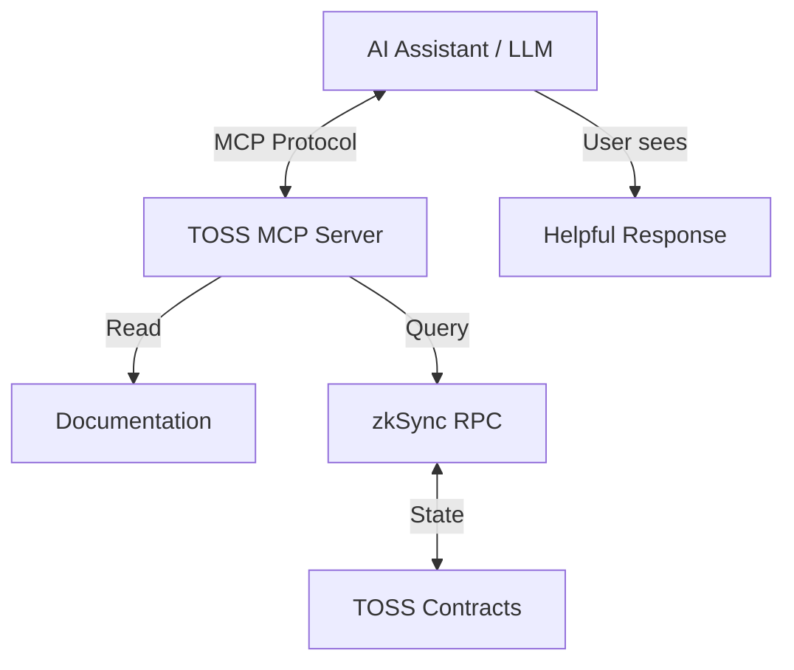

# MCP Integration Overview

## What is MCP?

**Model Context Protocol (MCP)** is a standardized protocol enabling AI models to interact with external systems, access documentation, and execute operations through structured tools and resources.

## TOSS MCP Integration

TOSS Protocol provides comprehensive MCP integration allowing AI assistants to:

- 📚 **Understand TOSS**: Access complete protocol documentation
- 🔍 **Query Protocol**: Get fund data, NAV, proposals, statistics
- 🛠️ **Assist Operations**: Help users create funds, trade, vote
- ✅ **Validate Actions**: Check eligibility, calculate costs, warn of risks
- 💡 **Provide Guidance**: Step-by-step instructions for all operations

## Why MCP for TOSS?

### For Users

**Natural Language Interface**:
```
User: "I want to create a balanced fund with $2M AUM"
AI: "I'll help you create a BALANCED fund. Let me check:
     ✓ Your FM score is 75 (minimum: 50)
     ✓ Required stake: 12,000 TOSS
     ✓ You have 15,000 TOSS available
     
     Recommended configuration for Tier 2 Balanced fund:
     - Management Fee: 2%
     - Performance Fee: 15%
     - Max Drawdown: 25%
     - Allowed Assets: BTC, ETH, Top 50
     
     Shall I proceed with fund creation?"
```

**Complex Operations Simplified**:
- AI guides through multi-step processes
- Validates parameters automatically
- Explains risks and costs
- Provides working code examples

### For Developers

**Intelligent Integration**:
```typescript
// AI can help write integration code
User: "Show me how to execute a trade"
AI: [Retrieves trade execution process docs]
    [Provides complete working code]
    [Explains RiskEngine validation]
    [Shows error handling]
```

### For Protocol

**Better UX**:
- Lower barrier to entry
- Fewer user errors
- Better education
- Increased adoption

## MCP Components

### 1. Tools

**30+ Operation Tools** for:
- Fund Manager operations
- Investor operations
- Governance participation
- Protocol queries

[View All Tools →](/docs/mcp-integration/tools/overview)

### 2. Resources

**105+ Documentation Resources**:
- Contract specifications
- Process workflows
- Governance guides
- Code examples

[View Resources →](/docs/mcp-integration/resources/overview)

### 3. Schemas

**JSON Schemas** for:
- Tool inputs/outputs
- Protocol types
- Configuration objects
- Validation rules

[View Schemas →](/docs/mcp-integration/schemas/overview)

### 4. Examples

**AI Prompt Examples**:
- Common user queries
- Multi-step operations
- Error handling
- Best practices

[View Examples →](/docs/mcp-integration/examples/overview)

## Quick Start for AI

### Accessing TOSS Documentation

```typescript
// AI can request any documentation page
const riskEngineDoc = await mcp.getResource("toss://docs/protocol/contracts/risk/RiskEngine");
// Returns complete RiskEngine.md markdown

// AI can now answer questions about RiskEngine
User: "How does FaultIndex work?"
AI: [Uses retrieved documentation to explain]
```

### Using TOSS Tools

```typescript
// AI can call tools to help users
await mcp.callTool("toss_get_fund_info", { fundId: 42 });
// Returns complete fund information

await mcp.callTool("toss_calculate_required_stake", { projectedAUM: 2000000 });
// Returns required TOSS stake amount
```

### Validating Operations

```typescript
// Before suggesting risky operation
const validation = await mcp.callTool("toss_validate_trade", {
  fundId: 42,
  assetIn: "USDC",
  assetOut: "BTC",
  amount: 50000  // $50k
});

if (!validation.approved) {
  AI: "⚠️ This trade would violate position size limit (20%).
       Current BTC position: 15% of NAV
       This trade would bring it to 22%
       Recommendation: Reduce trade to $30k"
}
```

## Integration Architecture



## Use Cases

### Use Case 1: Fund Creation Assistance

```
User: "Help me create a stable, low-risk fund"

AI Process:
1. Retrieves fund creation process docs
2. Checks FM eligibility via query tool
3. Recommends STABLE class, TIER_1 configuration
4. Calculates required stake
5. Validates config against tier limits
6. Provides complete code example
7. Explains risks and costs
```

### Use Case 2: Governance Participation

```
User: "I want to propose reducing my fund's management fee"

AI Process:
1. Retrieves fund governance docs
2. Checks user is FM of fund
3. Validates new fee within limits
4. Explains voting process (5 days, 30% quorum)
5. Shows expected investor response
6. Provides proposal creation code
```

### Use Case 3: Risk Analysis

```
User: "Will this trade trigger slashing?"

AI Process:
1. Retrieves trade execution and risk validation docs
2. Calls validation tool
3. Calculates FaultIndex
4. Explains if trade safe/risky
5. Provides alternative if risky
6. Shows potential slashing amount
```

### Use Case 4: Troubleshooting

```
User: "My transaction failed with 'Insufficient stake'"

AI Process:
1. Retrieves fund creation and stake management docs
2. Calls getRequiredStake tool
3. Compares with user's stake
4. Explains shortfall
5. Shows how to increase stake
6. Provides working code
```

## MCP Tool Categories

### Fund Manager Tools (8 tools)
- `toss_create_fund`
- `toss_execute_trade`
- `toss_update_fund_config`
- `toss_collect_management_fee`
- `toss_collect_performance_fee`
- `toss_close_fund`
- `toss_increase_stake`
- `toss_check_fm_eligibility`

### Investor Tools (7 tools)
- `toss_deposit_to_fund`
- `toss_request_withdrawal`
- `toss_stake_toss`
- `toss_upgrade_investor_class`
- `toss_vote_on_fund_proposal`
- `toss_get_portfolio`
- `toss_calculate_returns`

### Governance Tools (6 tools)
- `toss_create_fund_proposal`
- `toss_create_fm_proposal`
- `toss_create_protocol_proposal`
- `toss_vote_on_proposal`
- `toss_execute_proposal`
- `toss_check_proposal_status`

### Query Tools (10 tools)
- `toss_get_fund_info`
- `toss_get_fund_nav`
- `toss_get_fund_performance`
- `toss_search_funds`
- `toss_get_investor_profile`
- `toss_get_governance_proposals`
- `toss_calculate_required_stake`
- `toss_validate_trade`
- `toss_get_config_parameters`
- `toss_get_risk_metrics`

**Total**: 31 MCP Tools

## Benefits

### For End Users

✅ **Easier Onboarding**: AI guides through complex operations  
✅ **Fewer Errors**: AI validates before execution  
✅ **Better Understanding**: AI explains what's happening  
✅ **Cost Transparency**: AI shows gas costs upfront  
✅ **Risk Awareness**: AI warns of potential issues  

### For Developers

✅ **Faster Integration**: AI provides code examples  
✅ **Better Documentation**: AI can search/explain docs  
✅ **Debugging Help**: AI troubleshoots errors  
✅ **Best Practices**: AI suggests optimal patterns  

### For Protocol

✅ **Increased Adoption**: Lower learning curve  
✅ **Reduced Support**: AI handles common questions  
✅ **Better UX**: Natural language interface  
✅ **Data Insights**: Track what users ask AI  

## Getting Started

### For AI Developers

1. **[MCP Tools](/docs/mcp-integration/tools/overview)**: Available operations
2. **[MCP Resources](/docs/mcp-integration/resources/overview)**: Accessible documentation
3. **[Integration Guide](/docs/mcp-integration/integration-guide)**: How to integrate
4. **[Examples](/docs/mcp-integration/examples/overview)**: Working examples

### For End Users

Just use any AI assistant that supports MCP:
- Claude with MCP
- ChatGPT with plugins
- Custom LLM integrations

Example:
```
You: "I want to invest in a crypto fund"
AI: "I can help you with TOSS Protocol!
     
     First, let me show you available funds...
     [Calls toss_search_funds tool]
     
     Here are 3 Tier 1 (low risk) funds:
     1. Conservative BTC Fund - 2% mgmt fee, 15% 30-day return
     2. Balanced Crypto - 1.5% mgmt fee, 22% 30-day return
     3. Stable Yield - 1% mgmt fee, 8% 30-day return
     
     Which interests you?"
```

## Security & Safety

### AI Validation

Before suggesting any operation, AI:
1. ✅ Checks prerequisites met
2. ✅ Validates parameters
3. ✅ Calculates costs
4. ✅ Warns of risks
5. ✅ Explains consequences

### No Automatic Execution

**Important**: MCP tools are **informational only**:
- AI provides code/instructions
- User must execute transactions themselves
- No private keys in MCP
- User always in control

### Risk Warnings

AI always explains risks:
```
AI: "⚠️ Creating a Tier 3 fund requires:
     - 25,000 TOSS stake (locked until close)
     - Higher risk exposure (50% max drawdown)
     - Access only for Premium+ investors
     - Potential slashing if rules violated
     
     Are you sure you want to proceed?"
```

## Next Steps

- **[View MCP Tools](/docs/mcp-integration/tools/overview)**: See all available tools
- **[MCP Resources](/docs/mcp-integration/resources/overview)**: Accessible documentation
- **[Integration Guide](/docs/mcp-integration/integration-guide)**: Build with TOSS MCP
- **[Examples](/docs/mcp-integration/examples/overview)**: AI interaction examples

---

**Start exploring**: [MCP Tools Overview](/docs/mcp-integration/tools/overview)

