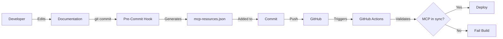

# MCP Sync System

## Overview

TOSS implements an **automatic synchronization system** ensuring MCP resources always reflect current documentation state.

## Problem Solved

**Manual sync is error-prone**:
- ❌ Developers forget to update MCP
- ❌ Documentation and MCP drift apart
- ❌ AI models get outdated information
- ❌ Users receive incorrect guidance

**Automated sync ensures**:
- ✅ MCP always current
- ✅ No manual intervention needed
- ✅ Validated before deployment
- ✅ Version tracked

## Architecture



## Components

### 1. Documentation Hash

**Purpose**: Detect if docs changed

**Calculation**:
```typescript
// scripts/calculate-doc-hash.ts
hash = SHA256(concat(all markdown files sorted))
```

**Stored In**: `mcp-version.json`

**Usage**: Compare current hash with stored hash

### 2. MCP Generator

**Purpose**: Create MCP manifest from documentation

**Script**: `scripts/generate-mcp-resources.ts`

**Process**:
1. Scan all `docs/**/*.md` files
2. Extract metadata (title, description, category)
3. Calculate content hash per file
4. Generate MCP resource entries
5. Add tool definitions
6. Write to `mcp-resources.json`
7. Update `mcp-version.json`

**Output Files**:
- `mcp-resources.json`: Complete manifest
- `mcp-version.json`: Version tracking

### 3. Sync Validator

**Purpose**: Ensure MCP up-to-date before deployment

**Script**: `scripts/validate-mcp-sync.ts`

**Validation Checks**:
```typescript
✓ mcp-version.json exists
✓ mcp-resources.json exists
✓ Documentation hash matches
✓ Resource count matches doc count
✓ All URIs valid
✓ All referenced files exist
```

**When Run**:
- Pre-build (blocks deployment if out of sync)
- CI/CD (fails PR if out of sync)
- Manual check (`npm run validate-mcp-sync`)

### 4. Pre-Commit Hook

**Purpose**: Auto-generate MCP on documentation changes

**File**: `.husky/pre-commit`

**Trigger**: Any `docs/**/*.md` file staged for commit

**Process**:
```bash
if docs changed:
  npm run generate-mcp
  git add mcp-resources.json mcp-version.json
  commit proceeds with MCP included
```

**Result**: MCP always committed with doc changes

### 5. CI/CD Workflow

**Purpose**: Validate sync in pull requests and pushes

**File**: `.github/workflows/sync-mcp.yml`

**Triggers**:
- Push to main/develop with doc changes
- Pull request with doc changes

**Actions**:
```yaml
1. Calculate current doc hash
2. Compare with MCP version
3. If out of sync:
   - Generate MCP
   - Commit (on push) or comment (on PR)
4. Validate sync
5. Pass/fail based on validation
```

## Developer Workflows

### Workflow 1: Add New Documentation

```bash
# 1. Create new doc
touch docs/protocol/contracts/NewContract.md
# Edit file...

# 2. Stage file
git add docs/protocol/contracts/NewContract.md

# 3. Commit
git commit -m "docs: add NewContract specification"

# Pre-commit hook auto-runs:
# 📚 Documentation changed, updating MCP resources...
# ✅ MCP resources updated and added to commit

# 4. Push
git push

# CI validates MCP in sync
```

**Developer does nothing special** - automation handles it!

### Workflow 2: Update Existing Documentation

Same as above - pre-commit hook automatically regenerates MCP.

### Workflow 3: Manual MCP Regeneration

```bash
# If hook didn't run or you want to regenerate manually
npm run generate-mcp

# Check what changed
git diff mcp-resources.json

# Commit
git add mcp-resources.json mcp-version.json
git commit -m "chore: regenerate MCP resources"
```

### Workflow 4: Validate Sync

```bash
# Check if MCP in sync with docs
npm run validate-mcp-sync

# Output:
# ✅ MCP is IN SYNC
#    Version: 1.0.0
#    Resources: 116
#    Last Sync: 2025-01-15T10:30:00Z
```

## Version Tracking

### mcp-version.json

```json
{
  "version": "1.0.0",
  "generatedAt": "2025-01-15T10:30:00Z",
  "documentationHash": "a3b5c7d9...",
  "resourceCount": 116,
  "toolCount": 31,
  "lastSync": "2025-01-15T10:30:00Z"
}
```

**Fields**:
- `version`: Semantic version (incremented on changes)
- `generatedAt`: When MCP was generated
- `documentationHash`: Hash of all documentation
- `resourceCount`: Total resources (should match doc count)
- `toolCount`: Total MCP tools
- `lastSync`: Last successful sync timestamp

### Version Bumping

**Automatic** based on changes:
- **Patch** (1.0.0 → 1.0.1): Content updates
- **Minor** (1.0.0 → 1.1.0): New docs added
- **Major** (1.0.0 → 2.0.0): Breaking MCP changes

## Safety Mechanisms

### 1. Pre-Build Validation

```json
// package.json
"scripts": {
  "prebuild": "npm run validate-mcp-sync",
  "build": "docusaurus build"
}
```

**Effect**: Build fails if MCP out of sync

**Error**:
```
❌ MCP OUT OF SYNC!

Documentation hash: abc123...
MCP hash: def456...

Run: npm run generate-mcp
```

### 2. CI/CD Gate

**Pull Request**: Bot comments if MCP needs update

**Push to main**: Auto-commits MCP update

**Result**: Can't merge out-of-sync MCP

### 3. Git Hooks

Pre-commit ensures MCP included in every doc commit.

### 4. Hash Verification

Every resource has content hash - detects tampering:

```typescript
// Validation
const content = readFile(resourcePath);
const hash = calculateHash(content);
if (hash !== resource.contentHash) {
  throw new Error('Content hash mismatch - file modified!');
}
```

## Monitoring

### Status Dashboard

Check sync status:

```bash
npm run validate-mcp-sync
```

### Metrics Tracked

- Last MCP generation time
- Documentation hash
- Resource count
- Sync failures (if any)
- CI/CD sync runs

### Alerts

**Critical** (blocks deployment):
- MCP hash mismatch
- Resource count mismatch
- Validation failures

**Warning** (investigate):
- Pre-commit hook failed
- CI/CD sync issues
- Large hash changes

## Troubleshooting

### Issue: "MCP OUT OF SYNC"

**Cause**: Documentation changed but MCP not regenerated

**Fix**:
```bash
npm run generate-mcp
git add mcp-resources.json mcp-version.json
git commit -m "chore: sync MCP"
```

### Issue: Pre-Commit Hook Not Running

**Cause**: Husky not installed

**Fix**:
```bash
npm install
npx husky install
```

### Issue: Hash Mismatch After Generation

**Cause**: Files modified between generation and validation

**Fix**: Regenerate again

### Issue: Resource Count Mismatch

**Cause**: New docs added but not in MCP

**Fix**: `npm run generate-mcp`

## Best Practices

### For Developers

✅ **Always run full commit** (don't skip hooks)
✅ **Verify MCP updated** in commit
✅ **Check CI passes** before merging
✅ **Review MCP changes** in large doc updates

❌ **Don't skip hooks** with `--no-verify`
❌ **Don't manually edit** mcp-resources.json
❌ **Don't force push** without CI validation

### For CI/CD

✅ **Run validation** on all PR
✅ **Block merge** if out of sync
✅ **Auto-commit** on main push
✅ **Alert team** on failures

## Technical Details

### Hash Algorithm

SHA-256 used for:
- Content integrity
- Change detection
- Tamper detection

### File Discovery

```typescript
glob.sync('docs/**/*.md', {
  ignore: ['**/node_modules/**']
})
```

Finds all documentation recursively.

### Resource URI Generation

```typescript
// File: docs/protocol/contracts/RiskEngine.md
// URI: toss://docs/protocol/contracts/RiskEngine

uri = 'toss://docs/' + relativePath.replace('.md', '')
```

### Category Detection

Automatic based on path:
```typescript
if (path.includes('/contracts/')) category = 'contracts';
if (path.includes('/processes/')) category = 'processes';
// ... etc
```

## Performance

### Generation Time

```
116 documents
~2MB total
Generation: ~2 seconds
Validation: ~1 second

Total overhead: ~3 seconds per commit
```

Acceptable for automatic sync.

### CI/CD Impact

Adds ~10 seconds to CI pipeline - minimal overhead for guaranteed sync.

## Related Documentation

- **[MCP Overview](/docs/mcp-integration/overview)**: What MCP provides
- **[Development Workflow](/docs/mcp-integration/development-workflow)**: Day-to-day usage
- **[Troubleshooting](/docs/mcp-integration/troubleshooting)**: Common issues

---

**Key Takeaway**: MCP sync is **fully automatic** - developers just edit docs, system handles the rest!

