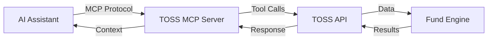

# MCP Protocol Overview

Learn how TOSS integrates with AI assistants through the Model Context Protocol (MCP).

## What is MCP?

**Model Context Protocol (MCP)** is an open protocol that enables AI assistants to securely interact with external systems and data sources. TOSS implements MCP to allow natural language interaction with your crypto funds.

## Why MCP for TOSS?

### Natural Language Interface

Instead of remembering complex CLI commands or API endpoints, you can simply ask:

```
"Show me my Bitcoin fund performance for the last 30 days"
"Create a new fund called 'DeFi Portfolio' with $10,000 initial deposit"
"Rebalance my growth fund to 60% BTC, 30% ETH, 10% stablecoins"
```

### AI-Powered Insights

AI assistants can:
- Analyze your portfolio and suggest optimizations
- Explain complex financial metrics in simple terms
- Alert you to significant market movements
- Generate custom reports and visualizations

### Secure Integration

MCP provides:
- **Authentication**: Secure token-based access
- **Permissions**: Granular control over AI capabilities
- **Audit Logs**: Track all AI-initiated actions
- **Rate Limiting**: Prevent abuse

## How TOSS Implements MCP

### Architecture



### Available Tools

TOSS exposes these MCP tools:

#### Fund Management
- `create_fund`: Create new funds
- `get_fund`: Retrieve fund details
- `list_funds`: List all funds
- `update_fund`: Modify fund settings
- `close_fund`: Close and liquidate a fund

#### Transaction Operations
- `create_transaction`: Execute trades
- `get_transaction`: View transaction details
- `list_transactions`: Query transaction history
- `cancel_transaction`: Cancel pending transactions

#### Portfolio Management
- `get_portfolio`: View current holdings
- `get_portfolio_performance`: Analyze performance
- `get_asset_allocation`: Check allocation breakdown
- `rebalance_portfolio`: Rebalance to target allocation

#### Analytics
- `get_analytics_summary`: Comprehensive analytics
- `calculate_risk_metrics`: Risk analysis
- `compare_funds`: Compare multiple funds
- `generate_report`: Create detailed reports

### Tool Schema Example

Each tool has a defined input schema. Example for `create_fund`:

```json
{
  "name": "create_fund",
  "description": "Create a new crypto fund with specified parameters",
  "inputSchema": {
    "type": "object",
    "required": ["name", "currency"],
    "properties": {
      "name": {
        "type": "string",
        "description": "Name of the fund"
      },
      "currency": {
        "type": "string",
        "enum": ["USD", "EUR", "BTC", "ETH"],
        "description": "Base currency for the fund"
      },
      "strategy": {
        "type": "string",
        "enum": ["conservative", "balanced", "aggressive", "custom"]
      }
    }
  }
}
```

## MCP Resources

In addition to tools, TOSS provides MCP resources:

### Fund Resources

```
fund://{fundId}                    - Complete fund information
fund://{fundId}/performance        - Performance metrics
fund://{fundId}/transactions       - Transaction history
```

### Portfolio Resources

```
portfolio://{fundId}               - Current holdings
portfolio://{fundId}/allocation    - Asset allocation
portfolio://{fundId}/performance   - Performance data
```

### Analytics Resources

```
analytics://{fundId}/summary       - Analytics overview
analytics://{fundId}/risk          - Risk metrics
```

## Example Interactions

### Creating a Fund

**User Prompt:**
```
Create a new balanced fund called "Retirement Portfolio" 
with $50,000 initial investment in USD
```

**MCP Tool Call:**
```json
{
  "tool": "create_fund",
  "arguments": {
    "name": "Retirement Portfolio",
    "currency": "USD",
    "strategy": "balanced",
    "initialDeposit": 50000
  }
}
```

**AI Response:**
```
I've created your "Retirement Portfolio" fund with a $50,000 
initial investment. The fund uses a balanced strategy and is 
valued in USD. Fund ID: abc123...

Would you like me to:
1. Set up automated rebalancing?
2. Configure risk management rules?
3. Add initial holdings?
```

### Checking Performance

**User Prompt:**
```
How is my Retirement Portfolio performing?
```

**MCP Tool Call:**
```json
{
  "tool": "get_portfolio_performance",
  "arguments": {
    "fundId": "abc123...",
    "period": "30d"
  }
}
```

**AI Response:**
```
📊 Retirement Portfolio Performance (Last 30 Days)

Current Value: $52,500
Initial Investment: $50,000
Total Return: +5.0%
30-day Return: +3.2%
Volatility: 12.5%
Sharpe Ratio: 1.85

Your portfolio is performing well, beating the market average 
by 1.5% this month. The volatility is within normal range for 
a balanced strategy.
```

### Rebalancing

**User Prompt:**
```
Rebalance my portfolio to 50% BTC, 35% ETH, 15% stablecoins
```

**MCP Tool Call:**
```json
{
  "tool": "rebalance_portfolio",
  "arguments": {
    "fundId": "abc123...",
    "targetAllocation": {
      "BTC": 50,
      "ETH": 35,
      "USDC": 15
    }
  }
}
```

**AI Response:**
```
I've rebalanced your Retirement Portfolio. Here are the changes:

Sold:
- 0.15 BTC → $6,750
- 2 ETH → $5,000

Bought:
- 5 ETH → $12,500
- 750 USDC → $750

New Allocation:
- BTC: 50.1% (target 50%)
- ETH: 34.9% (target 35%)
- USDC: 15.0% (target 15%)

Transaction fees: $45.50
```

## Security Considerations

### Authentication

MCP connections require authentication:

```bash
# Generate MCP access token
toss mcp:token:create --name "Claude Desktop" --permissions read,write

# Token: mcp_abc123...
```

Use this token in your AI assistant configuration.

### Permissions

Control what AI assistants can do:

```bash
# Read-only access
toss mcp:token:create --permissions read

# Full access
toss mcp:token:create --permissions read,write,admin

# Specific tools only
toss mcp:token:create --permissions read,write --tools create_fund,get_fund
```

### Audit Logging

All MCP actions are logged:

```bash
# View MCP audit log
toss mcp:logs

# Filter by token
toss mcp:logs --token mcp_abc123...

# Filter by action
toss mcp:logs --action create_fund
```

## Benefits of MCP Integration

### For End Users

- 🗣️ **Natural Language**: No need to learn complex commands
- ⚡ **Fast**: Get information quickly with simple questions
- 🤖 **AI-Powered**: Benefit from AI analysis and insights
- 📱 **Anywhere**: Use from any MCP-compatible AI assistant

### For Developers

- 🔌 **Standardized**: Open protocol, not proprietary API
- 🛠️ **Extensible**: Easy to add new tools and capabilities
- 📚 **Self-Documenting**: JSON schemas describe all tools
- 🔒 **Secure**: Built-in authentication and permissions

### For Organizations

- 🔐 **Controlled Access**: Granular permissions per token
- 📊 **Audit Trail**: Complete log of AI interactions
- 🚀 **Scalable**: Handle many concurrent AI connections
- 🔄 **Flexible**: Works with any MCP-compatible AI

## Supported AI Assistants

TOSS MCP integration works with:

- **Claude Desktop** (Anthropic)
- **GPT with MCP Plugin** (OpenAI)
- **Custom MCP Clients**
- Any MCP-compatible assistant

## Getting Started

Ready to enable MCP for your TOSS instance?

1. [Setup Guide](/docs/mcp/setup) - Enable MCP server
2. [AI Integration](/docs/mcp/ai-integration) - Connect your AI assistant
3. [Tool Reference](/docs/mcp/tools/overview) - Available tools
4. [Examples](/docs/mcp/examples/basic-queries) - Common queries

## Technical Specifications

- **Protocol**: MCP 1.0
- **Transport**: HTTP/SSE or stdio
- **Format**: JSON-RPC 2.0
- **Authentication**: Bearer tokens
- **Rate Limits**: 100 requests/minute per token

## Next Steps

- [Set up MCP](/docs/mcp/setup)
- [Connect Claude Desktop](/docs/mcp/ai-integration)
- [Explore example prompts](/docs/mcp/examples/ai-prompts)
- [View tool schemas](/docs/mcp/schemas/overview)

