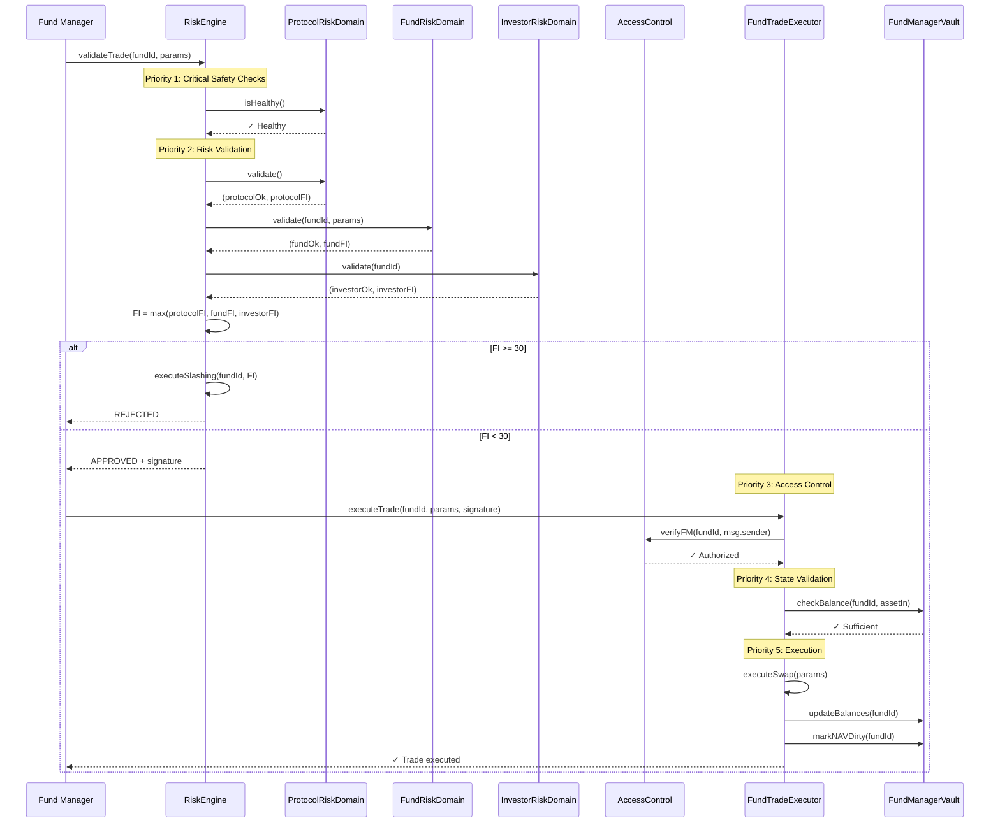
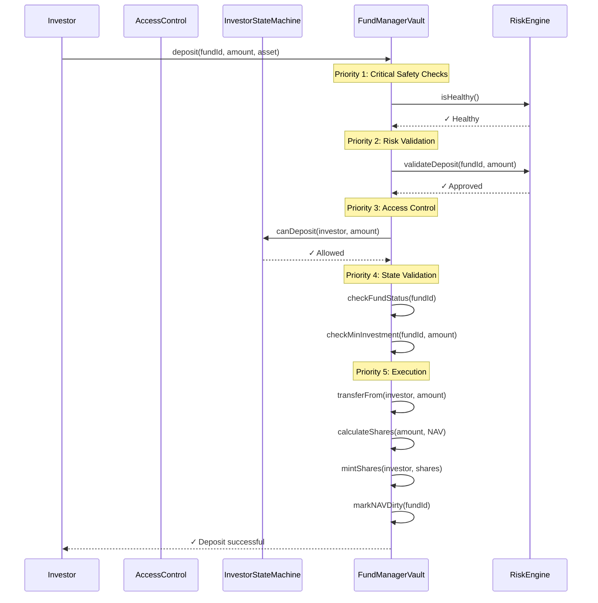
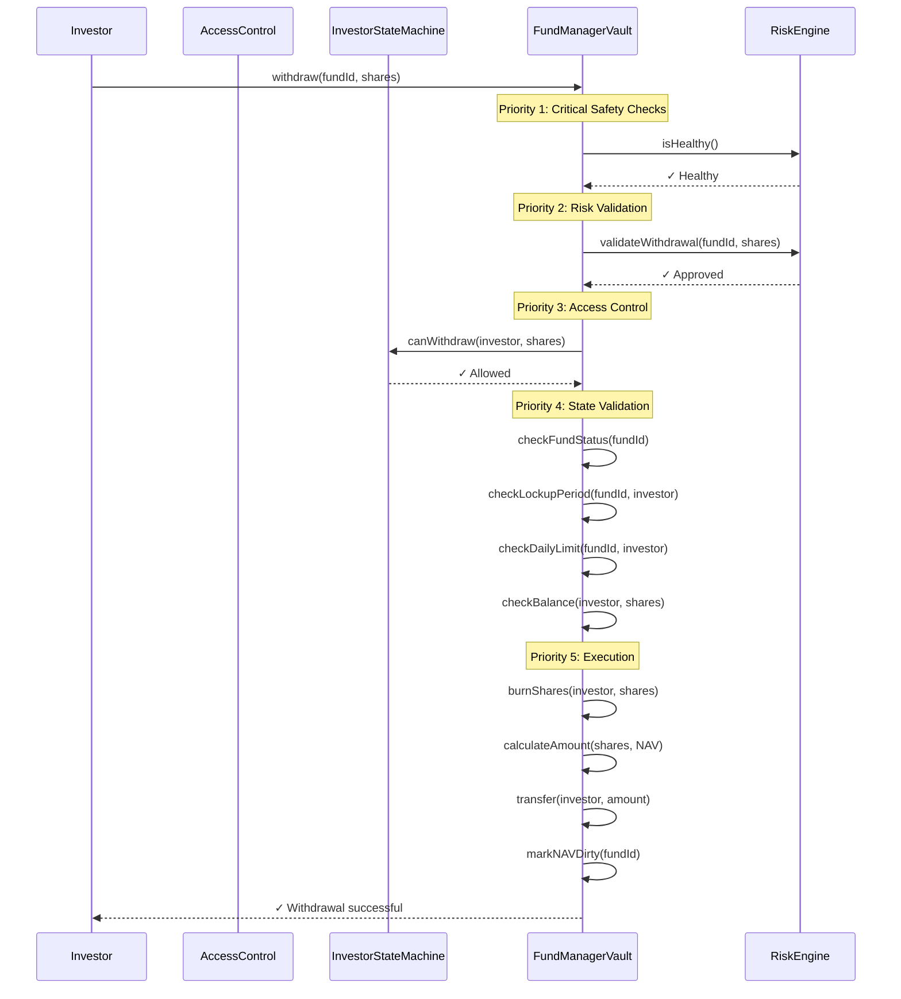
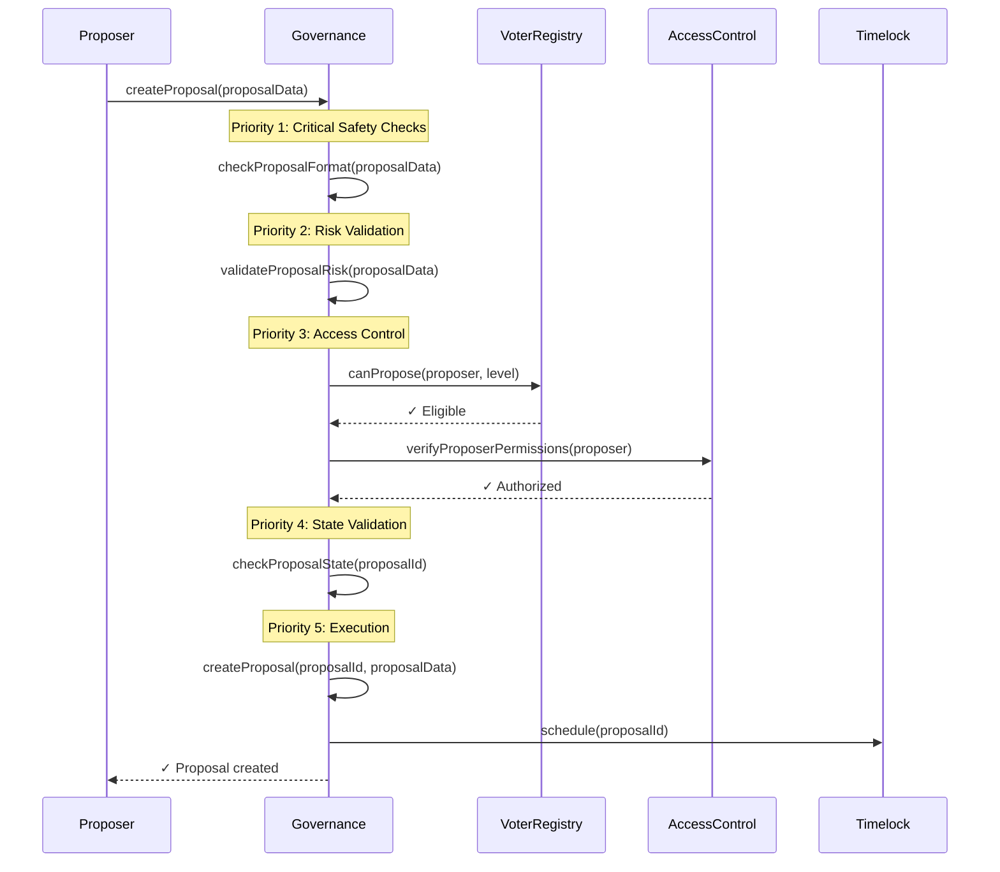

# Execution Priority Layer

## Overview

The Execution Priority Layer defines the strict ordering and prioritization of operations, validations, and system checks within the TOSS Protocol. This ensures deterministic execution order, prevents race conditions, and guarantees that critical safety checks occur before any operation proceeds.

## Priority Levels

The system uses a 5-level priority hierarchy:

```
Priority 1: Critical Safety Checks (Immutable)
Priority 2: Risk Validation (DAO-configurable thresholds)
Priority 3: Access Control & Permissions
Priority 4: State Validation & Consistency
Priority 5: Execution & State Updates
```

## Priority 1: Critical Safety Checks

**Purpose**: Immutable safety checks that cannot be bypassed or modified.

**Characteristics**:
- Execute first, before all other checks
- Cannot be disabled or modified
- Failures cause immediate rejection
- No gas optimization overrides

### Checks Included

#### 1. Protocol Health Check
```solidity
// Must pass: Protocol is operational
require(protocolRiskDomain.isHealthy(), "Protocol not healthy");
```

**Validation Points**:
- Oracle connectivity (all oracles responding)
- Sequencer availability (L2 operational)
- Bridge status (L1-L2 bridge operational)
- Emergency pause status (not paused)

**Failure Action**: Immediate rejection, no further checks

#### 2. Contract Integrity Check
```solidity
// Must pass: All critical contracts exist and are valid
require(address(fundFactory) != address(0), "Factory not set");
require(address(riskEngine) != address(0), "RiskEngine not set");
require(address(vault) != address(0), "Vault not set");
```

**Validation Points**:
- Critical contract addresses not zero
- Proxy implementations valid
- Upgrade proxies not corrupted

**Failure Action**: Immediate rejection, emergency mode

#### 3. State Corruption Check
```solidity
// Must pass: State is consistent
require(vault.getNAV(fundId) >= 0, "Invalid NAV");
require(vault.getBalance(fundId, asset) >= 0, "Invalid balance");
```

**Validation Points**:
- NAV values non-negative
- Balance values non-negative
- Share counts consistent

**Failure Action**: Circuit breaker, investigation required

## Priority 2: Risk Validation

**Purpose**: Risk-based validations using DAO-configurable thresholds.

**Characteristics**:
- Execute after safety checks pass
- Thresholds are DAO-configurable
- Calculations are deterministic
- Failures trigger slashing

### Execution Order

#### 1. Protocol Risk Domain
```solidity
(bool protocolOk, uint256 protocolFI) = protocolRiskDomain.validate();
if (!protocolOk) {
    // Protocol-level risk detected
    return (false, protocolFI);
}
```

**Checks**:
- Oracle price confidence
- System-wide liquidity
- Bridge stability
- Gas price anomalies

#### 2. Fund Risk Domain
```solidity
(bool fundOk, uint256 fundFI) = fundRiskDomain.validate(fundId, tradeParams);
if (!fundOk) {
    // Fund-level risk detected
    return (false, fundFI);
}
```

**Checks**:
- Position size limits (PSL)
- Concentration limits (PCL)
- Drawdown thresholds
- Volatility limits
- Leverage constraints

#### 3. Investor Risk Domain
```solidity
(bool investorOk, uint256 investorFI) = investorRiskDomain.validate(fundId);
if (!investorOk) {
    // Investor-level risk detected
    return (false, investorFI);
}
```

**Checks**:
- Investor state (ACTIVE/LIMITED/HIGH_RISK/FROZEN/BANNED)
- Withdraw behavior ratio (WBR)
- Deposit velocity ratio (DVR)
- Loss reaction index (LRI)

#### 4. Combined FaultIndex Calculation
```solidity
uint256 combinedFI = _combineFaultIndices(protocolFI, fundFI, investorFI);

if (combinedFI >= SLASHING_THRESHOLD) {
    // Trigger slashing
    slashingEngine.executeSlashing(fundId, combinedFI);
    return (false, combinedFI);
}
```

**Formula**:
```
FI = max(protocolFI, fundFI, investorFI)

Where:
- protocolFI: Protocol-level fault index (0-100)
- fundFI: Fund-level fault index (0-100)
- investorFI: Investor-level fault index (0-100)
```

## Priority 3: Access Control & Permissions

**Purpose**: Verify that the caller has appropriate permissions.

**Characteristics**:
- Execute after risk validation passes
- Role-based checks
- Context-specific permissions
- Failures cause rejection (no slashing)

### Execution Order

#### 1. Fund Manager Identity Check
```solidity
require(fundRegistry.getFundManager(fundId) == msg.sender, "Not FM");
```

**Validation**:
- Caller is the registered Fund Manager for this fund
- FM is not banned or frozen
- FM stake is sufficient

#### 2. Investor State Check
```solidity
require(investorStateMachine.canDeposit(investor, amount), "Deposit not allowed");
```

**Validation**:
- Investor state allows the operation
- Operation limits not exceeded
- No frozen or banned status

#### 3. Session Key Validation (if applicable)
```solidity
if (isSessionKey(msg.sender)) {
    require(sessionKeyRegistry.isValid(fundId, msg.sender, expiry), "Invalid session key");
}
```

**Validation**:
- Session key is valid
- Session key not expired
- Session key has required permissions

## Priority 4: State Validation & Consistency

**Purpose**: Ensure system state is consistent before execution.

**Characteristics**:
- Execute after access control passes
- State consistency checks
- Prevents invalid state transitions
- Failures cause rejection (no slashing)

### Execution Order

#### 1. Fund Status Check
```solidity
require(fundRegistry.getFundStatus(fundId) == FundStatus.ACTIVE, "Fund not active");
```

**Validation**:
- Fund is in ACTIVE status
- Fund not paused
- Fund not closed
- Fund not in emergency

#### 2. Balance Sufficiency Check
```solidity
require(vault.getBalance(fundId, assetIn) >= amountIn, "Insufficient balance");
```

**Validation**:
- Sufficient balance for operation
- Balance includes pending operations
- Slippage protection met

#### 3. Share Calculation Validation
```solidity
uint256 expectedShares = calculateShares(amount, currentNAV, totalShares);
require(expectedShares > 0, "Zero shares");
```

**Validation**:
- Share calculation valid
- No division by zero
- Shares within bounds

## Priority 5: Execution & State Updates

**Purpose**: Execute the operation and update system state.

**Characteristics**:
- Execute after all validations pass
- Atomic operations
- State updates are final
- Emit events for indexing

### Execution Order

#### 1. Pre-Execution State Capture
```solidity
uint256 navBefore = vault.getNAV(fundId);
uint256 balanceBefore = vault.getBalance(fundId, asset);
uint256 sharesBefore = vault.getTotalShares(fundId);
```

**Purpose**: Capture state for event emission and rollback capability

#### 2. Operation Execution
```solidity
// Execute trade
uint256 amountOut = executeSwap(assetIn, assetOut, amountIn, minAmountOut);

// Update vault
vault.updateBalance(fundId, assetIn, balanceBefore - amountIn);
vault.updateBalance(fundId, assetOut, balanceBefore + amountOut);
```

**Validation**:
- Operation succeeds
- Slippage protection met
- Minimum output received

#### 3. Post-Execution State Update
```solidity
// Update NAV (off-chain will recalculate)
vault.markNAVDirty(fundId);

// Update timestamps
vault.updateLastTradeTime(fundId, block.timestamp);

// Update counters
vault.incrementDailyTradeCount(fundId);
```

**Purpose**: Mark state as requiring update, update metadata

#### 4. Event Emission
```solidity
emit TradeExecuted(
    fundId,
    assetIn,
    assetOut,
    amountIn,
    amountOut,
    block.timestamp
);
```

**Purpose**: Enable off-chain indexing and monitoring

## Trade Execution Priority Flow



## Deposit Execution Priority Flow



## Withdrawal Execution Priority Flow



## Governance Proposal Priority Flow



## Error Handling Priority

When an operation fails at any priority level, the following handling occurs:

### Priority 1 Failure
```solidity
// Critical safety check failed - immediate rejection
revert("Critical safety check failed");
```

**Action**: Immediate revert, no state changes, no events

### Priority 2 Failure
```solidity
// Risk validation failed - trigger slashing
slashingEngine.executeSlashing(fundId, faultIndex);
return (false, faultIndex);
```

**Action**: Reject operation, trigger slashing, emit event

### Priority 3 Failure
```solidity
// Access control failed - reject operation
revert("Access denied");
```

**Action**: Revert, no state changes, emit access denied event

### Priority 4 Failure
```solidity
// State validation failed - reject operation
revert("Invalid state");
```

**Action**: Revert, no state changes, emit validation failure event

### Priority 5 Failure
```solidity
// Execution failed - attempt rollback
_rollbackState(fundId, stateBefore);
revert("Execution failed");
```

**Action**: Revert, rollback state changes, emit execution failure event

## Gas Optimization

Priority-based execution enables gas optimization:

1. **Early Rejection**: Fail fast at highest priority (lowest gas)
2. **Cached Results**: Reuse validation results within same block
3. **Batch Operations**: Group similar priority checks
4. **Short-Circuit Evaluation**: Stop on first failure

## Security Guarantees

1. **Deterministic Order**: Priority order cannot be changed
2. **Immutable Priority 1**: Critical checks cannot be modified
3. **Fail-Safe Design**: Failures prevent unsafe operations
4. **Audit Trail**: All priority checks are logged

---

**Related**: [RiskEngine](/protocol/contracts/risk/RiskEngine), [FundTradeExecutor](/protocol/contracts/fund/FundTradeExecutor), [Access Control](/protocol/architecture/rbac-domain-diagram)

