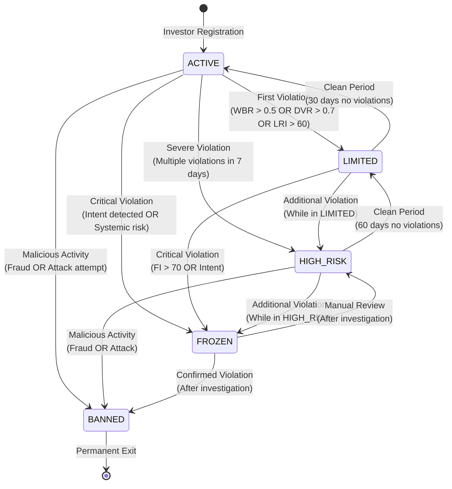

# Investor State Machine

## Overview

The Investor State Machine manages the complete lifecycle of investor accounts based on behavior patterns, violations, risk metrics, and protocol compliance. This state machine enables automatic restrictions, monitoring, and recovery mechanisms to protect the protocol while allowing good actors to operate freely.

## State Machine Diagram



## State Definitions

### ACTIVE (Default State)

**Description**: Normal operational state with full access to protocol features.

**Conditions**:
- New investors start in ACTIVE state
- No active violations
- All risk metrics within acceptable ranges

**Access Rights**:
- ✅ Full deposit/withdrawal access (within fund limits)
- ✅ Access to all allowed funds (based on class)
- ✅ Full governance participation (if eligible)
- ✅ Normal transaction limits
- ✅ No additional monitoring overhead

**Mathematical Thresholds**:
```
WBR (Withdraw Behavior Ratio) ≤ 0.5
DVR (Deposit Velocity Ratio) ≤ 0.7
LRI (Loss Reaction Index) ≤ 60
Violation Count (7 days) = 0
ICS (Investor Composite Score) ≥ 0
```

### LIMITED

**Description**: Restricted state with reduced limits and enhanced monitoring. Investor can still operate but with constraints.

**Trigger Conditions**:
```
Trigger LIMITED if:
  WBR > 0.5 OR
  DVR > 0.7 OR
  LRI > 60 OR
  Violation Count (7 days) ≥ 1
```

**Access Rights**:
- ⚠️ Reduced deposit limit: 50% of normal limit
- ⚠️ Reduced withdrawal limit: 25% of normal limit
- ⚠️ Only Tier 1-2 funds accessible
- ✅ Governance participation (normal)
- ⚠️ Enhanced monitoring: Every transaction flagged
- ⚠️ Warnings issued on all operations

**Restrictions**:
```solidity
// Limited state restrictions
depositLimit = normalLimit * 0.5;
withdrawalLimit = normalLimit * 0.25;
allowedFunds = [Tier1, Tier2];  // No Tier 3-4
monitoringLevel = ENHANCED;
```

**Recovery Conditions**:
```
Return to ACTIVE if:
  Clean Period: 30 days with no violations
  AND
  WBR ≤ 0.3 AND DVR ≤ 0.5 AND LRI ≤ 50
  AND
  Violation Count (30 days) = 0
```

### HIGH_RISK

**Description**: Severely restricted state with strict limits. Investor represents elevated risk to the protocol.

**Trigger Conditions**:
```
Trigger HIGH_RISK if:
  (Violation Count (7 days) ≥ 3) OR
  (While LIMITED: Additional violation) OR
  (LRI > 80) OR
  (Intent probability > 0.6)
```

**Access Rights**:
- ⚠️ Severely reduced deposit limit: 10% of normal limit
- ⚠️ Withdrawal limit: 50% of current balance (one-time)
- ⚠️ Only Tier 1 funds accessible
- ❌ No governance participation
- ⚠️ Maximum monitoring: Every action logged and reviewed
- ⚠️ All operations require manual review flag

**Restrictions**:
```solidity
// High risk state restrictions
depositLimit = normalLimit * 0.1;
withdrawalLimit = balance * 0.5;  // One-time only
allowedFunds = [Tier1];  // Only lowest risk
monitoringLevel = MAXIMUM;
governanceEligible = false;
manualReviewRequired = true;
```

**Recovery Conditions**:
```
Return to LIMITED if:
  Clean Period: 60 days with no violations
  AND
  WBR ≤ 0.2 AND DVR ≤ 0.3 AND LRI ≤ 40
  AND
  Violation Count (60 days) = 0
  AND
  ICS Score ≥ 50
```

### FROZEN

**Description**: Investigation state. All operations suspended pending manual review. Used for suspicious activity or potential fraud.

**Trigger Conditions**:
```
Trigger FROZEN if:
  (Intent probability > 0.8) OR
  (Systemic risk detected) OR
  (Multiple HIGH_RISK violations) OR
  (Suspected fraud/attack) OR
  (Guardian intervention)
```

**Access Rights**:
- ❌ All deposits blocked
- ❌ All withdrawals blocked
- ❌ No fund access
- ❌ No governance participation
- ❌ All operations suspended
- ⏳ Investigation pending

**Restrictions**:
```solidity
// Frozen state restrictions
depositAllowed = false;
withdrawalAllowed = false;
allOperationsSuspended = true;
investigationStatus = PENDING;
manualReviewRequired = true;
```

**Recovery Conditions**:
```
Return to HIGH_RISK if:
  Investigation complete: No violation confirmed
  AND
  Guardian approves recovery
  AND
  Risk assessment: HIGH_RISK acceptable

OR

Transition to BANNED if:
  Investigation complete: Violation confirmed
  OR
  Fraud/attack confirmed
```

### BANNED

**Description**: Permanent exclusion. Investor banned from protocol permanently. No recovery possible.

**Trigger Conditions**:
```
Trigger BANNED if:
  (Confirmed fraud) OR
  (Attack attempt confirmed) OR
  (While FROZEN: Violation confirmed) OR
  (Malicious intent confirmed) OR
  (Protocol security threat)
```

**Access Rights**:
- ❌ All deposits permanently blocked
- ❌ All withdrawals permanently blocked
- ❌ No fund access
- ❌ No governance participation
- ❌ All protocol interactions blocked
- ❌ Permanent exclusion

**Restrictions**:
```solidity
// Banned state restrictions
depositAllowed = false;
withdrawalAllowed = false;
allOperationsSuspended = true;
permanentBan = true;
recoveryPossible = false;
```

**Recovery Conditions**:
```
None - BANNED is permanent
```

## State Transition Logic

### Mathematical Formulas

#### 1. Withdraw Behavior Ratio (WBR)

```
WBR = (Total Withdrawals / Total Deposits) × (Withdrawal Frequency / Deposit Frequency)

Where:
- Total Withdrawals: Lifetime USD withdrawn
- Total Deposits: Lifetime USD deposited
- Withdrawal Frequency: Number of withdrawals in last 30 days
- Deposit Frequency: Number of deposits in last 30 days

WBR Thresholds:
- WBR ≤ 0.5: Normal (ACTIVE)
- WBR > 0.5: Warning (ACTIVE → LIMITED)
- WBR > 0.8: High Risk (LIMITED → HIGH_RISK)
```

#### 2. Deposit Velocity Ratio (DVR)

```
DVR = Rapid Deposit Count / Total Deposit Count

Where:
- Rapid Deposit: Deposit within 1 hour of previous withdrawal
- Total Deposit Count: Deposits in last 30 days

DVR Thresholds:
- DVR ≤ 0.7: Normal (ACTIVE)
- DVR > 0.7: Warning (ACTIVE → LIMITED)
- DVR > 0.9: High Risk (LIMITED → HIGH_RISK)
```

#### 3. Loss Reaction Index (LRI)

```
LRI = Panic Withdrawal Count / Total Withdrawal Count × 100

Where:
- Panic Withdrawal: Withdrawal within 24 hours of fund drawdown > 5%
- Total Withdrawal Count: Withdrawals in last 90 days

LRI Thresholds:
- LRI ≤ 60: Normal (ACTIVE)
- LRI > 60: Warning (ACTIVE → LIMITED)
- LRI > 80: High Risk (LIMITED → HIGH_RISK)
```

#### 4. Intent Probability (IP)

```
IP = 0.4 × Pattern_Match + 0.3 × Timing_Anomaly + 0.2 × Amount_Anomaly + 0.1 × Velocity_Anomaly

Where:
- Pattern_Match: Match with known attack patterns (0-100)
- Timing_Anomaly: Unusual timing patterns (0-100)
- Amount_Anomaly: Unusual amount patterns (0-100)
- Velocity_Anomaly: Unusual velocity patterns (0-100)

IP Thresholds:
- IP ≤ 0.6: Acceptable
- IP > 0.6: High Risk (ACTIVE/LIMITED → HIGH_RISK)
- IP > 0.8: Critical (ANY → FROZEN)
```

#### 5. Violation Score

```
VS = Σ(Violation_Weight_i × Recency_Multiplier_i)

Where:
- Violation_Weight: Severity of violation (1-10)
- Recency_Multiplier: 1.0 (last 7 days), 0.5 (8-30 days), 0.25 (31-90 days)

VS Thresholds:
- VS = 0: ACTIVE
- VS ≥ 1: ACTIVE → LIMITED
- VS ≥ 3: LIMITED → HIGH_RISK
- VS ≥ 10: HIGH_RISK → FROZEN
```

### State Transition Matrix

| Current State | Next State | Condition | Recovery Period |
|--------------|------------|-----------|-----------------|
| ACTIVE | LIMITED | First violation OR WBR > 0.5 OR DVR > 0.7 OR LRI > 60 | 30 days clean |
| ACTIVE | HIGH_RISK | VS ≥ 3 OR Multiple violations (7 days) | 60 days clean |
| ACTIVE | FROZEN | IP > 0.8 OR Systemic risk | Manual review |
| ACTIVE | BANNED | Confirmed fraud/attack | Permanent |
| LIMITED | ACTIVE | 30 days clean AND all metrics normalized | N/A |
| LIMITED | HIGH_RISK | Additional violation OR VS ≥ 3 | 60 days clean |
| LIMITED | FROZEN | IP > 0.8 OR Critical violation | Manual review |
| HIGH_RISK | LIMITED | 60 days clean AND all metrics normalized | N/A |
| HIGH_RISK | FROZEN | Additional violation OR IP > 0.8 | Manual review |
| HIGH_RISK | BANNED | Confirmed fraud/attack | Permanent |
| FROZEN | HIGH_RISK | Investigation: No violation, Guardian approved | 60 days clean |
| FROZEN | BANNED | Investigation: Violation confirmed | Permanent |
| BANNED | - | No recovery possible | Permanent |

## Implementation

### State Storage

```solidity
struct InvestorStateData {
    InvestorState currentState;
    uint256 stateChangedAt;
    uint256 violationsLast30Days;
    uint256 violationsLast7Days;
    uint256 lastViolationAt;
    uint256 cleanPeriodStart;  // For recovery tracking
    string lastTransitionReason;
    bool manualReviewPending;
}

mapping(address => InvestorStateData) public investorStates;
mapping(address => StateTransition[]) public stateHistory;

struct StateTransition {
    InvestorState fromState;
    InvestorState toState;
    uint256 timestamp;
    string reason;
    address triggeredBy;  // Contract that triggered transition
}
```

### Transition Function

```solidity
function transition(
    address investor,
    InvestorState newState,
    string calldata reason
) external onlyInvestorRiskDomain {
    InvestorStateData storage data = investorStates[investor];
    InvestorState currentState = data.currentState;
    
    // Validate transition
    require(isValidTransition(currentState, newState), "Invalid transition");
    
    // Record transition
    stateHistory[investor].push(StateTransition({
        fromState: currentState,
        toState: newState,
        timestamp: block.timestamp,
        reason: reason,
        triggeredBy: msg.sender
    }));
    
    // Update state
    data.currentState = newState;
    data.stateChangedAt = block.timestamp;
    data.lastTransitionReason = reason;
    
    // Handle recovery tracking
    if (newState == InvestorState.ACTIVE || newState == InvestorState.LIMITED) {
        data.cleanPeriodStart = block.timestamp;
    }
    
    // Handle frozen state
    if (newState == InvestorState.FROZEN) {
        data.manualReviewPending = true;
    }
    
    emit InvestorStateChanged(investor, currentState, newState, reason);
}
```

### Validation Function

```solidity
function isValidTransition(
    InvestorState from,
    InvestorState to
) public pure returns (bool) {
    // Same state allowed (no-op)
    if (from == to) return false;
    
    // BANNED cannot transition
    if (from == InvestorState.BANNED) return false;
    
    // Valid transitions
    if (from == InvestorState.ACTIVE) {
        return to == InvestorState.LIMITED ||
               to == InvestorState.HIGH_RISK ||
               to == InvestorState.FROZEN ||
               to == InvestorState.BANNED;
    }
    
    if (from == InvestorState.LIMITED) {
        return to == InvestorState.ACTIVE ||
               to == InvestorState.HIGH_RISK ||
               to == InvestorState.FROZEN;
    }
    
    if (from == InvestorState.HIGH_RISK) {
        return to == InvestorState.LIMITED ||
               to == InvestorState.FROZEN ||
               to == InvestorState.BANNED;
    }
    
    if (from == InvestorState.FROZEN) {
        return to == InvestorState.HIGH_RISK ||
               to == InvestorState.BANNED;
    }
    
    return false;
}
```

### Access Control Checks

```solidity
function canDeposit(address investor, uint256 amount) external view returns (bool) {
    InvestorState state = investorStates[investor].currentState;
    
    if (state == InvestorState.FROZEN || state == InvestorState.BANNED) {
        return false;
    }
    
    // Check limits based on state
    uint256 limit = getDepositLimit(investor, state);
    return amount <= limit;
}

function canWithdraw(address investor, uint256 amount) external view returns (bool) {
    InvestorState state = investorStates[investor].currentState;
    
    if (state == InvestorState.FROZEN || state == InvestorState.BANNED) {
        return false;
    }
    
    // Check limits based on state
    uint256 limit = getWithdrawalLimit(investor, state);
    return amount <= limit;
}

function getDepositLimit(address investor, InvestorState state) internal view returns (uint256) {
    uint256 baseLimit = investorRegistry.getDepositLimit(investor);
    
    if (state == InvestorState.ACTIVE) return baseLimit;
    if (state == InvestorState.LIMITED) return baseLimit * 50 / 100;  // 50%
    if (state == InvestorState.HIGH_RISK) return baseLimit * 10 / 100;  // 10%
    
    return 0;  // FROZEN, BANNED
}

function getWithdrawalLimit(address investor, InvestorState state) internal view returns (uint256) {
    uint256 baseLimit = investorRegistry.getWithdrawalLimit(investor);
    uint256 balance = investorRegistry.getBalance(investor);
    
    if (state == InvestorState.ACTIVE) return baseLimit;
    if (state == InvestorState.LIMITED) return baseLimit * 25 / 100;  // 25%
    if (state == InvestorState.HIGH_RISK) return balance * 50 / 100;  // 50% of balance, one-time
    
    return 0;  // FROZEN, BANNED
}
```

## Automatic Recovery Mechanism

### Recovery Tracking

```solidity
function checkRecovery(address investor) external {
    InvestorStateData storage data = investorStates[investor];
    InvestorState currentState = data.currentState;
    
    if (currentState == InvestorState.ACTIVE || currentState == InvestorState.BANNED) {
        return;  // No recovery needed
    }
    
    uint256 cleanPeriod = block.timestamp - data.cleanPeriodStart;
    uint256 requiredCleanPeriod = getRequiredCleanPeriod(currentState);
    
    // Check if clean period met
    if (cleanPeriod < requiredCleanPeriod) {
        return;  // Not yet eligible
    }
    
    // Check if metrics normalized
    if (!areMetricsNormalized(investor, currentState)) {
        return;  // Metrics not normalized
    }
    
    // Check violation count
    if (data.violationsLast30Days > 0 && currentState == InvestorState.LIMITED) {
        return;  // Still have violations
    }
    
    if (data.violationsLast60Days > 0 && currentState == InvestorState.HIGH_RISK) {
        return;  // Still have violations
    }
    
    // Eligible for recovery
    InvestorState nextState = getRecoveryState(currentState);
    transition(investor, nextState, "Automatic recovery: Clean period and metrics normalized");
}

function getRequiredCleanPeriod(InvestorState state) internal pure returns (uint256) {
    if (state == InvestorState.LIMITED) return 30 days;
    if (state == InvestorState.HIGH_RISK) return 60 days;
    return 0;
}

function getRecoveryState(InvestorState current) internal pure returns (InvestorState) {
    if (current == InvestorState.LIMITED) return InvestorState.ACTIVE;
    if (current == InvestorState.HIGH_RISK) return InvestorState.LIMITED;
    return current;
}
```

## Integration Points

### InvestorRiskDomain Integration

The InvestorRiskDomain contract monitors investor behavior and triggers state transitions:

```solidity
// In InvestorRiskDomain
function evaluateInvestor(address investor, uint256 fundId) external {
    // Calculate metrics
    uint256 wbr = calculateWBR(investor);
    uint256 dvr = calculateDVR(investor);
    uint256 lri = calculateLRI(investor);
    uint256 ip = calculateIP(investor);
    uint256 vs = calculateVS(investor);
    
    InvestorState currentState = stateMachine.getState(investor);
    
    // Determine new state
    InvestorState newState = currentState;
    string memory reason = "";
    
    if (ip > 80) {
        newState = InvestorState.FROZEN;
        reason = "Intent probability > 80%";
    } else if (vs >= 10) {
        newState = InvestorState.FROZEN;
        reason = "Violation score >= 10";
    } else if (currentState == InvestorState.ACTIVE && (wbr > 50 || dvr > 70 || lri > 60 || vs >= 1)) {
        newState = InvestorState.LIMITED;
        reason = "First violation detected";
    } else if (currentState == InvestorState.LIMITED && (vs >= 3 || lri > 80)) {
        newState = InvestorState.HIGH_RISK;
        reason = "Multiple violations while LIMITED";
    } else if (currentState == InvestorState.HIGH_RISK && (vs >= 10 || ip > 60)) {
        newState = InvestorState.FROZEN;
        reason = "Critical violation while HIGH_RISK";
    }
    
    // Trigger transition if needed
    if (newState != currentState) {
        stateMachine.transition(investor, newState, reason);
    }
}
```

## Events

```solidity
event InvestorStateChanged(
    address indexed investor,
    InvestorState fromState,
    InvestorState toState,
    string reason
);

event RecoveryEligible(
    address indexed investor,
    InvestorState currentState,
    InvestorState targetState
);

event RecoveryCompleted(
    address indexed investor,
    InvestorState fromState,
    InvestorState toState
);
```

## Security Considerations

1. **Unauthorized Transitions**: Only InvestorRiskDomain can trigger transitions
2. **Permanent Bans**: BANNED state cannot be reversed
3. **Recovery Validation**: All recovery conditions must be verified
4. **Guardian Override**: Guardians can freeze/unfreeze for security
5. **State History**: All transitions are immutable and auditable

---

**Related**: [InvestorRiskDomain](/protocol/contracts/risk/InvestorRiskDomain), [InvestorRegistry](/protocol/contracts/investor/InvestorRegistry), [InvestorPenaltyEngine](/protocol/contracts/investor/InvestorPenaltyEngine)

