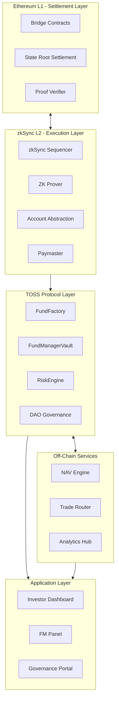

# Architecture Overview

A comprehensive technical overview of the TOSS Protocol's full system architecture, covering the end-to-end structure from Ethereum L1 settlement down to the user-facing applications.

## Architecture Goals

TOSS architecture is designed around four primary objectives:

### 1. Security by Design

- **Settlement on Ethereum L1**: Final settlement anchored to Ethereum mainnet
- **zkSync Validity Proofs**: L2 integrity guaranteed through zero-knowledge proofs
- **Mandatory FM Staking**: Economic security through required Fund Manager collateral
- **Strict Slashing Guarantees**: Automated enforcement of violations

### 2. Full Transparency

- **On-chain NAV Tracking**: Net Asset Value updates recorded on-chain
- **On-chain Execution Limits**: Risk rules and limits publicly verifiable
- **Auditable Vault Balances**: All fund holdings transparently tracked
- **Complete Fund History**: Immutable record of all fund operations

### 3. High Scalability & Low Fees

- **zkSync L2 Execution**: Low gas costs enable high-frequency operations
- **Optimized Calldata Structures**: Efficient data encoding reduces costs
- **Packed Storage Patterns**: Storage optimization minimizes on-chain footprint

### 4. Modular Expandability

- **Layer Separation**: Each layer is independently upgradeable via DAO
- **No Cross-Layer Dependency Loops**: Clean interfaces between components
- **Full Composability**: Future modules can integrate seamlessly

## Layered System Overview

TOSS follows a strict 5-layer architecture:

### Layer 0 — Ethereum L1 (Settlement Layer)

- **Finality**: Ultimate finality for all state roots
- **Rollup Commitments**: Storage for zkSync rollup commitments
- **Bridge Contracts**: USDC and TOSS token bridge smart contracts

### Layer 1 — zkSync L2 Execution Layer

- **Transaction Processing**: All fund operations executed on L2
- **Account Abstraction (AA)**: Smart contract wallets for users
- **Proof Generation**: ZK proofs for L1 verification
- **Low-Cost Computation**: Efficient execution of RiskEngine logic

### Layer 2 — Core Protocol Layer (TOSS Protocol)

Responsible for all economic logic:

- **FundFactory & FundRegistry**: Fund creation and indexing
- **FundManagerVault**: Secure asset custody
- **RiskEngine & Domains**: Risk validation and slashing
- **DAO Governance Contracts**: Decentralized parameter management

### Layer 3 — Off-chain Service Layer

- **NAV Engine**: Real-time fund valuation (PostgreSQL)
- **FM Trade Router**: Trade execution orchestration
- **AnalyticsHub**: Data warehouse and insights
- **Paymaster Service**: Gas sponsorship for user operations

### Layer 4 — Application Layer

- **Investor Dashboard**: Portfolio management interface
- **FM Fund Panel**: Fund manager control panel
- **Governance Portal**: DAO voting and proposals
- **Wallet Integrations**: Web3 wallet connectivity

## System Architecture Diagram

## Component Interactions

### Ethereum L1 Components

- **Canonical Bridge**: Handles deposits and withdrawals
- **Settlement Contract**: Stores zkSync state roots
- **Proof Verification**: Validates zkSync validity proofs

### zkSync Components

- **Sequencer**: Produces L2 batches from transactions
- **Prover**: Generates validity proofs for batches
- **zkSync Mempool**: Transaction queue management
- **AA Wallets & Paymasters**: Smart contract wallet infrastructure

### TOSS Protocol Layer

- **Smart Contracts by Domain**: Fund, Risk, Governance contracts
- **L2-Based NAV Accounting**: Share issuance and redemption logic
- **Contract-Level Gatekeeping**: All fund actions validated

### Off-Chain Components

- **NAV Calculation Engine**: Real-time fund valuation
- **Portfolio Analysis**: Risk metrics and performance tracking
- **CEX/DEX Trade Router**: Multi-venue trade execution
- **Monitoring**: BetterStack + CloudWatch observability

### Frontend Layer

- **Next.js Dashboard**: React-based user interface
- **Wallet Abstraction**: Unified wallet connection
- **L2 Transaction Builder**: zkSync transaction construction

## Security Model Overview

The TOSS security model is multi-layered:

1. **L2 Validity Enforcement**: zkSync proofs guarantee execution correctness
2. **Economic Enforcement**: FM staking creates skin-in-the-game
3. **Protocol-Level Limits**: RiskEngine enforces hard boundaries
4. **Governance-Based Safety**: Parameter changes require DAO approval
5. **Multi-Signature Execution**: Critical actions protected by multisig

## Scalability Characteristics

### Cost Efficiency

- **Cheap L2 Computation**: zkSync enables affordable operations
- **Minimized Calldata**: Packed encoding reduces data costs
- **Batched Operations**: NAV updates batched for efficiency

### Performance

- **High-Frequency Trading**: Low fees enable frequent trades
- **Real-Time Risk Validation**: L2 execution enables instant checks
- **Fast Investor Operations**: Quick deposit and withdrawal flows

## Next Steps

- **[Layered System](/docs/protocol/architecture/layered-system)**: Deep dive into each architectural layer
- **[L1-L2 Communication](/docs/protocol/architecture/l1-l2-communication)**: Understanding cross-layer messaging
- **[Security Model](/docs/protocol/architecture/security-model)**: Comprehensive security analysis

---

*For practical implementation details, see the [Technical Documentation](/docs/technical/intro).*

