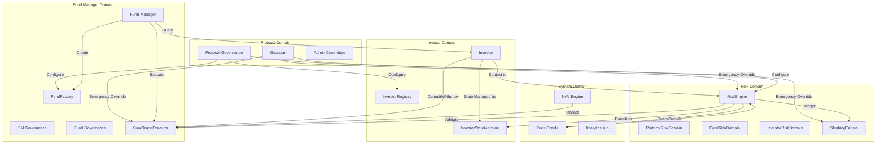

# RBAC Domain Diagram

## Overview

The Role-Based Access Control (RBAC) system in TOSS Protocol defines permissions and access rights across all domains and contract layers. This documentation provides a comprehensive view of roles, permissions, and domain boundaries.

## Role Hierarchy

```
Protocol Roles (Highest Authority)
├─ Guardian
├─ Protocol Governance
├─ Admin Committee
│
Domain Roles (Domain-Specific Authority)
├─ Fund Manager (FM)
├─ Fund Governance
├─ FM Governance
│
Participant Roles (User-Level Authority)
├─ Investor
├─ Voter (Governance)
├─ Session Key
│
System Roles (Automated Authority)
├─ RiskEngine
├─ NAV Engine
├─ SlashingEngine
├─ Price Oracle
└─ Off-Chain Services
```

## Domain Boundaries

### 1. Protocol Domain

**Scope**: Protocol-wide infrastructure and critical system parameters

**Roles**:
- Guardian
- Protocol Governance
- Admin Committee

**Permissions**:

| Role | Permissions | Contracts |
|------|-------------|-----------|
| Guardian | Emergency pause, Circuit breaker, Veto governance proposals | All contracts |
| Protocol Governance | Update protocol parameters, Upgrade contracts, Configure oracles | DAOConfigCore, ProtocolGovernance, Upgradeable contracts |
| Admin Committee | Create protocol proposals, Configure voter groups, Manage guardians | ProtocolGovernance, VoterRegistry |

**Access Control**:
```solidity
modifier onlyGuardian() {
    require(guardians[msg.sender], "Only guardian");
    _;
}

modifier onlyProtocolGovernance() {
    require(protocolGovernance.hasRole(PROTOCOL_GOVERNANCE_ROLE, msg.sender), "Not protocol governance");
    _;
}
```

### 2. Fund Manager Domain

**Scope**: Fund creation, management, and operations

**Roles**:
- Fund Manager (FM)
- FM Governance
- Fund Governance

**Permissions**:

| Role | Permissions | Contracts |
|------|-------------|-----------|
| Fund Manager | Create funds, Execute trades, Collect fees, Manage stake, Close funds | FundFactory, FundTradeExecutor, FundManagerVault, FundConfig |
| FM Governance | Update FM standards, Modify FM templates, Adjust FM stake requirements | FMGovernance, FundFactory |
| Fund Governance | Create fund proposals, Vote on fund proposals, Update fund parameters | FundGovernance, FundConfig |

**Access Control**:
```solidity
modifier onlyFundManager(uint256 fundId) {
    require(fundRegistry.getFundManager(fundId) == msg.sender, "Not FM");
    _;
}

modifier onlyActiveFM(address fm) {
    require(fmRegistry.isActive(fm), "FM not active");
    require(!fmRegistry.isBanned(fm), "FM banned");
    _;
}
```

### 3. Investor Domain

**Scope**: Investor registration, operations, and state management

**Roles**:
- Investor
- Investor Governance (for Protocol-level investor proposals)

**Permissions**:

| Role | Permissions | Contracts |
|------|-------------|-----------|
| Investor | Deposit to funds, Withdraw from funds, Upgrade class, Stake TOSS | FundManagerVault, InvestorRegistry, RewardDistributor |
| Investor Governance | Create protocol proposals (investor-focused), Vote on protocol proposals | ProtocolGovernance, VoterRegistry |

**Access Control**:
```solidity
modifier onlyInvestor() {
    require(investorRegistry.isRegistered(msg.sender), "Not registered");
    _;
}

modifier onlyActiveInvestor(address investor) {
    require(investorStateMachine.getState(investor) == InvestorState.ACTIVE || 
            investorStateMachine.getState(investor) == InvestorState.LIMITED, 
            "Investor not active");
    _;
}
```

### 4. Risk Domain

**Scope**: Risk validation, slashing, and penalty enforcement

**Roles**:
- RiskEngine
- ProtocolRiskDomain
- FundRiskDomain
- InvestorRiskDomain
- SlashingEngine

**Permissions**:

| Role | Permissions | Contracts |
|------|-------------|-----------|
| RiskEngine | Validate trades, Calculate FaultIndex, Trigger slashing, Approve/reject operations | RiskEngine, FundTradeExecutor, FundManagerVault |
| ProtocolRiskDomain | Validate protocol health, Check oracle connectivity, Monitor system-wide risks | ProtocolRiskDomain, RiskEngine |
| FundRiskDomain | Validate fund-level limits, Check position sizes, Monitor fund risks | FundRiskDomain, RiskEngine |
| InvestorRiskDomain | Validate investor behavior, Check investor state, Trigger state transitions | InvestorRiskDomain, RiskEngine, InvestorStateMachine |
| SlashingEngine | Calculate slashing amounts, Execute slashing, Burn tokens, Compensate NAV | SlashingEngine, TOSS Token, TOSSTreasury |

**Access Control**:
```solidity
modifier onlyRiskEngine() {
    require(msg.sender == address(riskEngine), "Not RiskEngine");
    _;
}

modifier onlySlashingEngine() {
    require(msg.sender == address(slashingEngine), "Not SlashingEngine");
    _;
}

modifier onlyInvestorRiskDomain() {
    require(msg.sender == address(investorRiskDomain), "Not InvestorRiskDomain");
    _;
}
```

### 5. System Domain

**Scope**: Automated system operations and off-chain services

**Roles**:
- NAV Engine
- Price Oracle
- Off-Chain Services

**Permissions**:

| Role | Permissions | Contracts |
|------|-------------|-----------|
| NAV Engine | Update NAV, Update High Water Mark, Record NAV history | FundManagerVault, AnalyticsHub |
| Price Oracle | Provide prices, Update price feeds, Report price confidence | PriceOracleRouter, RiskEngine |
| Off-Chain Services | Read-only access to all contracts, Event indexing, Analytics | All contracts (view functions only) |

**Access Control**:
```solidity
modifier onlyNAVEngine() {
    require(whitelistedNAVEngines[msg.sender], "Not NAV Engine");
    _;
}

modifier onlyPriceOracle() {
    require(whitelistedOracles[msg.sender], "Not price oracle");
    _;
}
```

## Domain Interaction Matrix

| From Domain | To Domain | Permissions | Restrictions |
|------------|-----------|-------------|--------------|
| Protocol | Fund Manager | Create proposals, Update FM requirements | Must pass governance |
| Protocol | Investor | Create proposals, Update investor standards | Must pass governance |
| Protocol | Risk | Update risk parameters, Configure slashing | Must pass governance |
| Protocol | System | Configure oracles, Update NAV engine | Must pass governance |
| Fund Manager | Fund | Create funds, Execute trades, Manage funds | Must have stake, Must be active |
| Fund Manager | Risk | Request risk validation | Read-only access to risk checks |
| Investor | Fund | Deposit, Withdraw | Must be active, Must meet fund requirements |
| Investor | Risk | Subject to risk validation | Read-only access to risk checks |
| Risk | Fund Manager | Trigger slashing, Reject trades | Can modify FM stake |
| Risk | Investor | Trigger state transitions, Apply penalties | Can modify investor state |
| Risk | System | Request price data | Read-only access |
| System | Fund | Update NAV, Record analytics | Read-only for most operations |
| System | Risk | Provide price data, Analytics | Read-only access |

## Cross-Domain Access Rules

### 1. Risk Engine Access to Fund Manager Domain

```solidity
// RiskEngine can read FM data but not modify
function getFundManager(uint256 fundId) external view returns (address) {
    return fundRegistry.getFundManager(fundId);  // Read-only
}

// RiskEngine can trigger slashing via SlashingEngine
function triggerSlashing(uint256 fundId, uint256 faultIndex) external onlyRiskEngine {
    slashingEngine.executeSlashing(fundId, faultIndex);  // Indirect modification
}
```

### 2. Investor Domain Access to Fund Domain

```solidity
// Investor can deposit/withdraw but cannot manage fund
function deposit(uint256 fundId, uint256 amount) external onlyActiveInvestor(msg.sender) {
    // Investor can only deposit, not configure fund
    _deposit(fundId, amount);  // Indirect modification via vault
}
```

### 3. Fund Manager Access to Investor Domain

```solidity
// Fund Manager can query investor state but not modify
function getInvestorState(address investor) external view returns (InvestorState) {
    return investorStateMachine.getState(investor);  // Read-only
}
```

## Permission Matrix by Operation

### Fund Creation

| Role | Can Create | Can Configure | Can Deploy | Notes |
|------|-----------|---------------|------------|-------|
| Fund Manager | ✅ | ✅ | ❌ (via Factory) | Must have stake |
| Fund Factory | ❌ | ❌ | ✅ | Automated |
| Protocol Governance | ✅ (templates) | ✅ (standards) | ❌ | Sets standards only |

### Trade Execution

| Role | Can Initiate | Can Validate | Can Execute | Can Reject |
|------|-------------|--------------|-------------|------------|
| Fund Manager | ✅ | ❌ | ✅ (if approved) | ❌ |
| RiskEngine | ❌ | ✅ | ❌ | ✅ |
| FundTradeExecutor | ❌ | ❌ | ✅ | ❌ |

### Deposit/Withdrawal

| Role | Can Deposit | Can Withdraw | Can Approve | Can Reject |
|------|------------|--------------|-------------|------------|
| Investor | ✅ | ✅ | ❌ | ❌ |
| Fund Manager | ❌ | ❌ | ❌ | ❌ |
| RiskEngine | ❌ | ❌ | ✅ | ✅ (if risk detected) |
| InvestorStateMachine | ❌ | ❌ | ✅ | ✅ (if state disallows) |

### Governance Proposals

| Role | Can Create | Can Vote | Can Execute | Can Veto |
|------|-----------|----------|-------------|----------|
| Fund Manager | ✅ (Fund-level) | ✅ (Fund-level) | ✅ (Fund-level) | ❌ |
| FM Governance | ✅ (FM-level) | ✅ (FM-level) | ✅ (FM-level) | ❌ |
| Protocol Governance | ✅ (Protocol-level) | ✅ (Protocol-level) | ✅ (Protocol-level) | ❌ |
| Guardian | ❌ | ❌ | ❌ | ✅ |

### NAV Updates

| Role | Can Calculate | Can Update | Can Query | Can Verify |
|------|--------------|------------|-----------|------------|
| NAV Engine | ✅ | ✅ | ✅ | ✅ |
| Fund Manager | ❌ | ❌ | ✅ | ❌ |
| Investor | ❌ | ❌ | ✅ | ❌ |
| Price Oracle | ✅ (prices) | ❌ | ✅ | ❌ |

### Slashing

| Role | Can Calculate | Can Execute | Can Approve | Can Veto |
|------|--------------|-------------|-------------|----------|
| RiskEngine | ✅ | ❌ | ✅ | ❌ |
| SlashingEngine | ✅ | ✅ | ❌ | ❌ |
| Fund Manager | ❌ | ❌ | ❌ | ❌ |
| Guardian | ❌ | ❌ | ❌ | ✅ (emergency) |

## Session Keys

Session keys provide temporary, limited permissions for Fund Managers:

**Permissions**:
- Execute trades (within session limits)
- Query fund state
- Cannot manage stake
- Cannot close funds
- Cannot modify configuration

**Access Control**:
```solidity
modifier onlySessionKey(uint256 fundId) {
    require(sessionKeyRegistry.isValid(fundId, msg.sender), "Invalid session key");
    require(sessionKeyRegistry.notExpired(fundId, msg.sender), "Session key expired");
    _;
}
```

## Emergency Access

Guardians have emergency override capabilities:

**Emergency Permissions**:
- Pause all operations
- Freeze accounts
- Veto proposals
- Trigger circuit breakers
- Upgrade contracts (with timelock)

**Access Control**:
```solidity
modifier onlyGuardian() {
    require(guardians[msg.sender], "Only guardian");
    _;
}

function emergencyPause() external onlyGuardian {
    _pause();  // Pause all operations
}
```

## Access Control Implementation

### OpenZeppelin AccessControl

```solidity
import "@openzeppelin/contracts/access/AccessControl.sol";

contract TOSSContract is AccessControl {
    bytes32 public constant FUND_MANAGER_ROLE = keccak256("FUND_MANAGER_ROLE");
    bytes32 public constant RISK_ENGINE_ROLE = keccak256("RISK_ENGINE_ROLE");
    bytes32 public constant NAV_ENGINE_ROLE = keccak256("NAV_ENGINE_ROLE");
    bytes32 public constant GUARDIAN_ROLE = keccak256("GUARDIAN_ROLE");
    
    constructor() {
        _grantRole(DEFAULT_ADMIN_ROLE, msg.sender);
    }
}
```

### Custom Role Checks

```solidity
modifier onlyFundManagerOrFactory(uint256 fundId) {
    require(
        fundRegistry.getFundManager(fundId) == msg.sender ||
        msg.sender == address(fundFactory),
        "Not authorized"
    );
    _;
}

modifier onlyRiskEngineOrGuardian() {
    require(
        msg.sender == address(riskEngine) ||
        hasRole(GUARDIAN_ROLE, msg.sender),
        "Not authorized"
    );
    _;
}
```

## State-Based Access Control

Access can also be controlled by state:

### Investor State Restrictions

```solidity
function canDeposit(address investor, uint256 amount) external view returns (bool) {
    InvestorState state = investorStateMachine.getState(investor);
    
    if (state == InvestorState.FROZEN || state == InvestorState.BANNED) {
        return false;
    }
    
    uint256 limit = getDepositLimit(investor, state);
    return amount <= limit;
}
```

### Fund State Restrictions

```solidity
function canExecuteTrade(uint256 fundId) external view returns (bool) {
    FundStatus status = fundRegistry.getFundStatus(fundId);
    
    return status == FundStatus.ACTIVE &&
           !paused() &&
           !fundRegistry.isEmergency(fundId);
}
```

## Diagram



---

**Related**: [Access Control](/protocol/security/overview), [Execution Priority Layer](/protocol/architecture/execution-priority-layer), [Investor State Machine](/protocol/architecture/investor-state-machine)

