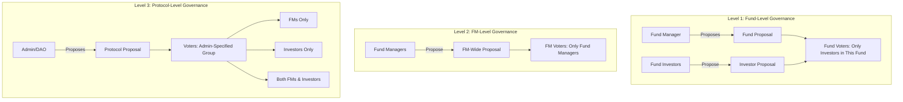

# Governance Overview

The TOSS Protocol employs a **multi-level governance system** where different stakeholders propose and vote on decisions relevant to their context—from individual fund management to protocol-wide parameters.

## Governance Philosophy

### Core Principles

1. **Context-Specific Governance**: Relevant stakeholders govern relevant decisions
2. **Fund Autonomy**: Each fund has internal governance for fund-specific matters
3. **Professional Standards**: Fund Managers govern their operational standards
4. **Protocol Safety**: Protocol-wide changes require appropriate authorization
5. **Transparent Decision-Making**: All proposals and votes on-chain

### Design Goals

- **Align Incentives**: Those affected by decisions participate in decisions
- **Prevent Capture**: No single group controls all aspects
- **Enable Flexibility**: Funds can adapt to investor preferences
- **Maintain Safety**: Critical protocol changes have appropriate oversight
- **Encourage Participation**: Rewards for active governance at all levels

## Multi-Level Governance Structure



### Level 1: Fund-Level Governance

Individual fund governance where fund-specific decisions are made.

#### Proposals by Fund Manager

**Proposer**: Fund Manager of the specific fund

**Voter Group**: Only investors who have deposited in this specific fund

**Voting Power**: Based on investor's share in the fund (not TOSS staking)

**Examples**:
- Change management fee (e.g., 2% → 1.5%)
- Adjust performance fee (e.g., 20% → 15%)
- Modify lockup period
- Change risk parameters (within allowed ranges)
- Update fund strategy description
- Add/remove allowed assets (within tier limits)

**Typical Flow**:
```solidity
// FM proposes fee change
fundGovernance.createProposal(
    fundId,
    "Reduce management fee to 1.5%",
    newFeeValue
);

// Only investors in this fund can vote
// Voting power = share ownership in fund
```

#### Proposals by Investors

**Proposer**: Any investor with minimum share threshold in the fund

**Voter Group**: Only investors in this specific fund

**Examples**:
- Request fee reduction
- Propose risk limit tightening
- Request strategy transparency improvements
- Vote on fund closure
- Replace Fund Manager (extreme cases)

**Minimum Threshold**: Must own ≥1% of fund shares to propose

### Level 2: FM-Level Governance

Governance among Fund Managers for standards affecting all FMs.

**Proposer**: Any active Fund Manager with ≥1 fund

**Voter Group**: Only Fund Managers (weighted by their total AUM managed)

**Voting Power**:
```
VP_FM = Total_AUM_Managed × FM_Reputation_Score
```

**Examples**:
- Change minimum FM stake requirements
- Modify FundClass templates
- Update FM certification standards
- Adjust RiskTier definitions (within protocol limits)
- FM community standards and best practices
- FM dispute resolution procedures

**Typical Flow**:
```solidity
// FM proposes change to minimum stake
fmGovernance.createProposal(
    "Increase minimum FM stake to 15,000 TOSS",
    targetContract,
    calldata
);

// Only FMs vote, weighted by AUM
```

### Level 3: Protocol-Level Governance

Protocol-wide governance for critical infrastructure and security.

**Proposer**: Admin (initially core team, later DAO-elected admin committee)

**Voter Group**: Admin specifies for each proposal

**Voter Group Options**:
1. **FMs Only**: For changes primarily affecting Fund Managers
2. **Investors Only**: For changes primarily affecting Investors
3. **Both FMs & Investors**: For changes affecting entire ecosystem
4. **Guardian Committee**: For emergency actions

**Examples**:

*FMs Only*:
- FundFactory deployment parameters
- Global FM slashing formulas
- RiskEngine core algorithms

*Investors Only*:
- Protocol fee structure
- Investor class definitions
- Reward distribution mechanisms

*Both Groups*:
- TOSS token economics changes
- zkSync integration updates
- Major protocol upgrades
- Oracle configuration

**Typical Flow**:
```solidity
// Admin proposes protocol change
protocolGovernance.createProposal(
    "Update oracle configuration",
    VoterGroup.BOTH,  // FMs and Investors vote
    targetContract,
    calldata
);

// Specified group votes
// Voting power = TOSS staked + bonuses
```

## Governance Actors by Level

### Fund-Level Actors

#### Fund Manager (Proposer & Affected Party)

**Rights**:
- Create proposals for their fund
- Vote as investor if they hold shares
- Implement approved changes

**Proposal Requirements**:
- Must be the verified FM of the fund
- No minimum threshold (FM automatically eligible)

#### Fund Investors (Proposers & Voters)

**Rights**:
- Create proposals if owning ≥1% of fund shares
- Vote on all fund-level proposals
- Delegate voting power to other fund investors

**Voting Power**:
```
VP_Fund = Fund_Shares_Owned / Total_Fund_Shares
```

**Example**: Investor owns 100 shares out of 10,000 total
```
Voting Power = 100 / 10,000 = 1% of votes
```

### FM-Level Actors

#### Fund Managers (Proposers & Voters)

**Rights**:
- Create proposals affecting all FMs
- Vote on FM governance proposals
- Delegate voting power to other FMs

**Voting Power**:
```
VP_FM = (AUM_Managed × 0.6) + (FM_Reputation × 0.4)

Where:
- AUM_Managed = Total AUM across all funds
- FM_Reputation = Score based on performance and compliance
```

**Proposal Requirements**:
- Must be active FM with ≥1 fund
- Must have managed funds for ≥30 days
- No slashing violations in last 90 days

### Protocol-Level Actors

#### Admin Committee (Proposers)

**Composition**: Initially core team, later DAO-elected committee

**Rights**:
- Create protocol-wide proposals
- Specify voter group for each proposal
- Emergency pause authority

**Limitations**:
- Cannot execute without vote approval
- Subject to timelock delays
- Guardian committee can veto

#### Voter Groups (Admin-Specified)

When creating protocol proposal, admin specifies voter group:

```solidity
enum VoterGroup {
    FM_ONLY,           // Only Fund Managers vote
    INVESTOR_ONLY,     // Only Investors vote
    BOTH,              // Both FMs and Investors vote
    GUARDIAN           // Guardian committee votes
}
```

**Voting Power (Protocol Level)**:
```
VP_Protocol = TOSS_Staked × (1 + LockTimeBonus) × RoleMultiplier

RoleMultiplier:
- Fund Manager: 1.5x
- Strategic Investor: 2.0x
- Regular Investor: 1.0x
```

### Guardian Committee

**Role**: Emergency safety mechanism

**Powers**:
- **Emergency Veto**: Can block proposals (24-hour window)
- **Emergency Pause**: Can pause protocol in critical situations
- **Cannot**: Propose or approve changes directly

**Composition**:
- 5 members elected by DAO
- 3-of-5 multisig required
- 6-month terms with rotation

**Limitations**:
- Veto expires after 24 hours
- Can only veto, not approve
- All actions logged and reviewable

## Proposal Lifecycle by Level

Different governance levels have different proposal flows optimized for their context.

### Fund-Level Proposals

```
1. FM/Investor creates proposal
   ↓
2. Fund investors receive notification
   ↓
3. Voting period (3-7 days)
   ↓
4. Quorum check (≥30% of fund shares must vote)
   ↓
5. Approval check (>50% of votes for)
   ↓
6. Timelock (24-48 hours)
   ↓
7. Execution (FM implements change)
```

**Key Characteristics**:
- **Fast**: Shorter voting and timelock periods
- **Focused**: Only affected investors participate
- **Flexible**: Each fund can have different governance rules
- **Share-Based**: Voting power = share ownership, not TOSS

### FM-Level Proposals

```
1. FM creates proposal
   ↓
2. All FMs notified
   ↓
3. Discussion period (3 days minimum)
   ↓
4. Voting period (5-7 days)
   ↓
5. Quorum check (≥20% of total FM voting power)
   ↓
6. Approval check (>60% approval for standard, >75% for critical)
   ↓
7. Timelock (48 hours)
   ↓
8. Execution via DAO
```

**Key Characteristics**:
- **Professional**: Only FMs participate
- **AUM-Weighted**: Larger funds have proportionally more say
- **Higher Thresholds**: Requires strong consensus

### Protocol-Level Proposals

```
1. Admin creates proposal + specifies voter group
   ↓
2. Eligible voters notified
   ↓
3. Community discussion (7 days minimum)
   ↓
4. Voting period (7-14 days)
   ↓
5. Quorum check (varies by voter group)
   ↓
6. Approval check (>66% for critical changes)
   ↓
7. Guardian veto window (24 hours)
   ↓
8. Timelock (48-72 hours)
   ↓
9. Execution via DAO
```

**Key Characteristics**:
- **Deliberate**: Longer periods for critical changes
- **Flexible Voter Groups**: Admin specifies who votes
- **High Security**: Guardian oversight, long timelocks

## Voting Power Calculation by Level

### Fund-Level Voting Power

**Simple Share-Based**:
```
VP_Fund = Shares_Owned / Total_Shares

Example:
Investor A: 1,000 shares / 10,000 total = 10% voting power
Investor B: 500 shares / 10,000 total = 5% voting power
```

**No TOSS staking required** - voting power purely based on fund investment.

### FM-Level Voting Power

**AUM-Weighted with Reputation**:
```
VP_FM = (Total_AUM × 0.6) + (Reputation_Score × AUM × 0.4)

Reputation Components:
- Fund Performance: Sharpe ratio, consistency
- Compliance Record: No slashing = bonus
- Community Standing: Forum participation, proposals
- Longevity: Years as active FM

Example:
FM A: $10M AUM, 80 reputation → VP = 6M + 3.2M = 9.2M
FM B: $5M AUM, 95 reputation → VP = 3M + 1.9M = 4.9M
```

### Protocol-Level Voting Power

**TOSS-Staked with Bonuses**:
```
VP_Protocol = TOSS_Staked × (1 + LockBonus) × RoleMultiplier

Lock Time Bonus:
- No lock: 0% bonus (1.0x)
- 6 months: 50% bonus (1.5x)
- 1 year: 100% bonus (2.0x)
- 2 years: 150% bonus (2.5x)
- 4 years: 200% bonus (3.0x)

Role Multiplier:
- Regular Investor: 1.0x
- Fund Manager: 1.5x (higher stake in ecosystem)
- Strategic Investor: 2.0x (large TOSS holder)

Example:
Investor: 10,000 TOSS staked, 1-year lock, Strategic class
VP = 10,000 × 2.0 (lock) × 2.0 (role) = 40,000 voting power
```

## Governance Examples

### Example 1: Fund Manager Proposes Fee Reduction

```typescript
// Fund "Alpha BTC Fund" (fundId: 42)
// Current management fee: 2%
// FM wants to reduce to 1.5% to attract more investors

// Step 1: FM creates proposal
fundGovernance.createProposal(
  fundId: 42,
  proposalType: ProposalType.FEE_CHANGE,
  title: "Reduce management fee to 1.5%",
  newManagementFee: 150, // basis points (1.5%)
  description: "Reducing fee to be more competitive..."
);

// Step 2: Fund investors vote
// - 10 investors hold shares
// - Voting period: 5 days
// - Voting power = share ownership

// Step 3: Result
// For: 65% (by shares)
// Against: 25%
// Abstain: 10%
// Result: PASSED (>50% approval)

// Step 4: Timelock (24 hours)
// Step 5: FM implements new fee
```

### Example 2: Investor Proposes Risk Tightening

```typescript
// Investor concerned about fund volatility
// Proposes reducing max drawdown from 30% to 20%

// Step 1: Investor creates proposal (owns 5% of fund)
fundGovernance.createInvestorProposal(
  fundId: 42,
  proposalType: ProposalType.RISK_PARAMETER,
  parameter: "maxDrawdown",
  newValue: 20,
  reason: "Recent market volatility requires tighter controls"
);

// Step 2: Fund investors vote
// Step 3: If >50% approve, FM must implement or investors can exit penalty-free
```

### Example 3: FMs Propose Higher Minimum Stake

```typescript
// FMs want to increase quality bar by raising minimum stake

// Step 1: Senior FM creates proposal
fmGovernance.createProposal(
  proposalType: ProposalType.FM_STAKE_REQUIREMENT,
  newMinimumStake: 15_000 * 1e18, // 15,000 TOSS
  rationale: "Increase skin-in-the-game for better FM quality"
);

// Step 2: All FMs vote
// Voting power = AUM managed + reputation
// Voting period: 7 days

// Step 3: Result
// For: 72% (by voting power)
// Against: 28%
// Result: PASSED

// Step 4: Timelock (48 hours)
// Step 5: Protocol updates minimum stake
```

### Example 4: Admin Changes Oracle Configuration

```typescript
// Critical infrastructure change affecting everyone

// Step 1: Admin creates protocol proposal
protocolGovernance.createProposal(
  proposalType: ProposalType.ORACLE_CONFIG,
  voterGroup: VoterGroup.BOTH, // FMs and Investors vote
  title: "Add Pyth Network as backup oracle",
  implementation: [...],
  description: "Enhances oracle resilience..."
);

// Step 2: Both FMs and Investors vote
// Voting power = TOSS staked with bonuses
// Voting period: 14 days

// Step 3: Guardian review window (24 hours)
// Step 4: Timelock (72 hours for critical change)
// Step 5: Execution via DAO executor
```

## Governance Rewards

### Reward Pool

```
Governance Rewards = 5% of protocol fees

Distribution:
├─ Active Voters: 60%
├─ Proposal Authors (passed): 20%
├─ Delegates: 15%
└─ Guardian Committee: 5%
```

### Voter Rewards

```solidity
function claimVotingRewards(uint256[] memory proposalIds) external {
    uint256 totalReward = 0;
    
    for (uint i = 0; i < proposalIds.length; i++) {
        uint256 proposalId = proposalIds[i];
        Proposal storage proposal = proposals[proposalId];
        
        // Must have voted
        require(hasVoted[proposalId][msg.sender], "Did not vote");
        
        // Calculate share
        uint256 voterPower = getVotingPower(msg.sender, proposalId);
        uint256 totalPower = proposal.totalVotingPower;
        uint256 reward = (rewardPool[proposalId] * voterPower) / totalPower;
        
        totalReward += reward;
    }
    
    TOSS.transfer(msg.sender, totalReward);
}
```

## Quorum and Approval Requirements

### Fund-Level

```yaml
Quorum Required:
  - Standard changes: 30% of fund shares
  - Critical changes: 50% of fund shares

Approval Required:
  - Fee changes: >50%
  - Risk parameter changes: >60%
  - FM replacement: >75%
  
Voting Period: 3-7 days
Timelock: 24-48 hours
```

### FM-Level

```yaml
Quorum Required:
  - Standard changes: 20% of FM voting power
  - Critical changes: 40% of FM voting power

Approval Required:
  - Standard proposals: >60%
  - Critical proposals: >75%

Voting Period: 5-7 days
Timelock: 48 hours
```

### Protocol-Level

```yaml
Quorum Required (varies by voter group):
  - FM Only: 15% of FM voting power
  - Investor Only: 10% of investor voting power
  - Both: 10% of combined voting power

Approval Required:
  - Standard: >50%
  - Important: >66%
  - Critical: >75%

Voting Period: 7-14 days
Timelock: 48-72 hours (plus 24h guardian window)
```

## Parameter Change Limits

Changes are bounded to prevent destabilization:

```solidity
// Fund-level: Flexible within protocol bounds
function validateFundParameterChange(uint256 fundId, string param, uint256 newValue) {
    FundConfig memory config = fundConfigs[fundId];
    
    // Can change within RiskTier limits
    require(newValue >= tierLimits[config.tier].min, "Below tier minimum");
    require(newValue <= tierLimits[config.tier].max, "Above tier maximum");
    
    // Max 50% change per proposal
    uint256 maxDelta = config.currentValue * 50 / 100;
    require(abs(newValue - config.currentValue) <= maxDelta, "Change too large");
}

// FM-level: Limited to protect ecosystem
struct FMParameterLimits {
    uint256 minValue;
    uint256 maxValue;
    uint256 maxChangePerProposal;  // 20% max
    uint256 cooldownPeriod;         // 30 days minimum
}

// Protocol-level: Most restrictive
struct ProtocolParameterLimits {
    uint256 minValue;
    uint256 maxValue;
    uint256 maxChangePerProposal;  // 10% max
    uint256 cooldownPeriod;         // 90 days minimum
    bool requiresGuardianApproval;  // For critical params
}
```

## Emergency Governance

### Emergency Proposal

For critical security issues:

```solidity
function createEmergencyProposal(...) 
    external 
    onlyGuardian 
    returns (uint256) 
{
    // Reduced voting period (6-24 hours)
    // Reduced timelock (6-24 hours)
    // Requires 75%+ approval
    // Guardian veto not available
}
```

### Emergency Pause

```solidity
function emergencyPause() external {
    require(
        msg.sender == guardian || 
        hasRole(EMERGENCY_ROLE, msg.sender),
        "Not authorized"
    );
    
    _pause();
    emit EmergencyPause(msg.sender, block.timestamp);
    
    // Auto-unpause after 72 hours if not extended
    unpauseTimestamp = block.timestamp + 72 hours;
}
```

## Governance Security

### Attack Vectors & Mitigations

#### Flash Loan Attack

**Attack**: Borrow TOSS, vote, return in same block

**Mitigation**: 
```solidity
// Snapshot taken 1 block before voting starts
uint256 snapshot = block.number - 1;

// Flash loan cannot affect historical balance
uint256 votingPower = TOSS.balanceOfAt(voter, snapshot);
```

#### Governance Capture

**Attack**: Accumulate >51% voting power

**Mitigation**:
- Expensive (need >500M TOSS)
- Parameter change limits
- Timelock allows response time
- Guardian can veto
- Multiple domains prevent total control

#### Proposal Spam

**Attack**: Create many frivolous proposals

**Mitigation**:
- 1,000 TOSS minimum to propose
- Reputation penalty for failed proposals
- Community can downvote before formal proposal

## Governance Roadmap

### Phase 1: Foundation DAO (Current)

- Core team holds admin keys
- Community advisory votes (non-binding)
- Parameter changes via multisig

### Phase 2: Hybrid Governance (Q2 2025)

- Multi-domain DAO activated
- Binding on-chain votes
- Gradual transfer of admin keys
- Guardian committee elected

### Phase 3: Full Decentralization (Q4 2025)

- All control transferred to DAO
- Core team acts as one stakeholder
- Self-sustaining governance
- Multiple independent delegates

### Phase 4: Advanced Governance (2026+)

- Cross-chain governance
- Optimistic governance (fast-track small changes)
- Conviction voting experiments
- Futarchy (prediction market governance)

## Summary

TOSS implements a sophisticated **three-level governance system**:

1. **Fund-Level**: Investors govern their specific funds (fees, risk, strategy)
2. **FM-Level**: Fund Managers govern their professional standards
3. **Protocol-Level**: Admin proposes, specified groups vote on infrastructure

This ensures:
- ✅ Relevant stakeholders make relevant decisions
- ✅ Fund autonomy and flexibility
- ✅ Professional self-governance among FMs
- ✅ Protected protocol-wide parameters
- ✅ No single point of control

## Next Steps

- **[DAO Structure](/docs/protocol/governance/dao-structure)**: Detailed specifications for each governance level
- **[Proposal Lifecycle](/docs/protocol/governance/proposal-lifecycle)**: Complete flows for fund, FM, and protocol proposals
- **[Voting Mechanism](/docs/protocol/governance/voting-mechanism)**: Voter eligibility and power calculations
- **[Governance Contracts](/docs/protocol/contracts/governance-layer)**: Smart contract implementations

---

*For practical examples, see [Proposal Lifecycle](/docs/protocol/governance/proposal-lifecycle).*

