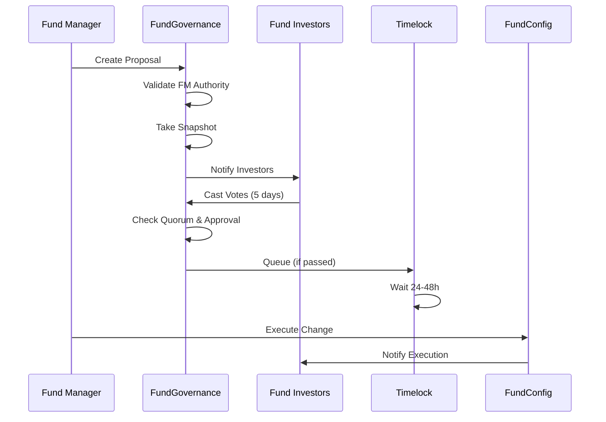
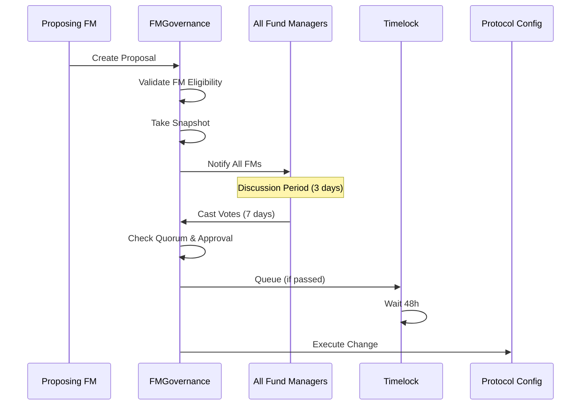
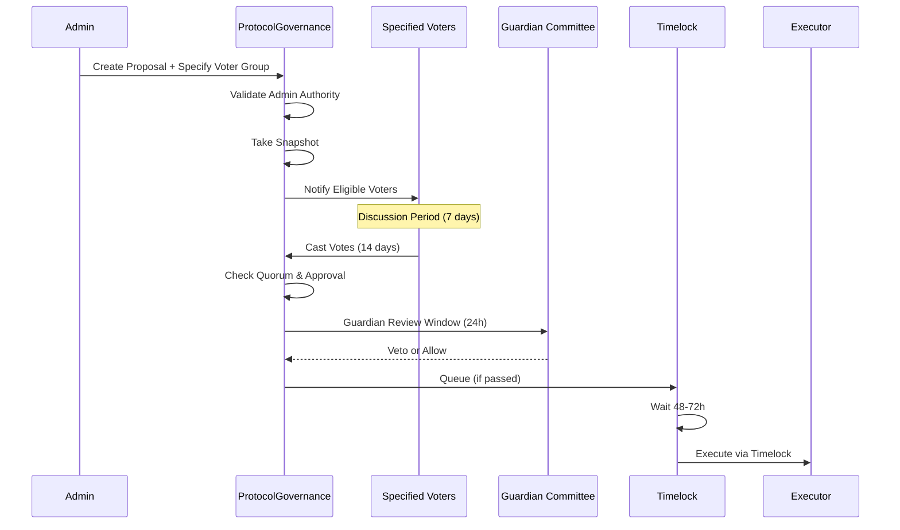

# Proposal Lifecycle

Complete specification of proposal workflows at each governance level, from creation to execution.

## Overview

Each governance level has optimized proposal flows balancing speed, security, and participation:

- **Fund-Level**: Fast, focused on affected investors
- **FM-Level**: Deliberate, professional consensus-building
- **Protocol-Level**: Secure, with multiple safety checks

## Fund-Level Proposal Lifecycle

### Type 1: FM-Proposed Changes



#### Step 1: Proposal Creation

```solidity
function createFMProposal(
    uint256 fundId,
    ProposalType proposalType,
    bytes calldata proposalData
) external returns (uint256 proposalId) {
    // Validate FM
    require(fundRegistry.getFundManager(fundId) == msg.sender, "Not FM");
    require(!fundRegistry.isFundPaused(fundId), "Fund paused");
    
    // Create proposal
    proposals[nextProposalId] = FundProposal({
        fundId: fundId,
        proposer: msg.sender,
        proposalType: proposalType,
        proposalData: proposalData,
        snapshot: block.number,
        votingStarts: block.timestamp + 1 days,  // 24h delay
        votingEnds: block.timestamp + 6 days,    // 5-day voting
        forVotes: 0,
        againstVotes: 0,
        abstainVotes: 0,
        state: ProposalState.PENDING
    });
    
    emit ProposalCreated(nextProposalId, fundId, msg.sender, proposalType);
    return nextProposalId++;
}
```

**Example - Fee Change Proposal**:
```typescript
// Current: 2% management fee
// Proposed: 1.5% management fee

const proposalData = ethers.utils.defaultAbiCoder.encode(
  ['uint256'], // new fee in basis points
  [150]        // 1.5%
);

await fundGovernance.createFMProposal(
  fundId,
  ProposalType.FEE_CHANGE,
  proposalData
);
```

#### Step 2: Notification Period (24 hours)

- All fund investors notified via:
  - On-chain event
  - Email (if registered)
  - Dashboard notification
  - Discord/Telegram bot (if configured)

- FM posts rationale in fund's discussion forum

#### Step 3: Voting Period (5 days)

```solidity
function castVote(uint256 proposalId, uint8 support) external {
    FundProposal storage proposal = proposals[proposalId];
    
    // Check eligibility
    require(block.timestamp >= proposal.votingStarts, "Voting not started");
    require(block.timestamp <= proposal.votingEnds, "Voting ended");
    require(!hasVoted[proposalId][msg.sender], "Already voted");
    
    // Get voting power (snapshot-based)
    uint256 shares = vault.balanceOfAt(
        msg.sender,
        proposal.fundId,
        proposal.snapshot
    );
    require(shares > 0, "No shares");
    
    // Record vote
    hasVoted[proposalId][msg.sender] = true;
    
    if (support == 0) {
        proposal.againstVotes += shares;
    } else if (support == 1) {
        proposal.forVotes += shares;
    } else if (support == 2) {
        proposal.abstainVotes += shares;
    }
    
    emit VoteCast(proposalId, msg.sender, support, shares);
}
```

**Voting Options**:
- `0` = Against
- `1` = For
- `2` = Abstain (counts for quorum)

#### Step 4: Quorum & Approval Check

```solidity
function state(uint256 proposalId) public view returns (ProposalState) {
    FundProposal storage proposal = proposals[proposalId];
    
    if (block.timestamp <= proposal.votingEnds) {
        return ProposalState.ACTIVE;
    }
    
    // Calculate totals
    uint256 totalVotes = proposal.forVotes + proposal.againstVotes + proposal.abstainVotes;
    uint256 totalShares = vault.totalSharesAt(proposal.fundId, proposal.snapshot);
    
    // Check quorum
    uint256 quorumPct = (totalVotes * 100) / totalShares;
    uint256 requiredQuorum = _getRequiredQuorum(proposal.proposalType);
    
    if (quorumPct < requiredQuorum) {
        return ProposalState.DEFEATED;  // Not enough participation
    }
    
    // Check approval
    uint256 approvalPct = (proposal.forVotes * 100) / (proposal.forVotes + proposal.againstVotes);
    uint256 requiredApproval = _getRequiredApproval(proposal.proposalType);
    
    if (approvalPct >= requiredApproval) {
        return ProposalState.SUCCEEDED;
    } else {
        return ProposalState.DEFEATED;
    }
}
```

**Thresholds**:
```yaml
Fee Changes:
  Quorum: 30% of shares
  Approval: >50%

Risk Parameters:
  Quorum: 40% of shares
  Approval: >60%

FM Replacement:
  Quorum: 50% of shares
  Approval: >75%
```

#### Step 5: Timelock Queue

```solidity
function queue(uint256 proposalId) external {
    require(state(proposalId) == ProposalState.SUCCEEDED, "Not succeeded");
    
    FundProposal storage proposal = proposals[proposalId];
    uint256 delay = _getTimelockDelay(proposal.proposalType);
    proposal.eta = block.timestamp + delay;
    proposal.state = ProposalState.QUEUED;
    
    emit ProposalQueued(proposalId, proposal.eta);
}
```

**Timelock Delays**:
- Standard (fees): 24 hours
- Important (risk): 48 hours
- Critical (FM replacement): 72 hours

#### Step 6: Execution

```solidity
function execute(uint256 proposalId) external {
    FundProposal storage proposal = proposals[proposalId];
    
    require(proposal.state == ProposalState.QUEUED, "Not queued");
    require(block.timestamp >= proposal.eta, "Timelock not expired");
    require(block.timestamp < proposal.eta + GRACE_PERIOD, "Stale");
    
    // Execute based on proposal type
    if (proposal.proposalType == ProposalType.FEE_CHANGE) {
        uint256 newFee = abi.decode(proposal.proposalData, (uint256));
        fundConfig.setManagementFee(proposal.fundId, newFee);
    }
    // ... other types
    
    proposal.state = ProposalState.EXECUTED;
    emit ProposalExecuted(proposalId);
}
```

### Type 2: Investor-Proposed Changes

**Key Difference**: Investors can propose, but if FM disagrees, special rules apply:

```solidity
function executeInvestorProposal(uint256 proposalId) external {
    InvestorProposal storage proposal = investorProposals[proposalId];
    require(proposal.state == ProposalState.QUEUED, "Not queued");
    
    // Check if FM agreed or was overridden
    if (proposal.fmApproved) {
        // FM agreed - normal execution
        _executeProposalData(proposal);
    } else {
        // FM disagreed but investors voted >75%
        require(proposal.forVotes > proposal.totalVotes * 75 / 100, "Need 75% for override");
        
        // Execute with FM penalty-free exit window
        _executeProposalData(proposal);
        _openFMExitWindow(proposal.fundId);  // FM can exit without penalty for 7 days
    }
}
```

## FM-Level Proposal Lifecycle



### Step 1: Proposal Creation

```solidity
function createFMProposal(
    ProposalType proposalType,
    bytes calldata proposalData
) external onlyActiveFM returns (uint256 proposalId) {
    // Validate proposer
    require(_canFMPropose(msg.sender), "Not eligible");
    
    // Create proposal
    fmProposals[nextProposalId] = FMProposal({
        proposer: msg.sender,
        proposalType: proposalType,
        proposalData: proposalData,
        snapshot: block.number,
        votingStarts: block.timestamp + 3 days,  // 3-day discussion
        votingEnds: block.timestamp + 10 days,   // 7-day voting
        forVotes: 0,
        againstVotes: 0,
        totalVotingPower: _getTotalFMVotingPower(),
        state: ProposalState.PENDING
    });
    
    emit FMProposalCreated(nextProposalId, msg.sender, proposalType);
    return nextProposalId++;
}
```

**Eligibility Requirements**:
```typescript
function _canFMPropose(address fm) internal view returns (bool) {
  const funds = fundRegistry.getFundsManaged(fm);
  const activeSince = fmRegistry.activeSince(fm);
  const daysSinceSlash = slashingEngine.daysSinceLastSlash(fm);
  
  return (
    funds.length >= 1 &&                          // Has at least 1 fund
    block.timestamp >= activeSince + 30 days &&  // Active for 30+ days
    daysSinceSlash >= 90                          // No recent slashing
  );
}
```

### Step 2: Discussion Period (3 days)

- Forum thread created automatically
- FMs discuss pros/cons
- Proposer can update description (but not implementation)
- Community sentiment gauged

### Step 3: Voting Period (7 days)

```solidity
function castVoteWeighted(uint256 proposalId, uint8 support) external onlyActiveFM {
    FMProposal storage proposal = fmProposals[proposalId];
    
    require(block.timestamp >= proposal.votingStarts);
    require(block.timestamp <= proposal.votingEnds);
    require(!hasVotedFM[proposalId][msg.sender]);
    
    // Calculate voting power (AUM + reputation)
    uint256 votingPower = _getFMVotingPower(msg.sender);
    
    hasVotedFM[proposalId][msg.sender] = true;
    
    if (support == 1) {
        proposal.forVotes += votingPower;
    } else {
        proposal.againstVotes += votingPower;
    }
    
    emit FMVoteCast(proposalId, msg.sender, support, votingPower);
}
```

### Step 4: Approval Check

```yaml
Standard Proposals:
  Quorum: 20% of FM voting power
  Approval: >60%
  Examples: Minor parameter tweaks

Critical Proposals:
  Quorum: 40% of FM voting power
  Approval: >75%
  Examples: Major stake requirement changes
```

### Step 5: Execution via Protocol

```solidity
function executeFMProposal(uint256 proposalId) external {
    FMProposal storage proposal = fmProposals[proposalId];
    
    require(proposal.state == ProposalState.QUEUED);
    require(block.timestamp >= proposal.eta);
    
    // Execute based on type
    if (proposal.proposalType == ProposalType.FM_STAKE_REQUIREMENT) {
        uint256 newStake = abi.decode(proposal.proposalData, (uint256));
        fmRegistry.setMinimumStake(newStake);
    }
    // ... other types
    
    proposal.state = ProposalState.EXECUTED;
}
```

## Protocol-Level Proposal Lifecycle



### Step 1: Admin Proposal Creation

```solidity
function createProtocolProposal(
    ProposalType proposalType,
    VoterGroup voterGroup,      // Admin specifies!
    address[] calldata targets,
    uint256[] calldata values,
    bytes[] calldata calldatas,
    string calldata description
) external onlyAdmin returns (uint256 proposalId) {
    // Validate proposal
    require(targets.length == values.length && targets.length == calldatas.length);
    require(targets.length > 0, "Empty proposal");
    
    // Create proposal
    protocolProposals[nextProposalId] = ProtocolProposal({
        proposer: msg.sender,
        proposalType: proposalType,
        voterGroup: voterGroup,         // Key: Admin decides voter group
        targets: targets,
        values: values,
        calldatas: calldatas,
        description: description,
        snapshot: block.number,
        votingStarts: block.timestamp + 7 days,   // 7-day discussion
        votingEnds: block.timestamp + 21 days,    // 14-day voting
        forVotes: 0,
        againstVotes: 0,
        guardianReviewed: false,
        state: ProposalState.PENDING
    });
    
    emit ProtocolProposalCreated(
        nextProposalId,
        msg.sender,
        proposalType,
        voterGroup
    );
    
    return nextProposalId++;
}
```

**Voter Group Decision Matrix**:
```typescript
function determineVoterGroup(proposalType: ProposalType): VoterGroup {
  switch (proposalType) {
    case ProposalType.ORACLE_CONFIG:
      return VoterGroup.BOTH;  // Affects everyone
      
    case ProposalType.SLASHING_FORMULA:
      return VoterGroup.FM_ONLY;  // Primarily affects FMs
      
    case ProposalType.PROTOCOL_FEE:
      return VoterGroup.INVESTOR_ONLY;  // Primarily affects investors
      
    case ProposalType.EMERGENCY_ACTION:
      return VoterGroup.GUARDIAN_ONLY;  // Emergency only
      
    default:
      return VoterGroup.BOTH;  // Default: everyone votes
  }
}
```

### Step 2: Discussion Period (7 days)

- Community forum discussion
- Technical analysis published
- Simulation results shared
- Concerns raised and addressed

### Step 3: Voting Period (14 days)

```solidity
function castProtocolVote(uint256 proposalId, uint8 support) external {
    ProtocolProposal storage proposal = protocolProposals[proposalId];
    
    // Check timing
    require(block.timestamp >= proposal.votingStarts);
    require(block.timestamp <= proposal.votingEnds);
    require(!hasVotedProtocol[proposalId][msg.sender]);
    
    // Check eligibility based on voter group
    require(_isEligibleVoter(msg.sender, proposal.voterGroup), "Not eligible");
    
    // Get voting power based on group
    uint256 votingPower = _getProtocolVotingPower(
        msg.sender,
        proposal.voterGroup,
        proposal.snapshot
    );
    
    hasVotedProtocol[proposalId][msg.sender] = true;
    
    if (support == 1) {
        proposal.forVotes += votingPower;
    } else {
        proposal.againstVotes += votingPower;
    }
    
    emit ProtocolVoteCast(proposalId, msg.sender, support, votingPower);
}
```

**Voting Power by Group**:
```typescript
function _getProtocolVotingPower(
  address voter,
  voterGroup: VoterGroup,
  snapshot: number
): number {
  const tossStaked = staking.balanceOfAt(voter, snapshot);
  const lockBonus = staking.getLockBonus(voter);
  
  let roleMultiplier = 1.0;
  
  if (voterGroup === VoterGroup.FM_ONLY || voterGroup === VoterGroup.BOTH) {
    if (fundRegistry.isActiveFM(voter)) {
      roleMultiplier = 1.5;  // FMs get 1.5x
    }
  }
  
  if (voterGroup === VoterGroup.INVESTOR_ONLY || voterGroup === VoterGroup.BOTH) {
    const investorClass = investorRegistry.getClass(voter);
    if (investorClass === InvestorClass.STRATEGIC) {
      roleMultiplier = 2.0;  // Strategic investors get 2x
    }
  }
  
  return tossStaked * (1 + lockBonus) * roleMultiplier;
}
```

### Step 4: Guardian Review (24 hours)

After voting ends, Guardian Committee has 24 hours to veto:

```solidity
function guardianVeto(uint256 proposalId, string calldata reason) 
    external 
    onlyGuardian 
{
    ProtocolProposal storage proposal = protocolProposals[proposalId];
    
    require(proposal.state == ProposalState.SUCCEEDED);
    require(block.timestamp < proposal.votingEnds + 24 hours, "Veto period expired");
    require(!proposal.guardianReviewed, "Already reviewed");
    
    proposal.guardianReviewed = true;
    proposal.state = ProposalState.VETOED;
    
    emit GuardianVeto(proposalId, msg.sender, reason);
}

function guardianApprove(uint256 proposalId) external onlyGuardian {
    ProtocolProposal storage proposal = protocolProposals[proposalId];
    
    require(proposal.state == ProposalState.SUCCEEDED);
    
    proposal.guardianReviewed = true;
    // Can now be queued
    
    emit GuardianApproved(proposalId, msg.sender);
}
```

**Guardian Veto Examples**:
- Critical security vulnerability discovered
- Technical implementation flawed
- Simulation shows severe negative impact
- Legal/compliance concern

### Step 5: Timelock (48-72 hours)

```solidity
function queueProtocol(uint256 proposalId) external {
    ProtocolProposal storage proposal = protocolProposals[proposalId];
    
    require(proposal.state == ProposalState.SUCCEEDED);
    require(proposal.guardianReviewed, "Guardian review pending");
    
    uint256 delay = _getProtocolTimelockDelay(proposal.proposalType);
    proposal.eta = block.timestamp + delay;
    proposal.state = ProposalState.QUEUED;
    
    emit ProtocolProposalQueued(proposalId, proposal.eta);
}
```

**Delays**:
- Standard: 48 hours
- Critical (upgrades, security): 72 hours
- Emergency: 24 hours (Guardian-approved only)

### Step 6: Execution

```solidity
function executeProtocol(uint256 proposalId) external {
    ProtocolProposal storage proposal = protocolProposals[proposalId];
    
    require(proposal.state == ProposalState.QUEUED);
    require(block.timestamp >= proposal.eta);
    require(block.timestamp < proposal.eta + GRACE_PERIOD);
    
    // Execute all transactions
    for (uint i = 0; i < proposal.targets.length; i++) {
        _executeTransaction(
            proposal.targets[i],
            proposal.values[i],
            proposal.calldatas[i]
        );
    }
    
    proposal.state = ProposalState.EXECUTED;
    emit ProtocolProposalExecuted(proposalId);
}
```

## Proposal State Machine

```
PENDING (created, waiting for voting start)
    ↓
ACTIVE (voting in progress)
    ↓
SUCCEEDED (passed quorum & approval) or DEFEATED (failed)
    ↓
QUEUED (in timelock)
    ↓
EXECUTED (changes applied) or EXPIRED (not executed in time)
    
Special States:
- CANCELED (proposer/admin canceled)
- VETOED (Guardian vetoed)
```

## Cancellation Rules

### Fund-Level

```solidity
// FM can cancel own proposal before voting ends
function cancel(uint256 proposalId) external {
    FundProposal storage proposal = proposals[proposalId];
    require(msg.sender == proposal.proposer, "Not proposer");
    require(proposal.state == ProposalState.PENDING || proposal.state == ProposalState.ACTIVE);
    
    proposal.state = ProposalState.CANCELED;
}

// Investors can cancel if FM misbehaving
function emergencyCancel(uint256 proposalId) external {
    // Requires 51%+ of fund shares to sign
    require(_getEmergencyCancelSignatures(proposalId) >= 51);
    proposals[proposalId].state = ProposalState.CANCELED;
}
```

### FM-Level

```solidity
// Proposer can cancel before voting starts
function cancelFM(uint256 proposalId) external {
    require(msg.sender == fmProposals[proposalId].proposer);
    require(fmProposals[proposalId].state == ProposalState.PENDING);
    
    fmProposals[proposalId].state = ProposalState.CANCELED;
}
```

### Protocol-Level

```solidity
// Admin can cancel before execution
function cancelProtocol(uint256 proposalId) external onlyAdmin {
    require(protocolProposals[proposalId].state != ProposalState.EXECUTED);
    protocolProposals[proposalId].state = ProposalState.CANCELED;
}

// Guardian can veto during review window
function guardianVeto(uint256 proposalId) external onlyGuardian {
    // (shown above)
}
```

## Proposal Timeline Comparison

| Stage | Fund-Level | FM-Level | Protocol-Level |
|-------|------------|----------|----------------|
| **Creation** | Immediate | Immediate | Immediate |
| **Discussion** | None (informal) | 3 days | 7 days |
| **Voting** | 5 days | 7 days | 14 days |
| **Guardian Review** | No | No | 24 hours |
| **Timelock** | 24-48h | 48h | 48-72h |
| **Grace Period** | 7 days | 7 days | 14 days |
| **Total (Standard)** | ~6-7 days | ~17 days | ~24-31 days |

## Execution Mechanisms

### Fund-Level Execution

```solidity
// Directly modifies fund configuration
function _executeFundProposal(FundProposal storage proposal) internal {
    if (proposal.proposalType == ProposalType.FEE_CHANGE) {
        (uint256 newFee) = abi.decode(proposal.proposalData, (uint256));
        fundConfig.setManagementFee(proposal.fundId, newFee);
    }
    
    // Emit event for off-chain services
    emit FundConfigUpdated(proposal.fundId, proposal.proposalType);
}
```

### FM-Level Execution

```solidity
// Updates FM-wide templates and standards
function _executeFMProposal(FMProposal storage proposal) internal {
    if (proposal.proposalType == ProposalType.FM_STAKE_REQUIREMENT) {
        uint256 newMinStake = abi.decode(proposal.proposalData, (uint256));
        fmRegistry.setMinimumStake(newMinStake);
        
        // Apply to existing FMs gradually
        _scheduleStakeUpdate(newMinStake);
    }
}
```

### Protocol-Level Execution

```solidity
// Executes via Timelock with multi-step security
function _executeProtocolProposal(ProtocolProposal storage proposal) internal {
    for (uint i = 0; i < proposal.targets.length; i++) {
        bytes memory returnData = _executeTransaction(
            proposal.targets[i],
            proposal.values[i],
            proposal.calldatas[i]
        );
        
        // Verify execution succeeded
        require(returnData.length == 0 || abi.decode(returnData, (bool)));
    }
    
    emit ProtocolUpdate(proposal.proposalId, proposal.proposalType);
}
```

## Emergency Procedures

### Emergency Fund Pause (Fund-Level)

```solidity
// Any investor with 10%+ shares can trigger emergency pause
function emergencyPauseFund(uint256 fundId, string calldata reason) external {
    uint256 shares = vault.balanceOf(msg.sender, fundId);
    uint256 totalShares = vault.totalShares(fundId);
    
    require((shares * 100) / totalShares >= 10, "Need 10% to pause");
    
    fundRegistry.pauseFund(fundId);
    emit FundEmergencyPause(fundId, msg.sender, reason);
    
    // Auto-creates governance proposal to resolve
    _createEmergencyResolutionProposal(fundId);
}
```

### Emergency Protocol Action

```solidity
// Guardian or Admin can pause protocol
function emergencyPauseProtocol() external {
    require(
        guardianCommittee.isMember(msg.sender) ||
        adminCommittee.isMember(msg.sender),
        "Not authorized"
    );
    
    _pause();
    emit ProtocolEmergencyPause(msg.sender, block.timestamp);
    
    // Must unpause via governance within 72 hours or auto-unpause
}
```

## Proposal Templates

### Fund-Level Templates

#### Template 1: Fee Change

```typescript
const feeChangeProposal = {
  fundId: 42,
  proposalType: ProposalType.FEE_CHANGE,
  title: "Reduce Management Fee to 1.5%",
  description: `
    Proposal to reduce management fee from 2% to 1.5% to:
    - Be more competitive with other funds
    - Attract more investors
    - Increase total AUM
    
    Impact Analysis:
    - Current AUM: $5M
    - Current annual fees: $100k
    - New annual fees: $75k
    - Expected AUM increase: +20% ($6M)
    - New total fees: $90k
    
    Net impact: -$10k short term, but +$10k if AUM grows as projected
  `,
  implementation: {
    newManagementFee: 150, // 1.5% in basis points
  },
  votingPeriod: 5, // days
  timelock: 24,    // hours
};
```

#### Template 2: Risk Parameter Change

```typescript
const riskChangeProposal = {
  fundId: 42,
  proposalType: ProposalType.RISK_PARAMETER,
  title: "Tighten Max Drawdown to 20%",
  description: `
    Proposal to reduce maximum drawdown limit from 30% to 20%.
    
    Rationale:
    - Recent market volatility higher than expected
    - Investor feedback requesting lower risk
    - Fund current drawdown: 15% (comfortable margin)
    
    Impact:
    - More conservative trading required
    - Lower return potential (estimated -2% annual return)
    - Higher investor confidence
  `,
  implementation: {
    parameter: "maxDrawdown",
    newValue: 20,
  },
  votingPeriod: 7, // days (critical change)
  timelock: 48,    // hours
};
```

### FM-Level Templates

```typescript
const fmStakeProposal = {
  proposalType: ProposalType.FM_STAKE_REQUIREMENT,
  title: "Increase Minimum FM Stake to 15,000 TOSS",
  description: `
    Proposal to increase minimum FM stake from 10,000 to 15,000 TOSS.
    
    Benefits:
    - Increased skin-in-the-game
    - Higher quality bar for FMs
    - More security budget for slashing
    - Reduces fly-by-night operators
    
    Transition Plan:
    - Existing FMs: 90-day grace period to increase stake
    - New FMs: Immediate 15,000 requirement
    - FMs below threshold: Cannot create new funds until compliant
    
    Impact Analysis:
    - Current active FMs: 47
    - FMs below 15k: 12 (will need to add stake or close)
    - Estimated dropout: 3-5 FMs
    - Net positive: Quality improvement outweighs loss
  `,
  implementation: {
    newMinimumStake: ethers.utils.parseEther("15000"),
    gracePeriod: 90 * 24 * 60 * 60, // 90 days in seconds
  },
  votingPeriod: 7,
  timelock: 48,
};
```

### Protocol-Level Templates

```typescript
const oracleProposal = {
  proposalType: ProposalType.ORACLE_CONFIG,
  voterGroup: VoterGroup.BOTH,  // Everyone affected
  title: "Add Pyth Network as Backup Oracle",
  description: `
    Proposal to add Pyth Network as a backup oracle source.
    
    Rationale:
    - Enhances oracle resilience
    - Reduces single point of failure
    - Pyth has proven reliability
    - No additional cost (pay-per-use)
    
    Technical Implementation:
    - Add Pyth contract to PriceOracleRouter
    - Set as tertiary fallback (after Chainlink, Binance)
    - Configure deviation thresholds
    - Test on testnet first
    
    Risk Assessment: Low
    - Pyth is audited and battle-tested
    - Only fallback, not primary
    - Can disable if issues found
  `,
  implementation: {
    targets: [priceOracleRouter.address],
    values: [0],
    calldatas: [encodeFunctionData("addOracleSource", [pythAddress, priority])],
  },
  votingPeriod: 14,
  timelock: 72, // Critical infrastructure
};
```

## Next Steps

- **[Voting Mechanism](/protocol/governance/voting-mechanism)**: Detailed voting power calculations
- **[Governance Contracts](/protocol/contracts/governance-layer)**: Smart contract implementations
- **[DAO Structure](/protocol/governance/dao-structure)**: Governance level specifications

---

*Back to [Governance Overview](/protocol/governance/overview)*

