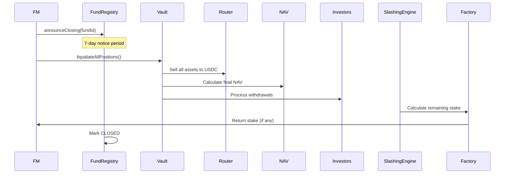

# Fund Closure Process

## Overview

Orderly fund closure, liquidation of positions, return of capital to investors, and stake return to FM.

## Prerequisites

- All investor shares redeemed OR
- All investors withdrawn OR
- Emergency closure (governance vote)

## Steps

1. **Announce Closure** (7-day notice)
2. **Stop New Deposits**
3. **Liquidate All Positions** (orderly)
4. **Calculate Final NAV**
5. **Process Pending Withdrawals**
6. **Return Capital** to remaining investors (pro-rata)
7. **Calculate Slashing** (if any violations)
8. **Return Stake** to FM (minus slashing)
9. **Mark Fund Closed** in registry

## Sequence



## Final Stake Calculation

```solidity
finalStake = initialStake - totalSlashed

If finalStake > 0:
    Transfer finalStake to FM
Else:
    No return (fully slashed)
```

---

**Related**: [Slashing Process](/protocol/processes/risk-compliance/slashing-execution)

