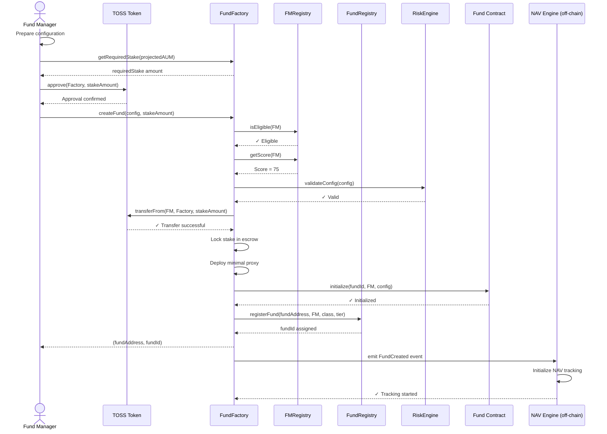

# Fund Creation Process

## Overview

Complete lifecycle of creating a new fund in the TOSS Protocol, from FM eligibility validation through stake locking, contract deployment, and fund activation.

## Participants

- **Fund Manager (FM)**: Initiates fund creation, provides stake
- **FundFactory**: Validates eligibility, deploys fund contract
- **TOSS Token**: Transfers and locks FM stake
- **FMRegistry**: Validates FM credentials
- **FundRegistry**: Registers and indexes new fund
- **RiskEngine**: Validates initial configuration
- **NAV Engine** (off-chain): Initializes NAV tracking

## Prerequisites

**FM Requirements**:
- ✅ Registered in FMRegistry
- ✅ FM Score (FMS) ≥ minimum threshold (default: 50)
- ✅ No active ban from SlashingEngine
- ✅ Sufficient TOSS balance for staking
- ✅ TOSS approved to FundFactory

**System Requirements**:
- ✅ Protocol not in PAUSED or EMERGENCY state
- ✅ FundFactory operational
- ✅ RiskEngine online

## Step-by-Step Flow

### Step 1: FM Prepares Configuration

**Actor**: Fund Manager

**Action**: Define fund parameters

**Configuration Parameters**:
```typescript
interface FundConfig {
  // Identity
  fundName: string;
  fundSymbol: string;
  strategyDescription: string;
  
  // Classification
  fundClass: FundClass;  // ALPHA, BALANCED, STABLE, QUANT, INDEX
  riskTier: RiskTier;    // TIER_1, TIER_2, TIER_3, TIER_4
  
  // Risk Limits
  maxPositionSize: number;      // PSL (% of NAV)
  maxConcentration: number;     // PCL (% of NAV)
  maxAssetExposure: number;     // AEL (% per asset)
  maxDrawdown: number;          // Maximum drawdown %
  maxVolatility: number;        // Annualized volatility %
  maxLeverage: number;          // Leverage ratio
  
  // Trading Rules
  maxDailyTrades: number;
  maxSlippage: number;
  allowedAssets: address[];
  
  // Fees
  managementFee: number;        // Annual % (0-3%)
  performanceFee: number;       // % above HWM (0-30%)
  depositFee: number;           // One-time %
  withdrawalFee: number;        // %
  
  // Operational
  minInvestment: number;        // Minimum deposit (USD)
  lockupPeriod: number;         // Days before withdrawal
  maxInvestors: number;         // 0 = unlimited
  kycRequired: boolean;
}
```

**Validation**: Configuration must comply with chosen RiskTier limits

**Off-Chain Tool**: FM uses dashboard or CLI to prepare configuration

### Step 2: FM Calculates Required Stake

**Actor**: Fund Manager

**Action**: Determine TOSS stake amount needed

**Formula**:
```
Required Stake = Base Minimum + (Projected AUM × Stake Ratio)

Where:
- Base Minimum = 10,000 TOSS (FM-level governance parameter)
- Stake Ratio = 0.1% of AUM (10 basis points)
- Projected AUM = Expected initial Assets Under Management
```

**Example Calculation**:
```typescript
// FM planning $2M fund
const baseMinimum = 10_000;  // TOSS
const projectedAUM = 2_000_000;  // USD
const stakeRatio = 0.001;  // 0.1%

const requiredStake = baseMinimum + (projectedAUM * stakeRatio);
// = 10,000 + (2,000,000 × 0.001)
// = 10,000 + 2,000 = 12,000 TOSS
```

**Contract Call**:
```solidity
uint256 requiredStake = fundFactory.getRequiredStake(projectedAUM);
```

### Step 3: FM Approves TOSS to FundFactory

**Actor**: Fund Manager

**Action**: Approve TOSS tokens for transfer

**Contract Calls**:
```solidity
// Standard approval
TOSS.approve(fundFactory.address, stakeAmount);

// Or using Permit (gasless)
const deadline = Math.floor(Date.now() / 1000) + 3600;
const { v, r, s } = await signPermit(fm, fundFactory.address, stakeAmount, deadline);
TOSS.permit(fm.address, fundFactory.address, stakeAmount, deadline, v, r, s);
```

**Permissions Required**: 🔒 FM must own TOSS tokens

**State Changes**: Allowance set in TOSS contract

**Events Emitted**: `Approval(fm, fundFactory, stakeAmount)`

**Possible Errors**:
- `InsufficientBalance`: FM doesn't have enough TOSS
- `InvalidPermit`: Permit signature invalid or expired

**Gas Cost**: ~45,000 gas (~$0.02 on zkSync)

### Step 4: FM Calls createFund()

**Actor**: Fund Manager

**Action**: Initiate fund creation transaction

**Contract Call**:
```solidity
(address fundAddress, uint256 fundId) = fundFactory.createFund(config, stakeAmount);
```

**Permissions Required**: 
- 🔒 Caller must be eligible FM
- 🔒 TOSS approval must be set

**Validations Performed**:

1. **FM Eligibility**:
   ```solidity
   require(fmRegistry.isEligible(msg.sender), "FM not eligible");
   require(fmRegistry.getScore(msg.sender) >= MIN_FM_SCORE, "Score too low");
   require(!slashingEngine.isBanned(msg.sender), "FM banned");
   ```

2. **Stake Sufficiency**:
   ```solidity
   uint256 required = minimumFMStake + (config.projectedAUM * stakeRatio / 10000);
   require(stakeAmount >= required, "Insufficient stake");
   ```

3. **Configuration Validity**:
   ```solidity
   require(riskEngine.validateConfig(config), "Invalid configuration");
   require(_feesWithinLimits(config), "Fees exceed limits");
   require(_riskParamsWithinTier(config), "Risk params violate tier");
   ```

**Possible Errors**:
- `FM not eligible`: Not registered or score too low
- `FM banned`: Previous slashing resulted in ban
- `Insufficient stake`: Provided stake less than required
- `Invalid configuration`: Config doesn't match RiskTier
- `Fees exceed limits`: Management/performance fees too high
- `Risk params violate tier`: Drawdown/volatility exceeds tier max
- `Asset not allowed`: Allowed assets not in tier list

### Step 5: FundFactory Transfers and Locks Stake

**Actor**: FundFactory (automated)

**Action**: Pull TOSS from FM and lock in escrow

**Contract Calls**:
```solidity
require(TOSS.transferFrom(msg.sender, address(this), stakeAmount), "Transfer failed");

fmStakes[msg.sender][nextFundId] = FMStake({
    amount: stakeAmount,
    lockedAt: block.timestamp,
    active: true
});
```

**State Changes**:
- TOSS balance: FM → FundFactory
- FM stake recorded and locked
- Stake cannot be withdrawn while fund active

**Events Emitted**: `Transfer(fm, fundFactory, stakeAmount)`

**Security Note**: Stake is locked, FM cannot withdraw until fund closed

### Step 6: Deploy Fund Contract

**Actor**: FundFactory (automated)

**Action**: Deploy minimal proxy pointing to fund implementation

**Contract Calls**:
```solidity
// EIP-1167 minimal proxy deployment
address fundAddress = Clones.clone(fundImplementation);
```

**State Changes**:
- New contract deployed at `fundAddress`
- Contract is minimal proxy (45 bytes), very cheap
- Points to master implementation

**Gas Cost**: ~50,000 gas (~$0.025 on zkSync)

**Why Minimal Proxy?**:
- Saves 99% deployment gas
- All funds share same implementation logic
- Each fund has isolated storage

### Step 7: Initialize Fund Contract

**Actor**: FundFactory (automated)

**Action**: Initialize cloned fund with configuration

**Contract Calls**:
```solidity
IFund(fundAddress).initialize({
    fundId: nextFundId,
    manager: msg.sender,
    config: config
});
```

**State Changes in Fund Contract**:
- Fund ID set
- Manager address set
- Configuration stored
- Allowed assets list loaded
- Initial NAV = 0
- High Water Mark = 0

**Permissions**: Only FundFactory can call initialize (one-time)

**Events Emitted**: `FundInitialized(fundId, manager, config)`

### Step 8: Register Fund

**Actor**: FundFactory (automated)

**Action**: Register fund in FundRegistry for discovery

**Contract Calls**:
```solidity
fundId = fundRegistry.registerFund({
    fundAddress: fundAddress,
    manager: msg.sender,
    fundClass: config.fundClass,
    riskTier: config.riskTier
});
```

**State Changes in FundRegistry**:
- Fund added to global registry
- Indexed by: manager, class, tier, status
- Reverse lookup (address → fundId) created
- Fund count incremented

**Events Emitted**: 
```solidity
emit FundRegistered(
    fundId,
    fundAddress,
    msg.sender,
    config.fundClass,
    config.riskTier,
    block.timestamp
);
```

### Step 9: Emit Fund Creation Event

**Actor**: FundFactory (automated)

**Action**: Emit comprehensive creation event

**Event**:
```solidity
emit FundCreated(
    fundId,              // Unique identifier
    fundAddress,         // Contract address
    msg.sender,          // FM address
    stakeAmount,         // Locked stake
    config.fundClass,    // Classification
    config.riskTier,     // Risk tier
    block.timestamp
);
```

**Subscribers**: 
- Off-chain NAV Engine (initializes tracking)
- Analytics Hub (starts recording)
- Frontend (updates fund list)
- Notification service (alerts investors)

### Step 10: Off-Chain Initialization

**Actor**: NAV Engine (automated, off-chain)

**Action**: Set up NAV tracking for new fund

**Process**:
1. Listen for `FundCreated` event
2. Create database entry for fund
3. Initialize NAV = 0
4. Set up price feed subscriptions for allowed assets
5. Start hourly NAV calculation schedule

**Database Entry**:
```sql
INSERT INTO funds (
    fund_id, fund_address, manager, created_at, current_nav, status
) VALUES (
    fundId, fundAddress, manager, NOW(), 0, 'ACTIVE'
);
```

### Step 11: Fund Becomes Active

**Actor**: System (automated)

**Action**: Fund status set to ACTIVE

**Final State**:
```yaml
Fund Status: ACTIVE
Fund ID: [Unique number]
Contract Address: [zkSync address]
Manager: [FM address]
Locked Stake: [Amount in TOSS]
Current NAV: 0
Total Shares: 0
Investors: 0
Status: Ready for deposits
```

**What FM Can Now Do**:
- ✅ Configure fund governance settings
- ✅ Accept investor deposits
- ✅ Execute trades (after investors deposit)
- ✅ Collect fees
- ✅ Update fund description

**What FM Cannot Do**:
- ❌ Withdraw stake (until fund closed)
- ❌ Change RiskTier (governance-controlled)
- ❌ Bypass RiskEngine
- ❌ Access investor funds directly

## Success Outcome

**End State**:
```
✓ Fund contract deployed and initialized
✓ FM stake locked in FundFactory
✓ Fund registered in FundRegistry
✓ NAV tracking initialized off-chain
✓ Fund discoverable by investors
✓ Fund ID assigned and confirmed
✓ All events emitted for indexing
```

**Confirmation**:
```typescript
// Verify fund creation
const fund = await fundRegistry.funds(fundId);
assert(fund.manager === fm.address);
assert(fund.status === FundStatus.ACTIVE);

const stake = await fundFactory.getFMStake(fm.address, fundId);
assert(stake.amount === stakeAmount);
assert(stake.active === true);
```

## Failure Scenarios

### Scenario 1: Insufficient FM Score

**Cause**: FM score below minimum threshold

**Error**: `revert("FM score too low")`

**Recovery**:
1. Improve FM score by:
   - Managing successful test fund
   - Participating in governance
   - Building reputation
2. Wait until score ≥ minimum
3. Retry fund creation

**User Impact**: Cannot create fund until score improves

### Scenario 2: Insufficient Stake

**Cause**: FM provides less TOSS than required

**Error**: `revert("Insufficient stake")`

**Recovery**:
1. Calculate correct amount: `getRequiredStake(projectedAUM)`
2. Acquire more TOSS
3. Approve correct amount
4. Retry

**User Impact**: Transaction reverts, gas spent but no state change

### Scenario 3: Invalid Configuration

**Cause**: Configuration violates RiskTier limits

**Error**: `revert("Risk params violate tier")`

**Example**:
```
Tier 1 fund with maxDrawdown = 50%
Tier 1 max = 15%
→ REJECTED
```

**Recovery**:
1. Review RiskTier limits
2. Adjust configuration to comply
3. Retry with valid config

### Scenario 4: FM Banned

**Cause**: Previous slashing event with FI > 85

**Error**: `revert("FM banned")`

**Recovery**: None - permanent ban. Must use different address or appeal to governance.

**User Impact**: Cannot create funds on TOSS

### Scenario 5: TOSS Transfer Fails

**Cause**: Insufficient balance or approval

**Error**: `revert("Transfer failed")`

**Recovery**:
1. Check TOSS balance
2. Ensure approval set correctly
3. Retry transaction

### Scenario 6: Proxy Deployment Fails

**Cause**: Out of gas or EVM error

**Error**: `revert` (various)

**Recovery**:
1. Increase gas limit
2. Check network status
3. Retry with higher gas

**Note**: If this fails, stake not transferred (atomic transaction)

## Timing & Performance

**Expected Duration**:
```
Transaction Execution: 2-5 seconds
L2 Block Confirmation: ~1 second
Event Indexing: 5-15 seconds
Off-Chain Setup: 30-60 seconds

Total Time to Fund Active: ~1-2 minutes
```

**Gas Costs (zkSync L2)**:
```
TOSS.approve(): ~45,000 gas (~$0.02)
FundFactory.createFund(): ~300,000 gas (~$0.15)

Total: ~$0.17

Compare to Ethereum L1: $50-500
Savings: 99%+
```

**Confirmations Required**:
- L2 Transaction: 1 confirmation (instant finality)
- Off-Chain Sync: 2-3 blocks for safety

## Security Considerations

### Attack Vector 1: Sybil Attack

**Attack**: Create many low-stake funds to game system

**Mitigation**:
- Minimum stake requirement (10,000 TOSS minimum)
- FM score requirement prevents new accounts
- Each fund requires separate stake (locked)
- Creating 100 funds requires 1M+ TOSS ($100k+)

**Severity**: Low (economically prohibitive)

### Attack Vector 2: Configuration Gaming

**Attack**: Set extreme parameters to exploit edge cases

**Mitigation**:
- RiskTier bounds enforced on-chain
- RiskEngine validates configuration
- Investors can see config before depositing
- Fund governance can change parameters later

**Severity**: Low (bounded by tier limits)

### Attack Vector 3: Front-Running Fund Creation

**Attack**: See pending fund creation, create similar fund first

**Mitigation**:
- No advantage to front-running (funds are unique)
- Plenty of "strategy space" for all FMs
- First-mover advantage minimal

**Severity**: Negligible

### Monitoring Points

**Monitor For**:
- Unusual spike in fund creations (possible Sybil)
- Funds created with extreme (but valid) parameters
- FMs creating many funds simultaneously
- Stake amounts significantly above minimum

**Alerts**:
- `> 10 funds created by single FM in 24h`
- `Fund created with tier max parameters`
- `Newly registered FM immediately creates fund`

## Code Example

### Complete Fund Creation (TypeScript + ethers.js)

```typescript
import { ethers } from 'ethers';

async function createFund(signer) {
  // Connect to contracts
  const toss = new ethers.Contract(TOSS_ADDRESS, TOSS_ABI, signer);
  const fundFactory = new ethers.Contract(FACTORY_ADDRESS, FACTORY_ABI, signer);
  
  // Step 1: Prepare configuration
  const config = {
    fundName: "Alpha BTC Strategy",
    fundSymbol: "ALPHA-BTC",
    strategyDescription: "Long/short BTC with volatility targeting",
    fundClass: FundClass.ALPHA,
    riskTier: RiskTier.TIER_3,
    maxPositionSize: 20,  // 20% PSL
    maxConcentration: 40,  // 40% PCL
    maxAssetExposure: 60,  // 60% AEL
    maxDrawdown: 50,  // 50% max DD
    maxVolatility: 80,  // 80% annualized
    maxLeverage: 3,  // 3x max leverage
    maxDailyTrades: 50,
    maxSlippage: 100,  // 1%
    allowedAssets: [WBTC_ADDRESS, USDC_ADDRESS],
    managementFee: 200,  // 2%
    performanceFee: 2000,  // 20%
    depositFee: 0,
    withdrawalFee: 50,  // 0.5%
    minInvestment: ethers.utils.parseUnits("1000", 6),  // $1000
    lockupPeriod: 30,  // 30 days
    maxInvestors: 0,  // unlimited
    kycRequired: false,
  };
  
  // Step 2: Calculate required stake
  const projectedAUM = ethers.utils.parseUnits("2000000", 6);  // $2M
  const requiredStake = await fundFactory.getRequiredStake(projectedAUM);
  console.log(`Required stake: ${ethers.utils.formatEther(requiredStake)} TOSS`);
  
  // Step 3: Check FM has sufficient TOSS
  const balance = await toss.balanceOf(signer.address);
  if (balance.lt(requiredStake)) {
    throw new Error(`Insufficient TOSS. Need ${ethers.utils.formatEther(requiredStake)}, have ${ethers.utils.formatEther(balance)}`);
  }
  
  // Step 4: Approve TOSS to FundFactory
  console.log("Approving TOSS...");
  const approveTx = await toss.approve(fundFactory.address, requiredStake);
  await approveTx.wait();
  console.log("✓ TOSS approved");
  
  // Step 5: Create fund
  console.log("Creating fund...");
  const createTx = await fundFactory.createFund(config, requiredStake);
  const receipt = await createTx.wait();
  
  // Step 6: Extract fund details from events
  const event = receipt.events.find(e => e.event === 'FundCreated');
  const fundId = event.args.fundId;
  const fundAddress = event.args.fundAddress;
  
  console.log(`✓ Fund created!`);
  console.log(`  Fund ID: ${fundId}`);
  console.log(`  Fund Address: ${fundAddress}`);
  console.log(`  Stake Locked: ${ethers.utils.formatEther(requiredStake)} TOSS`);
  
  // Step 7: Verify fund is active
  const fundMetadata = await fundRegistry.funds(fundId);
  assert(fundMetadata.status === FundStatus.ACTIVE);
  assert(fundMetadata.manager === signer.address);
  
  return { fundId, fundAddress };
}

// Usage
const { fundId, fundAddress } = await createFund(fmWallet);
```

### Using Permit for Gasless Approval

```typescript
async function createFundWithPermit(signer) {
  const deadline = Math.floor(Date.now() / 1000) + 3600;  // 1 hour
  const requiredStake = await fundFactory.getRequiredStake(projectedAUM);
  
  // Sign permit off-chain (free)
  const { v, r, s } = await signERC2612Permit(
    signer,
    TOSS_ADDRESS,
    signer.address,
    fundFactory.address,
    requiredStake.toString(),
    deadline
  );
  
  // Create fund with permit in single transaction
  const tx = await fundFactory.createFundWithPermit(
    config,
    requiredStake,
    deadline,
    v, r, s
  );
  
  await tx.wait();
}
```

## Sequence Diagram



## State Transition Diagram

```
Initial State:
├─ FM: Has TOSS, registered, score ≥ 50
├─ System: Active, operational
└─ Stake: Not yet locked

     ↓ [createFund() called]

Validations:
├─ FM eligibility ⊗
├─ Stake sufficiency ⊗
├─ Config validity ⊗
└─ All checks passed ✓

     ↓

Execution:
├─ TOSS transferred and locked
├─ Fund contract deployed
├─ Fund initialized
└─ Fund registered

     ↓

Final State:
├─ FM: Stake locked, fund active
├─ Fund: Deployed, initialized, registered
├─ System: Fund count++, registry updated
└─ Status: ACTIVE, ready for deposits
```

## Related Processes

**Next Steps**:
- **[Investor Deposit](/protocol/processes/investor/deposit)**: How investors join the fund
- **[Execute Trade](/protocol/processes/fund-manager/execute-trade)**: How FM trades fund assets
- **[Update Configuration](/protocol/processes/fund-manager/update-config)**: Modify fund parameters

**Related Contracts**:
- **[FundFactory](/protocol/contracts/fund/FundFactory)**: Contract specification
- **[FundRegistry](/protocol/contracts/fund/FundRegistry)**: Registry details
- **[TOSS Token](/protocol/contracts/core/TOSS)**: Token operations

**Governance**:
- **[FM-Level Governance](/protocol/governance/dao-structure)**: How FMs govern minimum stake

---

**Back**: [Processes Overview](/protocol/processes/overview)

**Next**: [Update Fund Configuration](/protocol/processes/fund-manager/update-config)

