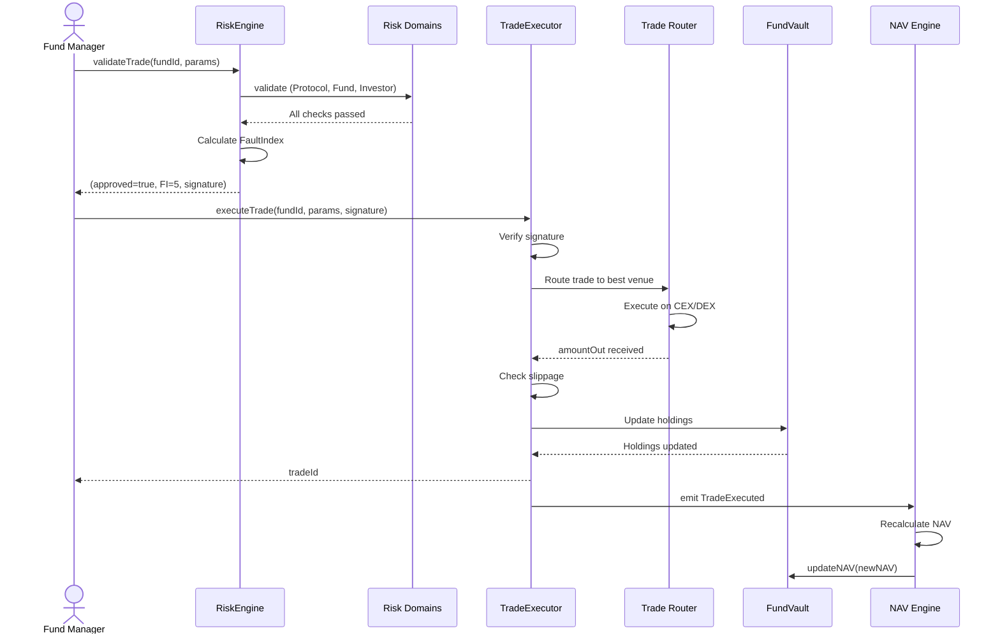

# Trade Execution Process

## Overview

Complete flow of FM executing a trade, from trade request through RiskEngine validation to final execution and NAV update.

## Participants

- **Fund Manager**: Initiates trade
- **RiskEngine**: Validates trade against all risk domains
- **FundTradeExecutor**: Executes approved trades
- **Trade Router** (off-chain): Routes to optimal venue
- **FundManagerVault**: Updates holdings
- **NAV Engine** (off-chain): Recalculates NAV

## Prerequisites

- Fund has investors (NAV > 0)
- FM has session key or uses main wallet
- Asset to trade is in allowed list
- Fund in ACTIVE status

## Step-by-Step Flow

### Step 1: FM Prepares Trade

**Contract Call**:
```typescript
const tradeParams = {
  fundId: 42,
  assetIn: USDC_ADDRESS,
  assetOut: WBTC_ADDRESS,
  amountIn: ethers.utils.parseUnits("10000", 6),  // $10k USDC
  minAmountOut: ethers.utils.parseUnits("0.24", 8),  // Min 0.24 BTC (slippage protection)
  deadline: block.timestamp + 300,  // 5 min expiry
};
```

### Step 2: Request RiskEngine Validation

**Actor**: Fund Manager

**Contract Call**:
```solidity
(bool approved, uint256 faultIndex, bytes memory signature) = 
    riskEngine.validateTrade(fundId, tradeParams);
```

**Validations**:
1. ✓ Protocol healthy (oracles, sequencer)
2. ✓ Position size ≤ PSL
3. ✓ Concentration ≤ PCL
4. ✓ Volatility ≤ max
5. ✓ Drawdown ≤ max
6. ✓ Asset in allowed list
7. ✓ Daily trade count not exceeded

**Possible Outcomes**:
- `approved = true, FI < 10`: Approve, no warning
- `approved = true, FI 10-30`: Approve with warning
- `approved = false, FI ≥ 30`: Reject + trigger slashing

**Events**: `TradeValidated(fundId, approved, faultIndex)`

**Gas Cost**: ~50,000 gas (~$0.025)

### Step 3: Execute Trade (if approved)

**Actor**: Fund Manager

**Contract Call**:
```solidity
uint256 tradeId = fundTradeExecutor.executeTrade(
    fundId,
    tradeParams,
    signature  // From RiskEngine
);
```

**Permissions**: 
- 🔒 Must be FM of fund
- 🔒 Must have valid RiskEngine signature
- 🔒 Signature must not be expired/used

**Trade Execution**:
1. Verify signature from RiskEngine
2. Call Trade Router (off-chain or DEX)
3. Validate slippage: `amountOut ≥ minAmountOut`
4. Update vault holdings
5. Emit trade event

**Events**: `TradeExecuted(fundId, tradeId, assetIn, assetOut, amountIn, amountOut)`

**Gas Cost**: ~100,000-200,000 gas (~$0.05-0.10)

### Step 4: NAV Recalculation

**Actor**: NAV Engine (automated, off-chain)

**Action**: Recalculate fund NAV after trade

**Process**:
1. Listen for `TradeExecuted` event
2. Update fund holdings in database
3. Fetch current prices for all assets
4. Calculate new NAV
5. Publish NAV on-chain

**Timing**: Within 1 minute of trade

## Success Outcome

```yaml
✓ Trade executed at acceptable price
✓ Vault holdings updated
✓ NAV recalculated
✓ Trade logged in AnalyticsHub
✓ FM can execute next trade
```

## Failure Scenarios

### Scenario 1: RiskEngine Rejects (FI ≥ 30)

**Cause**: Trade violates risk limits

**Error**: `approved = false`

**Outcome**: 
- Trade not executed
- FM slashed based on FI
- FM receives warning/ban

**Example**:
```
Trade would create 25% position
PSL = 20%
FI calculated = 45
Result: REJECTED + 5% stake slashed
```

### Scenario 2: Slippage Exceeded

**Cause**: Market moved, actual price worse than `minAmountOut`

**Error**: `revert("Slippage exceeded")`

**Recovery**: Retry with updated `minAmountOut`

### Scenario 3: Insufficient Liquidity

**Cause**: Not enough liquidity at venue

**Error**: Trade Router returns error

**Recovery**: 
- Split order across multiple venues
- Reduce trade size
- Wait for better liquidity

## Sequence Diagram



## Code Example

```typescript
async function executeTrade(fundId, assetIn, assetOut, amountIn, minAmountOut) {
  // Step 1: Prepare params
  const params = {
    fundId,
    assetIn,
    assetOut,
    amountIn,
    minAmountOut,
    deadline: Math.floor(Date.now() / 1000) + 300,
  };
  
  // Step 2: Get RiskEngine approval
  const { approved, faultIndex, signature } = await riskEngine.validateTrade(
    fundId,
    params
  );
  
  if (!approved) {
    throw new Error(`Trade rejected. FaultIndex: ${faultIndex}. Slashing may occur.`);
  }
  
  if (faultIndex >= 10) {
    console.warn(`⚠ Warning: FI = ${faultIndex}. Trade allowed but monitor closely.`);
  }
  
  // Step 3: Execute trade
  const tx = await fundTradeExecutor.executeTrade(
    fundId,
    params,
    signature
  );
  
  const receipt = await tx.wait();
  const event = receipt.events.find(e => e.event === 'TradeExecuted');
  
  console.log(`✓ Trade executed`);
  console.log(`  Sold: ${ethers.utils.formatUnits(event.args.amountIn, 6)} USDC`);
  console.log(`  Bought: ${ethers.utils.formatUnits(event.args.amountOut, 8)} BTC`);
  console.log(`  Gas: ${receipt.gasUsed.toString()}`);
  
  return event.args.tradeId;
}
```

---

**Related**: [Risk Validation Process](/protocol/processes/risk-compliance/risk-validation)

