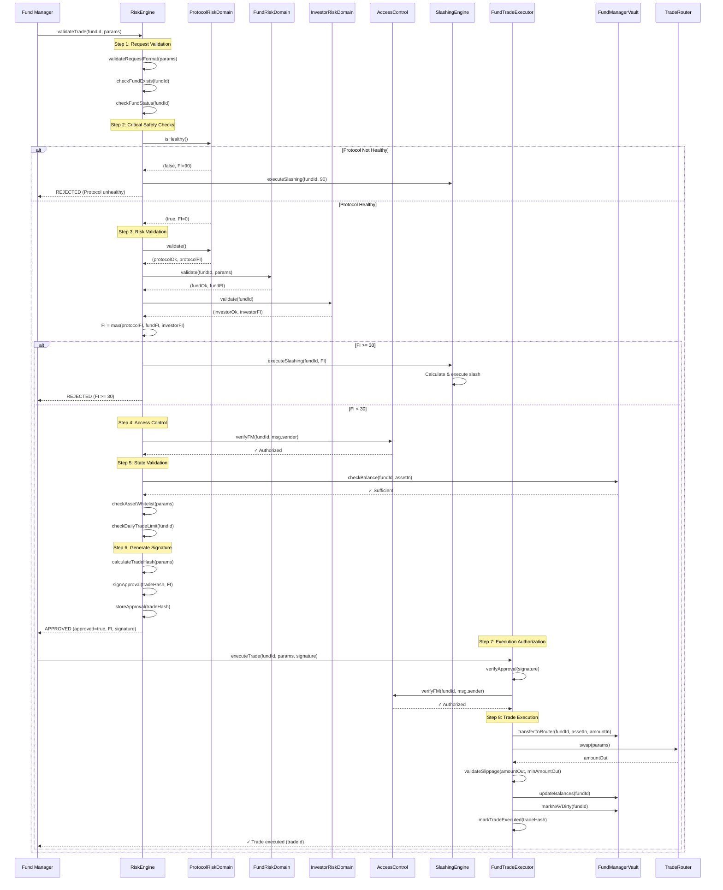

# Trade Authorization Flow

## Overview

Comprehensive documentation of the complete trade authorization flow, including all validation steps, access control checks, risk validations, and execution permissions. This flow ensures that every trade is properly authorized, validated, and executed securely.

## Authorization Flow Architecture

```
Trade Request → Critical Safety Checks → Risk Validation → Access Control → 
State Validation → Signature Generation → Execution Authorization → Trade Execution
```

## Complete Authorization Steps

### Step 1: Initial Request Validation

**Actor**: Fund Manager

**Contract Call**:
```solidity
(bool approved, uint256 faultIndex, bytes memory signature) = 
    riskEngine.validateTrade(fundId, tradeParams);
```

**Checks Performed**:

#### 1.1 Request Format Validation

```solidity
function validateRequestFormat(TradeParams calldata params) internal pure returns (bool) {
    require(params.fundId > 0, "Invalid fund ID");
    require(params.assetIn != address(0), "Invalid input asset");
    require(params.assetOut != address(0), "Invalid output asset");
    require(params.assetIn != params.assetOut, "Same asset");
    require(params.amountIn > 0, "Amount must be positive");
    require(params.minAmountOut > 0, "Min amount must be positive");
    require(params.deadline > block.timestamp, "Deadline expired");
    return true;
}
```

#### 1.2 Fund Existence Check

```solidity
require(fundRegistry.exists(fundId), "Fund not found");
```

#### 1.3 Fund Status Check

```solidity
FundStatus status = fundRegistry.getFundStatus(fundId);
require(status == FundStatus.ACTIVE, "Fund not active");
require(!fundRegistry.isPaused(fundId), "Fund paused");
require(!fundRegistry.isEmergency(fundId), "Fund in emergency");
```

### Step 2: Priority 1 - Critical Safety Checks

**Purpose**: Immutable safety checks that cannot be bypassed

#### 2.1 Protocol Health Check

```solidity
function checkProtocolHealth() internal view returns (bool, uint256 faultIndex) {
    // Check oracle connectivity
    bool oraclesHealthy = priceOracleRouter.isHealthy();
    if (!oraclesHealthy) {
        return (false, 95);  // Critical: No price data
    }
    
    // Check sequencer availability
    bool sequencerHealthy = sequencer.isOperational();
    if (!sequencerHealthy) {
        return (false, 90);  // Critical: L2 not operational
    }
    
    // Check bridge status
    bool bridgeHealthy = bridgeGateway.isOperational();
    if (!bridgeHealthy) {
        return (false, 85);  // Critical: Bridge not operational
    }
    
    // Check emergency pause
    bool notPaused = !emergencyPause.isPaused();
    if (!notPaused) {
        return (false, 100);  // Critical: Protocol paused
    }
    
    return (true, 0);
}
```

**Validation Points**:
- ✅ All price oracles responding (min 2/3 oracles)
- ✅ zkSync sequencer operational
- ✅ L1-L2 bridge operational
- ✅ Protocol not in emergency pause
- ✅ Contract addresses valid (not zero)

**Failure Action**: Immediate rejection, FI = 85-100

#### 2.2 Contract Integrity Check

```solidity
function checkContractIntegrity() internal view returns (bool) {
    require(address(fundFactory) != address(0), "Factory not set");
    require(address(riskEngine) != address(0), "RiskEngine not set");
    require(address(fundManagerVault) != address(0), "Vault not set");
    require(address(priceOracleRouter) != address(0), "Oracle not set");
    require(address(slashingEngine) != address(0), "SlashingEngine not set");
    return true;
}
```

### Step 3: Priority 2 - Risk Validation

**Purpose**: Multi-domain risk validation with FaultIndex calculation

#### 3.1 Protocol Risk Domain Validation

```solidity
(bool protocolOk, uint256 protocolFI) = protocolRiskDomain.validate();

// Checks:
// - Oracle price confidence (min 50%)
// - System-wide liquidity (sufficient)
// - Bridge stability (operational)
// - Gas price anomalies (normal range)
```

**Protocol FI Calculation**:
```
protocolFI = 0
if (oracleConfidence < 50): protocolFI = max(protocolFI, 40)
if (liquidity < threshold): protocolFI = max(protocolFI, 30)
if (bridgeUnstable): protocolFI = max(protocolFI, 50)
if (gasPriceAnomaly): protocolFI = max(protocolFI, 20)
```

#### 3.2 Fund Risk Domain Validation

```solidity
(bool fundOk, uint256 fundFI) = fundRiskDomain.validate(fundId, tradeParams);

// Checks:
// - Position Size Limit (PSL): positionSize <= PSL
// - Portfolio Concentration Limit (PCL): concentration <= PCL
// - Asset Exposure Limit (AEL): exposure <= AEL
// - Volatility limit: volatility <= maxVolatility
// - Drawdown limit: drawdown <= maxDrawdown
// - Leverage limit: leverage <= maxLeverage
// - Daily trade count: count < maxDailyTrades
// - Asset whitelist: asset in allowedAssets
```

**Fund FI Calculation**:
```
fundFI = 0

// Position Size Limit breach
if (positionSize > PSL):
    breachPercent = ((positionSize - PSL) / PSL) × 100
    fundFI = max(fundFI, min(100, breachPercent × 2))  // 50% breach = 100 FI

// Portfolio Concentration Limit breach
if (concentration > PCL):
    breachPercent = ((concentration - PCL) / PCL) × 100
    fundFI = max(fundFI, min(100, breachPercent × 1.5))

// Volatility breach
if (volatility > maxVolatility):
    breachPercent = ((volatility - maxVolatility) / maxVolatility) × 100
    fundFI = max(fundFI, min(100, breachPercent))

// Drawdown breach
if (drawdown > maxDrawdown):
    breachPercent = ((drawdown - maxDrawdown) / maxDrawdown) × 100
    fundFI = max(fundFI, min(100, breachPercent × 3))

// Asset not allowed
if (asset not in allowedAssets):
    fundFI = max(fundFI, 80)  // Critical violation
```

**Example Calculation**:
```
Trade: Buy $200,000 BTC
Fund NAV: $1,000,000
PSL: 20% ($200,000)
Current BTC Position: $150,000 (15%)
After Trade: $350,000 (35%)

Breach: 35% > 20% (PSL)
Breach %: ((35 - 20) / 20) × 100 = 75%
Fund FI: min(100, 75 × 2) = 100 (capped)

Result: fundFI = 100 (critical violation)
```

#### 3.3 Investor Risk Domain Validation

```solidity
(bool investorOk, uint256 investorFI) = investorRiskDomain.validate(fundId);

// Checks:
// - Investor state (ACTIVE/LIMITED/HIGH_RISK/FROZEN/BANNED)
// - Withdraw Behavior Ratio (WBR <= 0.5)
// - Deposit Velocity Ratio (DVR <= 0.7)
// - Loss Reaction Index (LRI <= 60)
```

**Investor FI Calculation**:
```
investorFI = 0

// State-based FI
if (investorState == LIMITED): investorFI = max(investorFI, 20)
if (investorState == HIGH_RISK): investorFI = max(investorFI, 40)
if (investorState == FROZEN): investorFI = max(investorFI, 60)
if (investorState == BANNED): investorFI = 100

// WBR breach
if (WBR > 0.5):
    investorFI = max(investorFI, min(100, (WBR - 0.5) × 200))

// DVR breach
if (DVR > 0.7):
    investorFI = max(investorFI, min(100, (DVR - 0.7) × 333))

// LRI breach
if (LRI > 60):
    investorFI = max(investorFI, min(100, (LRI - 60) × 2.5))
```

#### 3.4 Combined FaultIndex Calculation

```solidity
uint256 combinedFI = _combineFaultIndices(protocolFI, fundFI, investorFI);

function _combineFaultIndices(
    uint256 protocolFI,
    uint256 fundFI,
    uint256 investorFI
) internal pure returns (uint256) {
    // Take maximum (worst violation determines FI)
    return max(max(protocolFI, fundFI), investorFI);
}
```

**Decision Matrix**:

| Combined FI | Approval | Action |
|------------|----------|--------|
| 0-9 | ✅ Approved | No warning |
| 10-29 | ✅ Approved | Warning issued |
| 30-59 | ❌ Rejected | Slashing triggered (1-10%) |
| 60-84 | ❌ Rejected | Slashing triggered (10-50%) |
| 85-100 | ❌ Rejected | Slashing triggered (50-100%) + Ban |

### Step 4: Priority 3 - Access Control Validation

**Purpose**: Verify caller has appropriate permissions

#### 4.1 Fund Manager Identity Check

```solidity
address fundManager = fundRegistry.getFundManager(fundId);
require(fundManager == msg.sender || isSessionKey(msg.sender), "Not authorized");

// Check if session key
if (isSessionKey(msg.sender)) {
    require(sessionKeyRegistry.isValid(fundId, msg.sender), "Invalid session key");
    require(sessionKeyRegistry.notExpired(fundId, msg.sender), "Session key expired");
    require(sessionKeyRegistry.hasPermission(fundId, msg.sender, "TRADE"), "No trade permission");
}
```

#### 4.2 Fund Manager Status Check

```solidity
require(fmRegistry.isActive(fundManager), "FM not active");
require(!fmRegistry.isBanned(fundManager), "FM banned");
require(fmRegistry.hasSufficientStake(fundId), "Insufficient stake");
```

#### 4.3 Investor State Check (if applicable)

```solidity
// For trades affecting investor positions
if (affectsInvestorPositions) {
    InvestorState state = investorStateMachine.getState(investor);
    require(state == InvestorState.ACTIVE || state == InvestorState.LIMITED, "Investor not active");
}
```

### Step 5: Priority 4 - State Validation

**Purpose**: Ensure system state is consistent

#### 5.1 Fund State Validation

```solidity
FundStatus status = fundRegistry.getFundStatus(fundId);
require(status == FundStatus.ACTIVE, "Fund not active");
require(!fundRegistry.isPaused(fundId), "Fund paused");
require(!fundRegistry.isEmergency(fundId), "Fund in emergency");
require(fundManagerVault.getNAV(fundId) > 0, "Fund has zero NAV");
```

#### 5.2 Balance Sufficiency Check

```solidity
uint256 balance = fundManagerVault.getBalance(fundId, params.assetIn);
uint256 requiredAmount = params.amountIn;
require(balance >= requiredAmount, "Insufficient balance");

// Check for pending operations
uint256 pendingWithdrawals = fundManagerVault.getPendingWithdrawals(fundId);
uint256 availableBalance = balance - pendingWithdrawals;
require(availableBalance >= requiredAmount, "Insufficient available balance");
```

#### 5.3 Asset Whitelist Check

```solidity
FundConfig config = fundConfig.getFundConfig(fundId);
address[] memory allowedAssets = config.getAllowedAssets();
bool assetAllowed = false;

for (uint i = 0; i < allowedAssets.length; i++) {
    if (allowedAssets[i] == params.assetIn || allowedAssets[i] == params.assetOut) {
        assetAllowed = true;
        break;
    }
}

require(assetAllowed, "Asset not in allowed list");
```

#### 5.4 Daily Trade Limit Check

```solidity
uint256 dailyTradeCount = fundManagerVault.getDailyTradeCount(fundId);
uint256 maxDailyTrades = fundConfig.getMaxDailyTrades(fundId);
require(dailyTradeCount < maxDailyTrades, "Daily trade limit exceeded");
```

#### 5.5 Lockup Period Check

```solidity
// Check if fund allows trading during lockup
if (fundConfig.hasLockupPeriod(fundId)) {
    uint256 fundAge = block.timestamp - fundRegistry.getCreatedAt(fundId);
    uint256 lockupPeriod = fundConfig.getLockupPeriod(fundId);
    require(fundAge >= lockupPeriod, "Fund in lockup period");
}
```

### Step 6: Approval Signature Generation

**Purpose**: Generate cryptographic signature for trade approval

#### 6.1 Trade Hash Calculation

```solidity
bytes32 tradeHash = keccak256(abi.encodePacked(
    fundId,
    params.assetIn,
    params.assetOut,
    params.amountIn,
    params.minAmountOut,
    params.deadline,
    block.timestamp,
    block.number
));
```

#### 6.2 Signature Generation

```solidity
bytes memory signature = abi.encodePacked(
    tradeHash,
    combinedFI,
    block.timestamp,
    nonce
);

// Sign with RiskEngine private key
bytes memory signedSignature = _sign(signature, riskEnginePrivateKey);
```

#### 6.3 Approval Storage

```solidity
approvedTrades[tradeHash] = true;
tradeFaultIndex[tradeHash] = combinedFI;
```

**Approval Signature Structure**:
```
signature = {
    tradeHash: bytes32,
    faultIndex: uint256,
    timestamp: uint256,
    nonce: uint256,
    riskEngineSignature: bytes
}
```

### Step 7: Execution Authorization

**Purpose**: Verify approval signature before execution

#### 7.1 Signature Verification

```solidity
function verifyApproval(
    bytes32 tradeHash,
    bytes memory signature
) internal view returns (bool) {
    // Verify trade hash matches
    require(approvedTrades[tradeHash], "Trade not approved");
    
    // Verify signature from RiskEngine
    address signer = _recoverSigner(tradeHash, signature);
    require(signer == address(riskEngine), "Invalid signature");
    
    // Verify not expired
    uint256 approvalTime = tradeApprovalTime[tradeHash];
    require(block.timestamp - approvalTime < APPROVAL_EXPIRY, "Approval expired");
    
    // Verify not used
    require(!tradeExecuted[tradeHash], "Trade already executed");
    
    return true;
}
```

#### 7.2 Nonce Verification

```solidity
require(tradeNonce[fundId] == nonce, "Invalid nonce");
tradeNonce[fundId]++;
```

### Step 8: Trade Execution

**Purpose**: Execute approved trade

#### 8.1 Final Validation

```solidity
// Re-verify all critical checks
require(fundRegistry.getFundStatus(fundId) == FundStatus.ACTIVE, "Fund not active");
require(fundManagerVault.getBalance(fundId, params.assetIn) >= params.amountIn, "Insufficient balance");
require(block.timestamp <= params.deadline, "Deadline expired");
```

#### 8.2 Execute Swap

```solidity
// Transfer input asset to router
fundManagerVault.transferToRouter(fundId, params.assetIn, params.amountIn);

// Execute swap via router
uint256 amountOut = tradeRouter.swap(
    params.assetIn,
    params.assetOut,
    params.amountIn,
    params.minAmountOut,
    fundManagerVault.getVaultAddress(fundId)
);

// Validate slippage
require(amountOut >= params.minAmountOut, "Slippage exceeded");

// Update vault holdings
fundManagerVault.updateBalance(fundId, params.assetIn, balance - params.amountIn);
fundManagerVault.updateBalance(fundId, params.assetOut, balance + amountOut);

// Mark as executed
tradeExecuted[tradeHash] = true;

// Increment daily trade count
fundManagerVault.incrementDailyTradeCount(fundId);

// Mark NAV as dirty (requires recalculation)
fundManagerVault.markNAVDirty(fundId);
```

## Complete Authorization Flow Diagram



## Authorization Decision Tree

```
Trade Request
    │
    ├─ Request Format Valid? ── NO → REJECT (Format Error)
    │                                │
    │                               YES
    │                                │
    ├─ Protocol Healthy? ── NO → REJECT + SLASH (FI=90)
    │                            │
    │                           YES
    │                            │
    ├─ Risk Validation
    │   │
    │   ├─ Protocol Risk OK? ── NO → REJECT + SLASH (protocolFI)
    │   │                          │
    │   │                         YES
    │   │                          │
    │   ├─ Fund Risk OK? ── NO → REJECT + SLASH (fundFI)
    │   │                      │
    │   │                     YES
    │   │                      │
    │   └─ Investor Risk OK? ── NO → REJECT + SLASH (investorFI)
    │                              │
    │                             YES
    │                              │
    ├─ FI Calculation ── FI >= 30 → REJECT + SLASH
    │                   │
    │                  FI < 30
    │                   │
    ├─ Access Control
    │   │
    │   ├─ FM Authorized? ── NO → REJECT (Access Denied)
    │   │                      │
    │   │                     YES
    │   │                      │
    │   ├─ FM Active? ── NO → REJECT (FM Inactive)
    │   │                  │
    │   │                 YES
    │   │                  │
    │   └─ Sufficient Stake? ── NO → REJECT (Insufficient Stake)
    │                              │
    │                             YES
    │                              │
    ├─ State Validation
    │   │
    │   ├─ Fund Active? ── NO → REJECT (Fund Inactive)
    │   │                    │
    │   │                   YES
    │   │                    │
    │   ├─ Sufficient Balance? ── NO → REJECT (Insufficient Balance)
    │   │                            │
    │   │                           YES
    │   │                            │
    │   ├─ Asset Allowed? ── NO → REJECT (Asset Not Allowed)
    │   │                       │
    │   │                      YES
    │   │                       │
    │   └─ Trade Limit OK? ── NO → REJECT (Limit Exceeded)
    │                              │
    │                             YES
    │                              │
    ├─ Generate Signature
    │   │
    │   └─ Sign & Store Approval
    │                              │
    └─ APPROVED → Return (approved=true, FI, signature)
```

## Error Handling & Rejection Reasons

| Error Code | Reason | FI Impact | Action |
|------------|--------|-----------|--------|
| `INVALID_REQUEST` | Request format invalid | 0 | Reject immediately |
| `PROTOCOL_UNHEALTHY` | Protocol not operational | 90 | Reject + Slash |
| `PROTOCOL_RISK` | Protocol-level risk detected | 40-100 | Reject + Slash (if FI ≥ 30) |
| `FUND_RISK` | Fund-level limit breach | 30-100 | Reject + Slash (if FI ≥ 30) |
| `INVESTOR_RISK` | Investor-level risk detected | 20-100 | Reject + Slash (if FI ≥ 30) |
| `ACCESS_DENIED` | FM not authorized | 0 | Reject immediately |
| `FM_INACTIVE` | FM not active/banned | 0 | Reject immediately |
| `INSUFFICIENT_STAKE` | FM stake too low | 0 | Reject immediately |
| `FUND_INACTIVE` | Fund not active/paused | 0 | Reject immediately |
| `INSUFFICIENT_BALANCE` | Insufficient fund balance | 0 | Reject immediately |
| `ASSET_NOT_ALLOWED` | Asset not in whitelist | 80 | Reject + Slash |
| `TRADE_LIMIT_EXCEEDED` | Daily trade limit exceeded | 0 | Reject immediately |

## Authorization Cache & Optimization

### Approval Caching

```solidity
mapping(bytes32 => ApprovalCache) public approvalCache;

struct ApprovalCache {
    bool approved;
    uint256 faultIndex;
    uint256 cachedAt;
    bytes memory signature;
    uint256 expiryTime;
}

// Cache valid for 5 minutes
uint256 constant CACHE_DURATION = 300;

function getCachedApproval(bytes32 tradeHash) external view returns (bool, uint256, bytes memory) {
    ApprovalCache memory cache = approvalCache[tradeHash];
    
    if (cache.approved && block.timestamp < cache.expiryTime) {
        return (cache.approved, cache.faultIndex, cache.signature);
    }
    
    return (false, 0, "");
}
```

### Gas Optimization

```
Standard Flow: ~150,000 gas
Cached Flow: ~30,000 gas
Savings: ~80% for repeated trades
```

## Security Guarantees

1. **No Bypass**: All checks must pass, cannot skip any step
2. **Immutable Critical Checks**: Priority 1 checks cannot be modified
3. **Deterministic FI**: Same input always produces same FI
4. **Atomic Execution**: Either all checks pass or trade rejected
5. **Nonce Protection**: Prevents replay attacks
6. **Signature Verification**: Cryptographic proof of approval
7. **State Consistency**: All state checks validated before execution

---

**Related**: [Execution Priority Layer](/protocol/architecture/execution-priority-layer), [RiskEngine](/protocol/contracts/risk/RiskEngine), [FundTradeExecutor](/protocol/contracts/fund/FundTradeExecutor)

