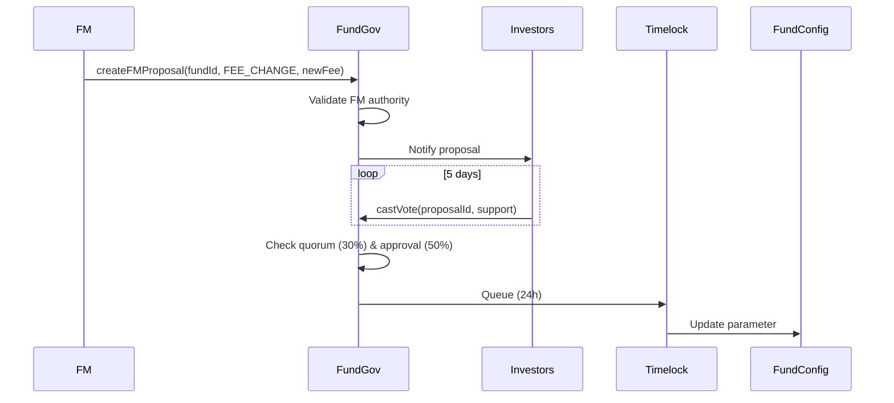

# Fund Configuration Update Process

## Overview

FM or investors propose changes to fund parameters via fund-level governance.

## Flow

## Key Steps

1. **FM creates proposal**: `fundGovernance.createFMProposal()`
2. **Investors vote** (5 days, share-based voting)
3. **Quorum check**: ≥30% shares voted
4. **Approval check**: >50% voted for
5. **Timelock**: 24-48h delay
6. **Execution**: Parameter updated in FundConfig

## Errors

- `Not fund manager`: Only FM can propose
- `Invalid parameter`: New value outside tier limits
- `Quorum not met`: Less than 30% voted
- `Not approved`: Less than 50% for

---

**Related**: [Fund Governance](/docs/protocol/processes/governance/fund-proposal)

