# Fund-Level Proposal Process

## Overview

FM or investor proposes change to fund parameters. Only investors in that fund vote.

## Process Flow

```mermaid
sequenceDiagram
    actor Proposer as FM or Investor
    participant FG as FundGovernance
    participant Investors
    participant TL as Timelock
    participant FC as FundConfig
    
    Proposer->>FG: createProposal(fundId, type, newValue)
    FG->>FG: Validate proposer (FM or ≥1% shares)
    FG->>Investors: Notify (5-day voting)
    loop Voting Period
        Investors->>FG: castVote(proposalId, support)
    end
    FG->>FG: Check quorum (30%) & approval (50%)
    alt Passed
        FG->>TL: Queue (24h delay)
        TL->>FC: Execute change
        FC->>Investors: Notify execution
    else Failed
        FG->>FG: Mark DEFEATED
    end
```



## Example: Fee Change

```typescript
// FM proposes reducing management fee from 2% to 1.5%
await fundGovernance.createFMProposal(
  fundId: 42,
  proposalType: ProposalType.FEE_CHANGE,
  newValue: 150,  // 1.5% in basis points
  title: "Reduce management fee",
  description: "To be more competitive..."
);

// Investors vote
await fundGovernance.connect(investor1).castVote(proposalId, 1);  // For
await fundGovernance.connect(investor2).castVote(proposalId, 0);  // Against

// After 5 days, if quorum met and approved:
await fundGovernance.queue(proposalId);

// After 24h timelock:
await fundGovernance.execute(proposalId);

// Fee now 1.5%
```

## Voting Power

**Share-based** (not TOSS):
```
Voting Power = Investor Shares / Total Fund Shares

Example:
- Investor A: 1,000 / 10,000 = 10%
- Investor B: 500 / 10,000 = 5%
```

---

**Related**: [FundGovernance](/protocol/contracts/governance/FundGovernance)

