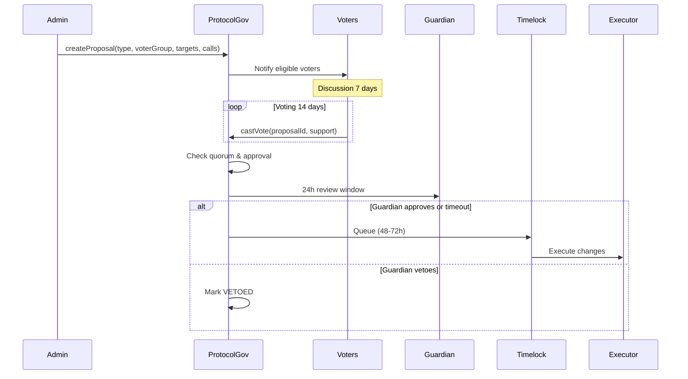

# Protocol-Level Proposal Process

## Overview

Admin creates protocol-wide proposal and specifies voter group (FM_ONLY, INVESTOR_ONLY, BOTH, or GUARDIAN).

## Process



## Voter Group Selection

Admin decides who votes based on proposal impact:

```typescript
if (affects === 'FMs primarily') voterGroup = VoterGroup.FM_ONLY;
if (affects === 'Investors primarily') voterGroup = VoterGroup.INVESTOR_ONLY;
if (affects === 'Everyone') voterGroup = VoterGroup.BOTH;
if (emergency) voterGroup = VoterGroup.GUARDIAN_ONLY;
```

## Examples

**Oracle Config** → BOTH (affects everyone)
**Slashing Formula** → FM_ONLY (affects FMs)
**Protocol Fee** → INVESTOR_ONLY (investors pay fees)

---

**Related**: [ProtocolGovernance](/protocol/contracts/governance/ProtocolGovernance)

