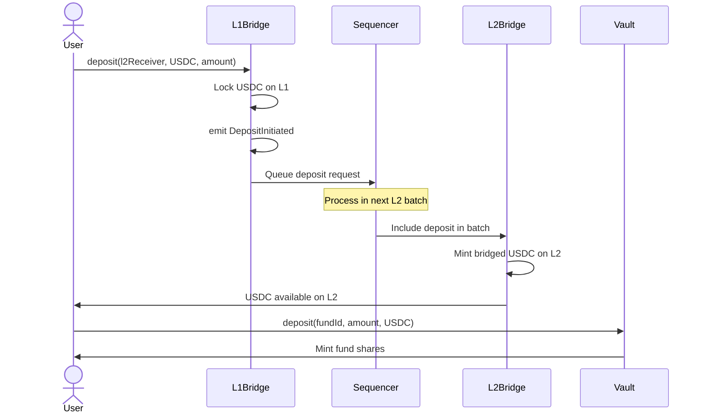

# L1 to L2 Deposit Process

## Overview

Complete flow for depositing assets from Ethereum L1 to zkSync L2 for TOSS fund investment.

## Participants

- **User** (on L1)
- **L1 Bridge** (Ethereum mainnet)
- **zkSync Sequencer**
- **L2 Bridge** (zkSync L2)
- **FundManagerVault** (L2)

## Process Flow



## Step-by-Step

### Step 1: User Approves USDC on L1

```solidity
// On Ethereum L1
await USDC_L1.approve(L1Bridge.address, amount);
```

**Gas Cost (L1)**: ~45,000 gas (~$5-20 depending on L1 gas price)

### Step 2: User Calls L1 Bridge Deposit

```solidity
await L1Bridge.deposit{value: l2GasFee}(
    l2Receiver,           // User's L2 address
    USDC_L1,             // USDC address on L1
    amount,              // Amount to bridge
    l2GasLimit,          // Gas for L2 transaction
    l2GasPerPubdata      // Gas per pubdata byte
);
```

**Parameters**:
- `l2GasFee`: ETH sent for L2 gas (refunded if excess)
- `l2GasLimit`: Typically 200,000
- `l2GasPerPubdata`: Current rate (check zkSync)

**Gas Cost (L1)**: ~150,000 gas (~$15-75)

### Step 3: L1 Bridge Locks USDC

**Action**: Bridge contract holds USDC on L1

**State**: USDC locked, deposit request queued

**Event**: `DepositInitiated(l1Sender, l2Receiver, amount)`

### Step 4: zkSync Sequencer Processes

**Timing**: 1-5 minutes (next L2 batch)

**Action**:
- Sequencer picks up deposit from L1 queue
- Includes in L2 batch
- Submits batch with deposit

### Step 5: L2 Bridge Mints USDC

**Action**: L2 bridge mints equivalent USDC on L2

**State**: User now has USDC on zkSync L2

**Event**: `DepositFinalized(l2Receiver, amount)`

### Step 6: User Deposits to Fund (L2)

Now on zkSync L2 (cheap!):

```solidity
await USDC_L2.approve(vault.address, amount);
await vault.deposit(fundId, amount, USDC_L2);
```

**Gas Cost (L2)**: ~50,000 gas (~$0.025)

## Total Timing

```
L1 Approval: ~15 seconds (1 block)
L1 Deposit: ~15 seconds (1 block)
L1 Finality: ~5-10 minutes (32 blocks)
zkSync Processing: ~2-5 minutes
L2 Mint: ~1 second
L2 Fund Deposit: ~1 second

Total: ~10-20 minutes L1→L2→Fund
```

## Total Cost

```
L1 Operations: $20-100 (gas dependent)
L2 Operations: $0.025
L2 Gas Fee: ~$0.50 (prepaid on L1)

Total: ~$20-100 (mostly L1 gas)
```

## Failure Scenarios

### L1 Transaction Fails

**Cause**: Insufficient gas, approval missing

**Result**: USDC not transferred, user keeps funds

**Recovery**: Fix issue, retry

### L2 Gas Insufficient

**Cause**: L2 gas limit too low

**Result**: Deposit stuck in L1 bridge

**Recovery**: Submit L2 transaction manually with higher gas

### User Error in L2 Address

**Cause**: Wrong l2Receiver address

**Result**: USDC sent to wrong L2 address

**Prevention**: UI double-checks address, warning shown

**Recovery**: If user controls L2 address, can recover. Otherwise, funds lost.

---

**Related**: [BridgeGateway](/protocol/contracts/core/BridgeGateway), [L1-L2 Communication](/protocol/architecture/l1-l2-communication)

