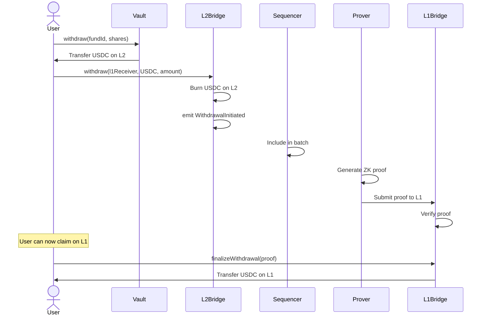

# L2 to L1 Withdrawal Process

## Overview

Withdraw funds from zkSync L2 back to Ethereum L1 with proof generation and verification.

## Process Flow



## Timing

```
L2 Withdrawal Request: Instant
L2 Batch Inclusion: 1-5 minutes
ZK Proof Generation: 1-4 hours
L1 Proof Submission: 15 seconds
L1 Claim: 15 seconds

Total: ~1-4 hours L2→L1
```

## Costs

```
L2 Withdrawal: ~50,000 gas (~$0.025)
L1 Claim: ~200,000 gas (~$20-100)

Total: ~$20-100 (mostly L1)
```

## Fast Bridge (Future)

Liquidity providers can fulfill withdrawal instantly for small fee:
- Instant: 1-5 minutes
- Fee: 0.1-0.3%
- LP gets repaid when proof settles

---

**Related**: [L1-L2 Communication](/protocol/architecture/l1-l2-communication)

