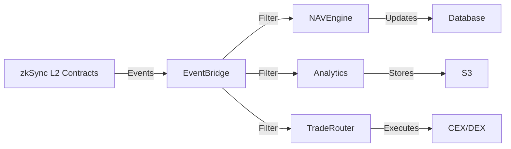

# Off-Chain Service Synchronization

## Overview

How off-chain services (NAV Engine, Analytics Hub) stay synchronized with on-chain state via event indexing.

## Event-Driven Architecture



## Key Events Subscribed

### NAV Engine Subscribes To:

- `TradeExecuted`: Recalculate NAV
- `Deposit`: Update fund AUM
- `Withdrawal`: Update fund AUM
- `FundCreated`: Initialize tracking

### Analytics Hub Subscribes To:

- `NAVUpdated`: Store snapshot
- `TradeExecuted`: Log trade
- `SlashingTriggered`: Record violation
- All events for comprehensive history

### Trade Router Subscribes To:

- Trade requests from FMs
- RiskEngine approvals
- Execution confirmations

## Synchronization Process

```typescript
// Event listener example
contract.on('TradeExecuted', async (fundId, tradeId, assetIn, assetOut, amountIn, amountOut, event) => {
  // Update database
  await db.query(`
    UPDATE fund_holdings 
    SET ${assetIn}_balance = ${assetIn}_balance - ${amountIn},
        ${assetOut}_balance = ${assetOut}_balance + ${amountOut}
    WHERE fund_id = ${fundId}
  `);
  
  // Recalculate NAV
  const newNAV = await calculateNAV(fundId);
  
  // Publish NAV on-chain
  await vault.updateNAV(fundId, newNAV);
});
```

## Failure Handling

**Event Miss**: Replay from last synced block
**Database Down**: Queue events, process when recovered
**Network Issue**: Retry with exponential backoff

---

**Integration Processes Complete!**

