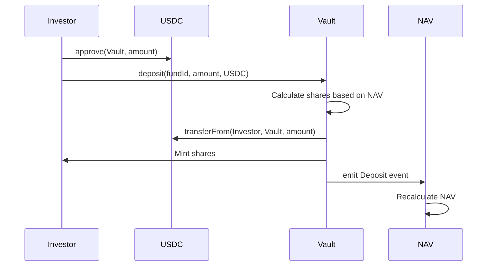

# Investor Deposit Process

## Overview

Investor deposits capital into a fund and receives shares based on current NAV.

## Flow



## Key Steps

**Step 1**: Approve USDC to vault
**Step 2**: Call `vault.deposit(fundId, amount, asset)`
**Step 3**: Vault calculates shares:
```
If first deposit: shares = amount (1:1)
Else: shares = (amount × totalShares) / currentNAV
```
**Step 4**: Vault mints shares to investor
**Step 5**: NAV updated

## Share Calculation Example

```
Scenario: Fund has NAV = $1M, Total Shares = 1M

Investor A deposits $100k:
shares = (100,000 × 1,000,000) / 1,000,000 = 100,000 shares

Investor A now owns 100k / 1.1M = 9.09% of fund
```

## Gas Cost

~50,000 gas (~$0.025 on zkSync)

## Errors

- `Asset not allowed`: Trying to deposit non-approved asset
- `Below minimum`: Amount less than minInvestment
- `Fund paused`: Fund not accepting deposits
- `Max investors reached`: Fund at capacity

---

**Next**: [Withdrawal Process](/protocol/processes/investor/withdraw)

