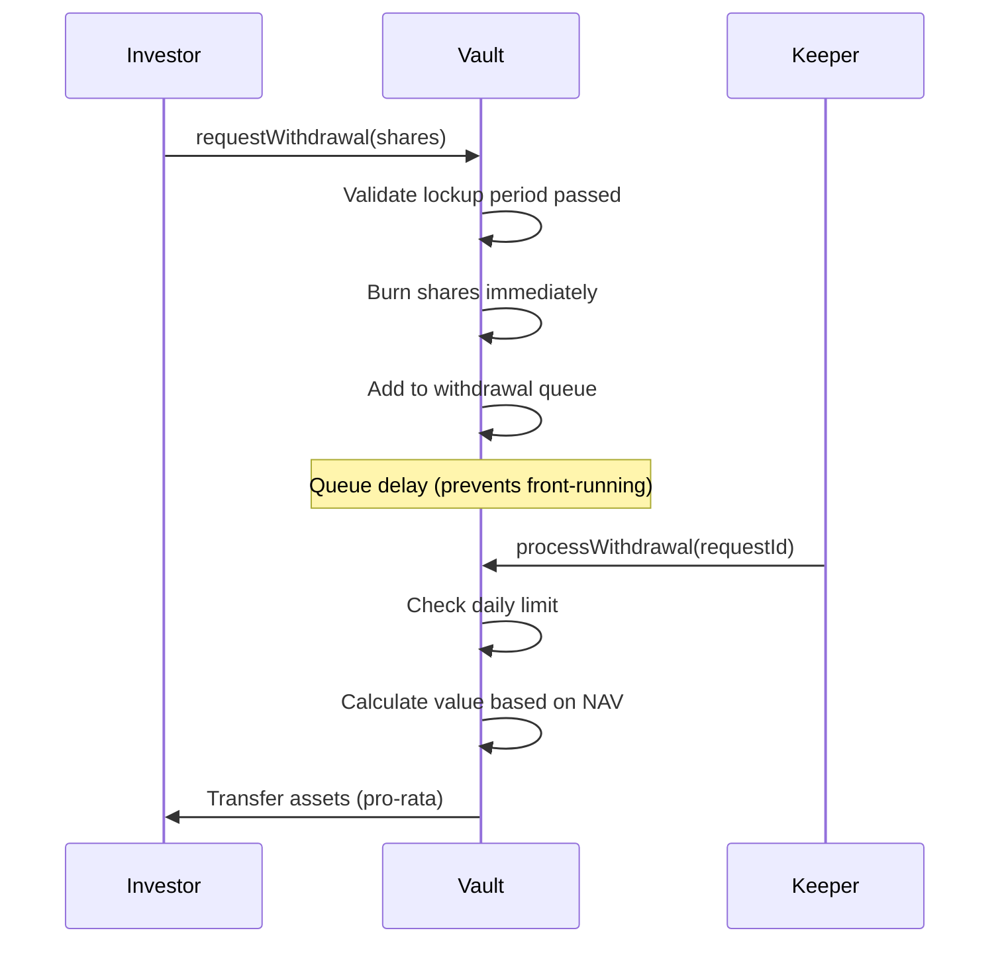

# Investor Withdrawal Process

## Overview

Two-step withdrawal: request (queued) → process (executed)

## Flow



## Key Steps

### Step 1: Request Withdrawal

```solidity
uint256 requestId = vault.requestWithdrawal(shares);
```

**Validations**:
- Owns shares
- Lockup period passed
- Not in FROZEN state

**Result**: Shares burned immediately (prevents double-withdrawal)

### Step 2: Process Withdrawal

```solidity
// Anyone can process (keeper network)
uint256 amount = vault.processWithdrawal(requestId);
```

**Checks**:
- Request exists
- Daily withdrawal limit not exceeded
- Sufficient liquidity in vault

**Assets Transferred**: Pro-rata across all held assets

## Timing

Request → Processing delay: 0-24 hours
Total time: Instant to 24 hours

## Fees

Withdrawal fee applied (if configured): 0-2%

---

**Related**: [Emergency Exit](/docs/protocol/processes/investor/emergency-exit)

