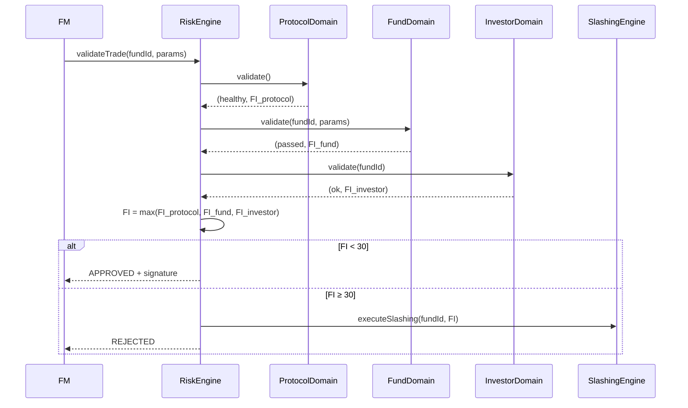

# Risk Validation Process

## Overview

Every trade passes through RiskEngine, which coordinates three risk domains to calculate FaultIndex and approve/reject trades.

## Flow



## FaultIndex Calculation

```
FI = 0.45×L + 0.25×B + 0.20×D + 0.10×I

L = Limit Breach (0-100)
B = Behavior Anomaly (0-100)
D = Damage Ratio (0-100)
I = Intent Probability (0-100)
```

## Decision Matrix

| FI Range | Action | Slash % |
|----------|--------|---------|
| 0-10 | Approve, no warning | 0% |
| 10-30 | Approve with warning | 0% |
| 30-60 | Reject + Slash | 1-10% |
| 60-85 | Reject + Slash | 10-50% |
| 85-100 | Reject + Slash + Ban | 50-100% |

---

**Related**: [Slashing Process](/docs/protocol/processes/risk-compliance/slashing-execution)

