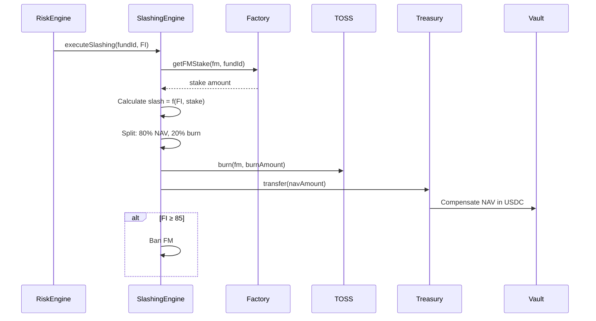

# Slashing Execution Process

## Overview

Automated slashing of FM stake when FaultIndex exceeds threshold, with burn and NAV compensation split.

## Trigger

FaultIndex ≥ 30 (slashing threshold)

## Process



## Calculation

```
Slash Ratio = f(FI):
  FI 30-60: 1-10% (linear)
  FI 60-85: 10-50% (linear)
  FI 85-100: 50-100% (linear)

Slash Amount = min(stake × ratio, fundLoss, totalStake)

Burn = SlashAmount × 20%
NAV Compensation = SlashAmount × 80%
```

## Example

```
FM Stake: 10,000 TOSS
FI: 50 (moderate violation)
Slash Ratio: 7%

Slash Amount = 10,000 × 0.07 = 700 TOSS
Burned: 700 × 0.2 = 140 TOSS (removed from supply)
To NAV: 700 × 0.8 = 560 TOSS (converted to USDC, added to fund)
```

## Outcomes

- Deflationary (supply decreases)
- Investor protection (NAV compensated)
- FM punishment (stake reduced)
- Ban if FI ≥ 85

---

**Related**: [RiskEngine](/protocol/contracts/risk/RiskEngine), [SlashingEngine](/protocol/contracts/risk/SlashingEngine)

