# NAV Update Process

## Overview

Automated hourly calculation and on-chain publication of fund Net Asset Value.

## Participants

- **NAV Engine** (off-chain): Calculates NAV
- **Price Oracles**: Provide asset prices
- **FundManagerVault**: Provides holdings
- **AnalyticsHub**: Stores NAV history

## Process Flow

```mermaid
sequenceDiagram
    participant Cron as Cron Job
    participant NAV as NAV Engine
    participant Oracle as PriceOracleRouter
    participant Vault as FundVault
    participant Hub as AnalyticsHub
    
    Cron->>NAV: Trigger (every hour)
    NAV->>Vault: getHoldings(fundId)
    Vault-->>NAV: [BTC: 10, ETH: 100, USDC: 50k]
    NAV->>Oracle: getPrice(BTC)
    Oracle-->>NAV: $42,000
    NAV->>Oracle: getPrice(ETH)
    Oracle-->>NAV: $2,200
    NAV->>NAV: Calculate NAV
    Note over NAV: NAV = (10×42k) + (100×2.2k) + 50k<br/>= 420k + 220k + 50k = $690k
    NAV->>Vault: updateNAV(fundId, 690000)
    NAV->>Hub: recordNAV(fundId, 690000)
    Hub-->>NAV: NAV recorded
```



## Calculation Formula

```
NAV = Σ(holdings[asset] × price[asset]) - liabilities

Where:
- holdings: Current balance of each asset in vault
- price: Multi-oracle median price (USD)
- liabilities: Outstanding fees, pending withdrawals
```

## Step-by-Step

### Step 1: Fetch Holdings

```typescript
const holdings = await vault.getAllHoldings(fundId);
// Returns: [{asset: WBTC, amount: 10}, {asset: WETH, amount: 100}, ...]
```

### Step 2: Get Prices

```typescript
const prices = {};
for (const holding of holdings) {
  const { price, confidence } = await priceOracle.getPrice(holding.asset);
  
  if (confidence < 50) {
    throw new Error(`Low confidence price for ${holding.asset}`);
  }
  
  prices[holding.asset] = price;
}
```

### Step 3: Calculate NAV

```typescript
let nav = 0;

for (const holding of holdings) {
  const value = holding.amount * prices[holding.asset];
  nav += value;
}

// Subtract liabilities
const pendingFees = await vault.getPendingFees(fundId);
const pendingWithdrawals = await vault.getPendingWithdrawals(fundId);

nav = nav - pendingFees - pendingWithdrawals;
```

### Step 4: Publish On-Chain

```solidity
await vault.updateNAV(fundId, nav);
```

**Access Control**: 🔒 Only NAV Engine

**Events**: `NAVUpdated(fundId, oldNAV, newNAV, timestamp)`

### Step 5: Update High Water Mark

```solidity
if (newNAV > highWaterMark) {
    highWaterMark = newNAV;
    emit HighWaterMarkUpdated(fundId, newNAV);
}
```

### Step 6: Record in AnalyticsHub

```solidity
await analyticsHub.recordNAV(fundId, nav, block.timestamp);
```

**Purpose**: Historical tracking, charts, performance analysis

## Frequency

- **Standard**: Every 1 hour
- **High Volatility**: Every 15 minutes
- **Emergency**: Real-time (on each trade)

## Error Handling

### Oracle Failure

**Detection**: Price confidence < 50% or deviation > 10%

**Action**:
1. Use cached price (max 1 hour old)
2. Mark NAV as "estimated"
3. Alert monitoring
4. Trigger circuit breaker if persists

### Calculation Error

**Detection**: NAV suddenly changes > 30% without trades

**Action**:
1. Don't publish suspicious NAV
2. Alert team
3. Investigate
4. Recalculate manually

### Network Failure

**Detection**: Cannot publish on-chain

**Action**:
1. Retry 3 times with exponential backoff
2. Cache NAV off-chain
3. Publish when network recovers
4. May skip update (non-critical if < 1% change)

## Timing & Gas

**Frequency**: Every 60 minutes
**Gas Cost**: ~30,000 gas per update (~$0.015)
**Monthly Cost**: ~720 updates × $0.015 = ~$10.80 per fund

**For 100 funds**: ~$1,080/month in NAV update gas

## Security Considerations

**Attack: Price Oracle Manipulation**
- **Risk**: Fake price inflates NAV
- **Mitigation**: Multi-source oracle, deviation limits, circuit breakers
- **Severity**: High → Mitigated

**Attack: NAV Inflation Before Withdrawal**
- **Risk**: FM manipulates NAV timing
- **Mitigation**: Hourly automatic updates, withdrawal queue delays
- **Severity**: Medium → Mitigated

---

**Related**: [PriceOracleRouter](/docs/protocol/contracts/utilities/PriceOracleRouter)

