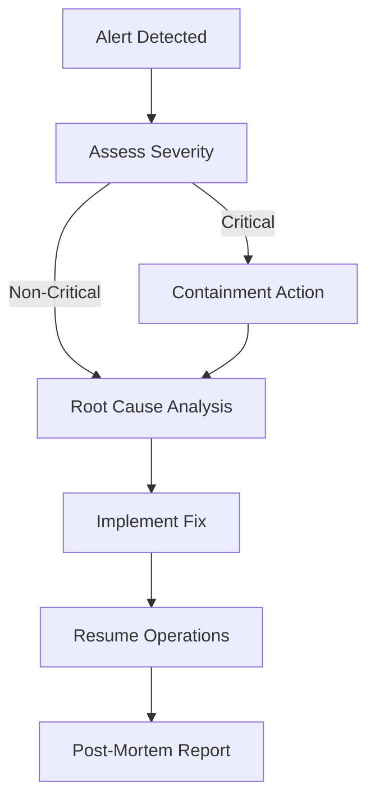

# Security Overview

Comprehensive security architecture of the TOSS Protocol, covering threat models, security layers, attack mitigations, and operational security procedures.

## Security Layers

TOSS implements defense-in-depth with multiple security layers:

```
Layer 1: Cryptographic Security (zkSync validity proofs)
Layer 2: Smart Contract Security (audited code, formal verification)
Layer 3: Economic Security (staking, slashing)
Layer 4: Oracle Security (multi-source, deviation detection)
Layer 5: Operational Security (monitoring, access controls)
```

Each layer provides independent protection, ensuring security even if one layer is compromised.

## Threat Model

### Threat Actors

1. **Malicious Fund Managers**: Attempting to drain investor funds
2. **Malicious Investors**: Coordinating attacks or exploiting mechanics
3. **External Attackers**: Exploiting smart contract vulnerabilities
4. **Oracle Manipulators**: Feeding false price data
5. **Governance Attackers**: Attempting to capture protocol control

### Attack Vectors

| Vector | Severity | Mitigation |
|--------|----------|-----------|
| Smart contract exploit | Critical | Audits, formal verification, bug bounty |
| Oracle manipulation | High | Multi-source oracles, deviation limits |
| FM fund drain | High | Staking, slashing, RiskEngine limits |
| Governance capture | Medium | Multi-domain DAO, timelocks, limits |
| Flash loan attack | Medium | Snapshot-based voting, balance checks |
| Withdrawal bank run | Medium | Daily limits, time-weighted fees |

## Cryptographic Security (Layer 1)

### zkSync Validity Proofs

```
Security Property: Impossible to commit invalid L2 state to L1

Guarantee: Every state transition is proven correct
Strength: Cryptographic (ZK-SNARK)
Trust Assumption: Math is correct (vs trusting validators)
```

**Key Benefits**:
- No fraud detection period needed
- Instant finality once proven
- Ethereum-level security inherited
- No game-theoretic assumptions

### State Root Verification

```solidity
// L1 verifies zkSync proofs
function verifyBatch(
    uint256 batchNumber,
    bytes calldata proof,
    bytes32 stateRoot
) external {
    require(zkVerifier.verify(proof, stateRoot), "Invalid proof");
    committedBatchRoots[batchNumber] = stateRoot;
    emit BatchVerified(batchNumber, stateRoot);
}
```

## Smart Contract Security (Layer 2)

### Domain Isolation

```
Core Domain ✗→ Fund Domain
Fund Domain ✗→ Governance Domain
Risk Domain ✗→ Investor Domain

All cross-domain communication through controlled interfaces
```

**Isolation Guarantees**:
- Exploit in one domain cannot directly affect others
- Access control strictly enforced
- Events emitted for all cross-domain calls

### Access Control Matrix

| Function | FM | Investor | DAO | Guardian | RiskEngine |
|----------|-----|----------|-----|----------|------------|
| Create Fund | ✓ | ✗ | ✗ | ✗ | ✗ |
| Execute Trade | ✓ | ✗ | ✗ | ✗ | Must approve |
| Deposit to Fund | ✗ | ✓ | ✗ | ✗ | ✗ |
| Update Parameters | ✗ | ✗ | ✓ | ✗ | ✗ |
| Emergency Pause | ✗ | ✗ | ✓ | ✓ | ✓ |
| Execute Slashing | ✗ | ✗ | ✗ | ✗ | ✓ |

### Reentrancy Protection

```solidity
// All external calls protected
modifier nonReentrant() {
    require(!_locked, "Reentrant call");
    _locked = true;
    _;
    _locked = false;
}

// Checks-Effects-Interactions pattern
function withdraw(uint256 amount) external nonReentrant {
    // Checks
    require(balances[msg.sender] >= amount, "Insufficient balance");
    
    // Effects (state changes first)
    balances[msg.sender] -= amount;
    totalBalance -= amount;
    
    // Interactions (external calls last)
    IERC20(asset).safeTransfer(msg.sender, amount);
}
```

### Audit Requirements

#### Pre-Launch Audits

- **Minimum 2 independent audits** by reputable firms
- Firms: Trail of Bits, OpenZeppelin, Zellic, Quantstamp, Consensys Diligence
- Scope: All core contracts, particularly RiskEngine and Vaults

#### Continuous Security

```yaml
Bug Bounty Program:
  Critical (funds at risk): $100,000 - $500,000
  High (protocol disruption): $25,000 - $100,000
  Medium (degraded UX): $5,000 - $25,000
  Low (informational): $1,000 - $5,000

Formal Verification:
  Contracts: RiskEngine, SlashingEngine, FundManagerVault
  Properties: Safety, liveness, fund isolation
  Tools: Certora, K Framework
```

## Economic Security (Layer 3)

### Staking as Security Budget

```
FM Security Budget = Total FM Stakes = Σ(FM_i_Stake)
Protocol Security = min(Economic_Attack_Cost, Cryptographic_Security)

Economic_Attack_Cost ≥ Max_Exploitable_Value
```

**Example**:
```
Total TVL: $100M
Total FM Stakes: $10M in TOSS
Max Single Fund: $5M

Attack Profitability:
- Gain: $5M (drain one fund)
- Cost: $500K+ (stake for that fund, slashed 100%)
- Result: Profitable if stake < gain

Mitigation:
- Require stake ≥ 20% of max single-trade impact
- Multiple risk checks before execution
- Gradual deposit limits for new funds
```

### Slashing as Deterrent

```
Violation Severity → FaultIndex → Slashing % → Burned + Compensate NAV

Expected Value for FM:
E(Malicious) = P(success) × Gain - P(caught) × Stake

Design Goal: Make E(Malicious) always negative
```

**Slashing Categories**:
```
Minor (FI 0.1-0.3):   1-10% stake
Moderate (FI 0.3-0.6): 10-20% stake
Major (FI 0.6-0.85):   20-50% stake
Critical (FI >0.85):   50-100% stake + permanent ban
```

## Oracle Security (Layer 4)

### Multi-Source Architecture

```
Price Feeds:
├─ Primary: Chainlink (trusted, decentralized)
├─ Secondary: Binance API (CEX, high liquidity)
├─ Tertiary: Coinbase API (CEX, compliance-focused)
└─ Fallback: Uniswap TWAP (DEX, manipulation-resistant)

Final Price = median([Primary, Secondary, Tertiary, Fallback])
```

### Deviation Detection

```solidity
function validatePrice(address asset) internal view returns (uint256) {
    uint256[] memory prices = new uint256[](4);
    prices[0] = chainlinkOracle.getPrice(asset);
    prices[1] = binanceOracle.getPrice(asset);
    prices[2] = coinbaseOracle.getPrice(asset);
    prices[3] = uniswapTWAP.getPrice(asset);
    
    uint256 median = _calculateMedian(prices);
    
    // Check deviation from median
    for (uint i = 0; i < prices.length; i++) {
        uint256 deviation = abs(prices[i] - median) * 1e18 / median;
        require(deviation < MAX_DEVIATION, "Price deviation too high");
    }
    
    return median;
}
```

### Circuit Breakers

```
Trigger Conditions:
├─ Oracle deviation > 10%
├─ Price movement > 30% in 1 hour
├─ Multiple oracle sources unavailable
└─ Suspiciously large trade requests

Actions:
├─ Pause new trades
├─ Alert monitoring systems
├─ Require manual review
└─ Auto-resume if conditions normalize
```

## Operational Security (Layer 5)

### Key Management

```yaml
Key Types:
  Hot Wallets:
    Purpose: Routine operations
    Storage: Encrypted environment variables
    Access: Automated services only
    Rotation: Every 7 days
    
  Warm Wallets:
    Purpose: FM trading keys (session keys)
    Storage: HSM or secure enclave
    Access: Fund Managers only
    Rotation: Every 24 hours
    
  Cold Wallets:
    Purpose: Treasury, emergency funds
    Storage: Hardware wallets, multisig
    Access: Manual, 3-of-5 approval
    Rotation: Annually or on demand
```

### Monitoring & Alerting

```typescript
// Critical alerts sent to: Pager Duty + Slack + Email + SMS
const criticalAlerts = [
  'Large unexpected transfer (>$100k)',
  'Slashing event triggered',
  'Oracle deviation >5%',
  'Emergency pause activated',
  'Withdrawal surge (>20% TVL in 1hr)',
  'Failed authentication attempt (admin)',
  'Smart contract upgrade initiated'
];

// Warning alerts sent to: Slack + Email
const warningAlerts = [
  'Unusual trading pattern detected',
  'Gas price spike (>200 gwei)',
  'High RiskEngine rejection rate',
  'Fund approaching risk limits',
  'Investor suspicious behavior flagged'
];
```

### Incident Response Procedure



**Response Times**:
- **Critical**: First response < 5 min, containment < 30 min
- **High**: First response < 30 min, containment < 2 hours
- **Medium**: First response < 2 hours, fix < 24 hours
- **Low**: First response < 24 hours, fix < 1 week

## Security Assumptions

### Trust Assumptions

1. **Ethereum L1 is secure**: L2 security depends on L1
2. **zkSync correctly implements validity proofs**: Trust zkSync implementation
3. **Majority of oracles are honest**: Price feed integrity
4. **Auditors are competent**: Smart contract security depends on audits
5. **Cryptography is sound**: ZK-SNARKs and signatures are secure

### Known Limitations

```yaml
Smart Contract Bugs:
  Risk: Always possible despite audits
  Mitigation: Multiple audits, formal verification, bug bounty
  Residual Risk: Low but non-zero

Economic Attacks:
  Risk: If attacker stake > security budget
  Mitigation: High stake requirements, slashing, limits
  Residual Risk: Low for well-capitalized funds

Oracle Failures:
  Risk: All sources fail or manipulated
  Mitigation: Multi-source, deviation limits, circuit breakers
  Residual Risk: Low probability, high impact

Regulatory Risk:
  Risk: Legal action in some jurisdictions
  Mitigation: Decentralization, compliance framework
  Residual Risk: Jurisdiction-dependent
```

## Security Roadmap

### Phase 1: Foundation (Current)

- [x] Multiple security audits
- [x] Testnet deployment
- [x] Bug bounty program
- [ ] Formal verification (in progress)

### Phase 2: Launch (Q2 2025)

- [ ] Mainnet deployment with limits
- [ ] Gradual TVL increase
- [ ] Real-time monitoring
- [ ] Incident response drills

### Phase 3: Maturity (Q4 2025)

- [ ] Remove TVL limits
- [ ] Decentralize oracle network
- [ ] Advanced threat detection
- [ ] Insurance integration

### Phase 4: Hardening (2026+)

- [ ] Formal verification of all contracts
- [ ] Zero-knowledge proof of reserves
- [ ] Decentralized monitoring
- [ ] Self-healing mechanisms

## Security Contacts

### Bug Disclosure

**Email**: security@toss.finance  
**PGP Key**: [Link to public key]  
**Response Time**: < 24 hours

**Please include**:
1. Vulnerability description
2. Steps to reproduce
3. Impact assessment
4. Proposed fix (if available)

### Emergency Contacts

**Critical Issues**: emergency@toss.finance  
**Phone**: [Emergency hotline]  
**Response Time**: < 1 hour

## Next Steps

- **[Threat Model](/docs/protocol/security/threat-model)**: Detailed attack analysis
- **[Smart Contract Security](/docs/protocol/security/smart-contract-security)**: Contract-specific security
- **[Economic Security](/docs/protocol/security/economic-security)**: Game theory and incentives
- **[Oracle Security](/docs/protocol/security/oracle-security)**: Price feed protection

---

*For operational security procedures, see [Technical Documentation - Deployment](/docs/technical/deployment/workflow).*

