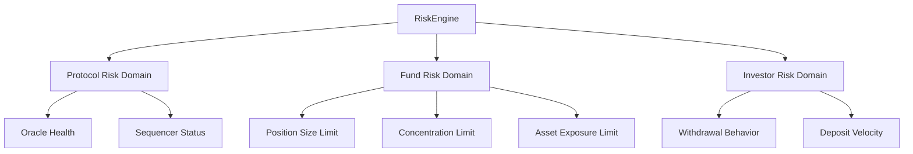

# Tokenomics & Risk Engine Overview

The TOSS tokenomics system and RiskEngine form the economic and security backbone of the protocol, ensuring accountability, sustainability, and investor protection through mathematically verifiable mechanisms.

## TOSS Token Overview

TOSS is a **fixed-supply, deflationary, governance + utility token** designed to:

- Secure the protocol via Fund Manager staking
- Enforce discipline through slashing mechanisms
- Enable investor participation and class upgrades
- Provide governance backbone for the ecosystem
- Serve as collateral for fund operations

**Total Supply**: 1,000,000,000 TOSS (fixed, non-mintable)

## Three-Layer Tokenomics Architecture

TOSS implements a secure three-layer architecture separating immutable economic principles from adjustable parameters:

### Layer 1: Immutable Layer 🔒

**Cannot Be Changed** - Provides foundational security guarantees

**Components**:
- **TOSS.sol**: Non-upgradeable ERC20 contract with fixed 1B supply
- **Mathematical Formulas**: Core economic formulas defined mathematically
- **Formula Structures**: How calculations are performed (immutable logic)

**Immutable Elements**:
```
✓ Fixed Supply: 1,000,000,000 TOSS (no minting ever)
✓ Burn Formula Structure: Burn = SlashAmount × (1 - γ)
✓ NAV Compensation Structure: NAVComp = SlashAmount × γ
✓ Slashing Formula Structure: Slash = f(FI, stake, configParams)
✓ FaultIndex Formula Structure: FI = wL×L + wB×B + wD×D + wI×I
```

**Security Benefit**: Core economic principles cannot be manipulated, even by governance.

**[Learn More →](/docs/protocol/tokenomics/immutable-layer)**

### Layer 2: Config Layer ⚙️

**DAO-Adjustable Parameters** - Flexibility within safe bounds

**Stored In**: `DAOConfigCore.sol`

**Adjustable Parameters**:
```solidity
// Slashing Parameters
gamma (γ): NAV compensation ratio (range: 50-90%, default: 80%)
alpha (α): Loss cap coefficient (range: 0.5-2.0, default: 1.0)
minSlashingFI: Minimum FI to trigger slash (range: 20-50, default: 30)
banThresholdFI: FI for permanent ban (range: 75-95, default: 85)

// Stake Requirements
fmBaseStake: Base FM stake (range: 5k-100k TOSS, default: 10k)
stakePerAUMRatio: Stake per $ AUM (range: 5-20 bps, default: 10 bps)

// FaultIndex Weights
weightL: Limit breach weight (range: 40-50%, default: 45%)
weightB: Behavior weight (range: 20-30%, default: 25%)
weightD: Damage weight (range: 15-25%, default: 20%)
weightI: Intent weight (range: 5-15%, default: 10%)
```

**Governance Process**:
1. DAO proposes parameter change
2. Validators vote (FM/Investor based on impact)
3. Guardian review (24h)
4. Timelock (48-72h)
5. Execute within bounds

**Security Benefit**: DAO can optimize parameters without compromising formula integrity.

**[Learn More →](/docs/protocol/tokenomics/config-layer)**

### Layer 3: Logic Layer 🔧

**Implementation Contracts** - Execute formulas with config parameters

**Contracts**:
- **SlashingEngine.sol**: Reads gamma, alpha from config
- **RiskEngine.sol**: Reads FI weights from config
- **FundFactory.sol**: Reads stake requirements from config

**Pattern**:
```solidity
// Example: SlashingEngine reads config
function calculateSlashing(uint256 stake, uint256 FI, uint256 loss) 
    public 
    view 
    returns (uint256) 
{
    // Read config parameters (Layer 2)
    uint256 gamma = daoConfig.getGamma();
    uint256 alpha = daoConfig.getAlpha();
    
    // Apply immutable formula structure (Layer 1)
    uint256 slashRatio = _getSlashRatio(FI);  // Immutable logic
    uint256 baseSlash = stake * slashRatio / 100;
    uint256 lossCap = (alpha * loss) / getTOSSPrice();
    
    return min(baseSlash, lossCap, stake);
}
```

**Security Benefit**: Formulas are immutable code, but parameters can be tuned safely.

**[Learn More →](/docs/protocol/tokenomics/logic-layer)**

### Why This Architecture?

**🛡️ Security**:
- Core formulas cannot be manipulated (even by DAO)
- Attack surface minimized
- Critical economic logic immutable
- Only safe parameters adjustable

**🔧 Flexibility**:
- DAO can optimize parameters based on data
- Adapt to market conditions without redeployment
- Fix parameter issues via governance
- Gradual tuning and improvement

**🔍 Transparency**:
- Clear separation: what's fixed vs what's adjustable
- Easy to audit immutable components
- Parameter changes visible and trackable
- No hidden changes possible

**⚖️ Balance**:
- Security where it matters (formulas)
- Flexibility where it helps (parameters)
- Best of both worlds

## Token Utility

### 1. Fund Manager Collateral

Fund Managers must stake TOSS to operate:

```
Required Stake = BaseStake + (AUM × StakeRatio)

Where:
- BaseStake = 10,000 TOSS (minimum)
- StakeRatio = 0.1% of Assets Under Management
```

**Example**: For a $1M fund
- Required Stake = 10,000 + (1,000,000 × 0.001) = 11,000 TOSS

### 2. Investor Staking & Classes

Investors stake TOSS to unlock benefits:

| Class | Stake Required | Benefits |
|-------|----------------|----------|
| Retail | 100 TOSS | Access to Tier 1-2 funds, basic fees |
| Premium | 1,000 TOSS | Access to Tier 1-3 funds, 10% fee discount |
| Institutional | 10,000 TOSS | Access to all tiers, 25% fee discount |
| Strategic | 100,000 TOSS | All benefits + enhanced voting power |

### 3. Governance Power

Voting power calculation:

```
VotingPower = TOSS_Staked × TimeLockMultiplier × ReputationMultiplier

Where:
- TimeLockMultiplier: 1x (no lock) to 4x (4-year lock)
- ReputationMultiplier: 0.5x (new) to 2x (excellent history)
```

### 4. Paymaster Fuel

TOSS funds the L2 Paymaster to sponsor:
- Fund Manager trading operations
- Governance transactions
- Critical investor operations

## Deflationary Model

TOSS becomes increasingly scarce through **slashing-based burning**.

### Burn Mechanism

```
Total_Slash = Slash_Amount
Burn_Amount = Total_Slash × (1 - γ)
NAV_Compensation = Total_Slash × γ

Where:
- γ = 0.8 (NAV Compensation Ratio)
- Burn_Amount = 20% of slashed tokens
- NAV_Compensation = 80% to fund vault
```

**Example**: If FM is slashed 10,000 TOSS
- Burned: 2,000 TOSS (removed from supply forever)
- NAV Compensation: 8,000 TOSS (sold for USDC, added to fund)

### Deflation Rate

Deflation depends on slashing frequency:

| Scenario | Annual Slashing | Annual Burn | Deflation Rate |
|----------|-----------------|-------------|----------------|
| Low | 100,000 TOSS | 20,000 TOSS | 0.002% |
| Medium | 1,000,000 TOSS | 200,000 TOSS | 0.02% |
| High | 5,000,000 TOSS | 1,000,000 TOSS | 0.1% |

*Note: Higher slashing indicates protocol issues; low-medium is expected*

## RiskEngine Architecture

The RiskEngine is the **core security and compliance layer** validating every significant action.

### Three Risk Domains



### Validation Flow

```solidity
function validateTrade(uint256 fundId, TradeParams params) 
    external 
    returns (bool, uint256 faultIndex) 
{
    // 1. Check Protocol Domain
    require(protocolDomain.isHealthy(), "Protocol not healthy");
    
    // 2. Check Fund Domain
    (bool fundOk, uint256 fundFI) = fundDomain.validate(fundId, params);
    
    // 3. Check Investor Domain
    (bool investorOk, uint256 investorFI) = investorDomain.validate(fundId);
    
    // 4. Calculate combined FaultIndex
    uint256 combinedFI = _combineFaultIndices(fundFI, investorFI);
    
    // 5. Trigger slashing if threshold exceeded
    if (combinedFI > SLASHING_THRESHOLD) {
        slashingEngine.executeSlashing(fundId, combinedFI);
        return (false, combinedFI);
    }
    
    return (fundOk && investorOk, combinedFI);
}
```

## FaultIndex (FI) Model

The FaultIndex quantifies violation severity.

### Calculation

```
FI = 0.45 × L + 0.25 × B + 0.20 × D + 0.10 × I

Where:
- L = Limit Breach Severity (0-1)
- B = Behavior Anomaly Score (0-1)
- D = Damage Ratio (actual loss / max acceptable loss)
- I = Intent Probability (malicious vs accidental)
```

### FI Ranges & Actions

| FI Range | Severity | Action |
|----------|----------|--------|
| 0.00 - 0.10 | Safe | No action |
| 0.10 - 0.30 | Warning | Alert FM, no slashing |
| 0.30 - 0.60 | Moderate | 1-10% slash |
| 0.60 - 0.85 | Major | 10-50% slash |
| 0.85 - 1.00 | Malicious | 50-100% slash + ban |

## Slashing Model

### Slashing Formula

```
Slash = min(S_slash, S_lossCap, S_total)

Where:
S_slash = r_slash(FI) × FM_Stake
S_lossCap = (α × Fund_Loss) / TOSS_Price
S_total = FM_Total_Stake

r_slash(FI) = slashing ratio based on FaultIndex:
- FI < 0.3: r = 0.01 to 0.10 (1-10%)
- FI 0.3-0.6: r = 0.10 to 0.20 (10-20%)
- FI 0.6-0.85: r = 0.20 to 0.50 (20-50%)
- FI > 0.85: r = 0.50 to 1.00 (50-100%)
```

### Slashing Distribution

```
Total Slashed = 100%
├─ Burned: 20%
└─ NAV Compensation: 80%
   └─ Converted to USDC and added to fund vault
```

## NAV Recovery Model

When a fund experiences loss due to FM violation, slashing compensates the NAV:

```
NAV_before = Fund_AUM_before_loss
Loss = Amount lost due to violation
NAV_after_loss = NAV_before - Loss

Slash_Amount = calculated based on FI
NAV_Compensation = Slash_Amount × 0.8
NAV_Compensation_USD = NAV_Compensation × TOSS_Price

NAV_recovered = NAV_after_loss + NAV_Compensation_USD
```

### High Water Mark (HWM)

Fund Managers cannot earn performance fees until NAV exceeds previous high:

```
if (Current_NAV > HWM) {
    Performance_Fee = (Current_NAV - HWM) × Performance_Fee_Rate
    HWM = Current_NAV
} else {
    Performance_Fee = 0
}
```

## Fund Risk Model

Each fund inherits risk constraints from its FundClass and RiskTier.

### Risk Parameters

```solidity
struct FundRiskParams {
    // Position Limits
    uint256 PSL;  // Position Size Limit (% of NAV)
    uint256 PCL;  // Portfolio Concentration Limit (% of NAV)
    uint256 AEL;  // Asset Exposure Limit (% per asset)
    
    // Risk Metrics
    uint256 maxVolatility;        // Annualized volatility cap
    uint256 maxDrawdown;          // Maximum drawdown from HWM
    uint256 maxLeverage;          // Maximum leverage ratio
    
    // Trading Rules
    uint256 maxDailyTrades;       // Trade frequency limit
    uint256 maxSlippage;          // Slippage tolerance
    address[] allowedAssets;      // Whitelist of assets
}
```

### Example: Conservative Fund

```yaml
FundClass: Balanced
RiskTier: Tier 1 (Low Risk)

Risk Limits:
  PSL: 10% (max 10% of NAV in single position)
  PCL: 25% (max 25% in single asset)
  AEL: 40% (max 40% total exposure to one asset)
  Max Volatility: 20% annualized
  Max Drawdown: 15%
  Max Leverage: 1.5x
  Max Daily Trades: 20
  Allowed Assets: [BTC, ETH, USDC, USDT, top 10 by market cap]
```

## Investor Risk Model

Prevents systemic abuse and bank-run scenarios.

### Metrics

- **WBR (Withdraw Behavior Ratio)**: Frequency and timing of withdrawals
- **DVR (Deposit Velocity Ratio)**: Rapid deposit/withdrawal cycles
- **Loss Reaction Index**: Panic selling during drawdowns
- **Multi-Fund Abuse Flag**: Coordinated attacks across funds

### State Machine

```
ACTIVE (normal operations)
  └─> LIMITED (unusual patterns detected, reduced limits)
      └─> HIGH_RISK (suspicious activity, enhanced monitoring)
          └─> FROZEN (investigation required)
              └─> BANNED (confirmed abuse)
```

## Economic Flows

### Fund Entry Flow

```
1. Investor stakes TOSS
2. Investor deposits USDC to fund
3. Fund shares minted based on NAV
4. Investor receives fund tokens
```

### Fund Exit Flow

```
1. Investor requests withdrawal
2. Fund shares burned
3. USDC transferred to investor
4. TOSS stake remains (can unstake separately)
```

### FM Lifecycle

```
1. FM stakes TOSS
2. FM creates fund via FundFactory
3. FM performs trades (validated by RiskEngine)
4. Profits earned → performance fees
5. Violations → slashing
6. FM closes fund → stake returned (minus any slashing)
```

## Economic Security Analysis

### Attack Scenarios

#### Scenario 1: FM Attempts to Drain Fund

**Attack**: FM places highly risky trade to profit personally

**Cost to Attacker**:
- Entire FM stake (10,000+ TOSS)
- Reputation loss
- Permanent ban

**Profit**:
- Potential gain from risky trade

**Defense**:
- RiskEngine rejects extreme trades
- Slashing removes stake
- Makes attack unprofitable unless stake < potential gain

#### Scenario 2: Governance Attack

**Attack**: Accumulate >51% voting power to change parameters

**Cost to Attacker**:
- 500,000,000+ TOSS (>$50M at $0.10/TOSS)

**Profit**:
- Control parameter changes (limited by ranges)

**Defense**:
- Extremely expensive
- Timelock delays allow response
- Guardian veto for critical changes
- Parameter change limits

## Next Steps

- **[Token Economics](/docs/protocol/tokenomics/token-economics)**: Detailed token distribution and utility
- **[Deflationary Model](/docs/protocol/tokenomics/deflationary-model)**: Burn mechanics and supply dynamics
- **[Slashing Mechanism](/docs/protocol/tokenomics/slashing-mechanism)**: Complete slashing specifications
- **[Fault Index](/docs/protocol/tokenomics/fault-index)**: FI calculation methodology
- **[NAV Recovery](/docs/protocol/tokenomics/nav-recovery)**: Fund recovery procedures

---

*For slashing simulations, see [Technical Documentation - Testing](/docs/technical/testing/overview).*

