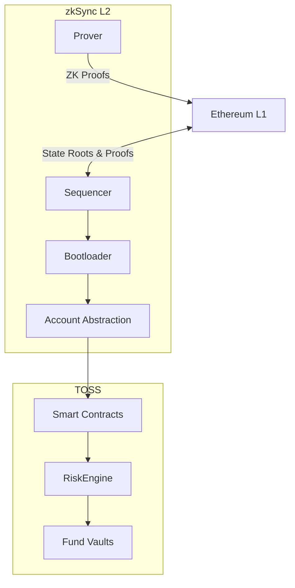

# zkSync Integration Overview

TOSS is built natively on zkSync Era, leveraging zero-knowledge rollup technology for scalable, low-cost, and secure fund management operations.

## Why zkSync?

### Validity Proofs > Optimistic Rollups

```
zkSync (Validity Proofs)          Optimistic Rollups
├─ Instant finality               ├─ 7-day fraud window
├─ No fraud window                ├─ Withdrawal delays
├─ Cryptographic security         ├─ Economic security
└─ Ethereum-level security        └─ Requires watchers
```

### Key Advantages for TOSS

1. **Low Fees**: RiskEngine validation costs ~$0.01 vs $5-50 on L1
2. **Fast Finality**: Minutes vs 7 days for optimistic rollups
3. **Account Abstraction**: Native smart contract wallets
4. **Paymaster**: Built-in gas sponsorship
5. **Ethereum Security**: Inherits L1 security guarantees

## zkSync Architecture

### Layer Overview



### Components

#### Sequencer
- Orders transactions into batches
- Maintains L2 state
- Ensures transaction validity
- Cannot censor (fallback to L1)

#### Prover
- Generates zero-knowledge proofs
- Proves correct execution of batches
- Submits proofs to L1 for verification
- Multiple provers for redundancy

#### Bootloader
- zkSync's transaction executor
- Processes batches of transactions
- Handles Account Abstraction logic
- Manages Paymaster interactions

## Account Abstraction (AA)

### What is Account Abstraction?

Traditional Ethereum:
```
EOA (Externally Owned Account) = Private Key
  └─ Limited to basic transfers
  └─ No custom logic
  └─ Gas paid in ETH only
```

zkSync Account Abstraction:
```
Smart Contract Wallet = Programmable Account
  ├─ Custom validation logic
  ├─ Session keys
  ├─ Multi-sig support
  ├─ Gas payment flexibility
  └─ Batch transactions
```

### TOSS AA Implementation

#### Fund Manager Wallets

```solidity
contract FundManagerWallet {
    address public owner;
    mapping(address => SessionKey) public sessionKeys;
    
    struct SessionKey {
        bool isActive;
        uint256 expiresAt;
        uint256 dailyLimit;
        uint256 usedToday;
    }
    
    // Allow automated trading with session keys
    function validateTransaction(Transaction tx) external {
        if (tx.from == owner) {
            // Owner can do anything
            return;
        }
        
        SessionKey memory key = sessionKeys[tx.from];
        require(key.isActive && key.expiresAt > block.timestamp);
        require(key.usedToday + tx.value < key.dailyLimit);
        
        // Update usage
        key.usedToday += tx.value;
    }
}
```

**Benefits for FMs:**
- Automated trading without exposing main private key
- Session keys rotate every 24 hours
- Daily limits prevent excessive loss
- Can revoke keys instantly

#### Investor Wallets

```solidity
contract InvestorWallet {
    address public owner;
    address public guardianService;
    uint256 public dailyWithdrawalLimit;
    
    // Social recovery
    mapping(address => bool) public recoveryAddresses;
    
    // Withdrawal limiting
    function validateWithdrawal(uint256 amount) external {
        require(getDailyWithdrawals() + amount < dailyWithdrawalLimit);
    }
    
    // Guardian can pause in case of compromise
    function emergencyPause() external {
        require(msg.sender == guardianService);
        _pause();
    }
}
```

**Benefits for Investors:**
- Social recovery if key lost
- Daily withdrawal limits prevent total loss
- Guardian service can pause if suspicious activity
- Multi-sig support for institutions

## Paymaster Architecture

### What is a Paymaster?

Paymaster = Gas Sponsor

```
Traditional: User pays gas in ETH
Paymaster: Third party pays gas for user
```

### TOSS Paymaster Design

```solidity
contract TOSSPaymaster {
    address public gasVault;
    mapping(address => bool) public sponsoredContracts;
    
    function validateAndPayForPaymasterTransaction(
        Transaction calldata _transaction
    ) external payable returns (bytes4 magic) {
        // 1. Check if transaction should be sponsored
        address target = _transaction.to;
        require(sponsoredContracts[target], "Not sponsored");
        
        // 2. Check user eligibility
        if (target == address(riskEngine)) {
            // RiskEngine calls are sponsored for all FMs
            require(fundRegistry.isFundManager(tx.origin));
        } else if (target == address(daoGovernance)) {
            // Governance votes sponsored for TOSS holders
            require(TOSS.balanceOf(tx.origin) >= MIN_GOVERNANCE_STAKE);
        }
        
        // 3. Pay for gas
        uint256 gasPrice = _transaction.maxFeePerGas;
        uint256 gasLimit = _transaction.gasLimit;
        uint256 maxGasCost = gasPrice * gasLimit;
        
        // Transfer from gas vault
        require(gasVault.balance >= maxGasCost);
        
        return PAYMASTER_VALIDATION_SUCCESS_MAGIC;
    }
}
```

### Sponsored Operations

| Operation | Sponsor | Reason |
|-----------|---------|--------|
| Trade validation | RiskEngine | Encourages frequent validation |
| Governance voting | DAO | Increase participation |
| First deposit | Protocol | Onboarding UX |
| Emergency actions | Protocol | Safety critical |

### Paymaster Funding

```
Gas Vault ← Protocol Fees (10%)
Gas Vault ← DAO Treasury
Gas Vault ← FM voluntary contributions
```

## L1-L2 Bridge Integration

### Deposit Flow

```solidity
// 1. User deposits USDC on L1
L1Bridge.deposit{value: 0}(
    l2Receiver,
    USDC_L1,
    amount,
    l2GasLimit,
    l2GasPerPubdata
);

// 2. L1 Bridge locks USDC

// 3. zkSync processes deposit in next batch

// 4. L2 Bridge mints bridged USDC
L2_USDC.mint(l2Receiver, amount);

// 5. User can now deposit to TOSS fund
FundManagerVault.deposit(fundId, amount);
```

### Withdrawal Flow

```solidity
// 1. User withdraws from fund on L2
FundManagerVault.withdraw(fundId, shares);
// Receives USDC on L2

// 2. User initiates L2 → L1 withdrawal
L2Bridge.withdraw(l1Receiver, USDC_L2, amount);

// 3. zkSync generates proof

// 4. User claims on L1 after proof
L1Bridge.finalizeWithdrawal(
    batchNumber,
    messageIndex,
    txNumberInBatch,
    message,
    merkleProof
);

// 5. L1 Bridge releases USDC to user
```

## Gas Optimization Strategies

### 1. Packed Storage

```solidity
// Instead of:
struct FundConfig_Unoptimized {
    uint256 maxPositionSize;    // 32 bytes
    uint256 maxConcentration;   // 32 bytes
    uint256 managementFee;      // 32 bytes
}
// Total: 96 bytes = 3 storage slots

// Optimized:
struct FundConfig_Optimized {
    uint64 maxPositionSize;     // 8 bytes
    uint64 maxConcentration;    // 8 bytes
    uint32 managementFee;       // 4 bytes
    uint32 performanceFee;      // 4 bytes
    uint32 createdAt;           // 4 bytes
    uint32 lastUpdate;          // 4 bytes
}
// Total: 32 bytes = 1 storage slot
// Savings: 66% gas reduction
```

### 2. Event Minimization

```solidity
// Instead of:
emit NAVUpdate(fundId, timestamp, oldNAV, newNAV, reason, updateType);

// Optimized:
emit NAVUpdate(fundId, uint32(timestamp), uint64(newNAV));
// Details stored off-chain in AnalyticsHub
```

### 3. Batched Operations

```solidity
// Instead of: 10 separate NAV updates (10 tx)
function updateNAV(uint256 fundId, uint256 newNAV) external;

// Optimized: 1 batched update (1 tx)
function updateNAVBatch(
    uint256[] calldata fundIds,
    uint256[] calldata newNAVs
) external {
    for (uint i = 0; i < fundIds.length; i++) {
        _updateNAV(fundIds[i], newNAVs[i]);
    }
}
// Savings: 90% gas reduction
```

### 4. Calldata Compression

```solidity
// Trade parameters compressed
struct CompactTradeParams {
    uint32 fundId;           // Instead of uint256
    uint16 assetId;          // Asset index instead of address
    uint64 amount;           // Sufficient for most trades
    uint8 orderType;         // 0=market, 1=limit, etc.
    uint64 limitPrice;       // If limit order
}
// Size: 25 bytes vs 160+ bytes uncompressed
```

### 5. View Function Caching

```solidity
// Cache frequently accessed view data
mapping(uint256 => CachedData) public cache;
uint256 public cacheValidity = 1 hours;

function getCachedData(uint256 fundId) 
    external 
    view 
    returns (FundData memory) 
{
    if (cache[fundId].timestamp + cacheValidity > block.timestamp) {
        return cache[fundId].data;
    }
    // Recompute and cache
}
```

## zkSync Constraints & Workarounds

### Constraints

1. **No Dynamic Gas Refunds**: Gas refunds are computed statically
2. **Limited Precompiles**: Some EVM precompiles not available
3. **Different Opcode Costs**: Some operations cost differently
4. **Bootloader Limitations**: Custom validation logic restrictions

### TOSS Workarounds

```solidity
// 1. Avoid relying on gas refunds
// Bad:
mapping(address => uint256) balances;
function clear(address user) external {
    delete balances[user]; // Expects refund
}

// Good:
function clear(address user) external {
    balances[user] = 0; // Explicit set to zero
}

// 2. Use zkSync-compatible libraries
// Instead of: OpenZeppelin standard contracts
// Use: zkSync-adapted versions

// 3. Avoid dynamic loops
// Bad:
for (uint i = 0; i < dynamicArray.length; i++) {
    // Process
}

// Good:
uint256 length = min(dynamicArray.length, MAX_BATCH_SIZE);
for (uint i = 0; i < length; i++) {
    // Process
}
```

## zkSync Security Benefits

### 1. Validity Proofs

```
Impossible to have invalid state on L2
→ Every state transition is proven
→ No fraud detection period needed
```

### 2. No Reorgs

```
L2 blocks final once included
→ No MEV on L2 (yet)
→ Transaction ordering protected
```

### 3. Forced Transactions

```
If zkSync censors transaction:
→ User can force via L1
→ Must be included within 24h
→ Ensures censorship resistance
```

## Performance Metrics

### Transaction Costs

| Operation | L1 Gas | L1 Cost ($) | zkSync Gas | zkSync Cost ($) | Savings |
|-----------|--------|-------------|------------|-----------------|---------|
| Transfer | 21,000 | $5-20 | 200 | $0.01 | 99%+ |
| Swap | 150,000 | $30-150 | 2,000 | $0.10 | 99%+ |
| Fund Deposit | 200,000 | $40-200 | 3,000 | $0.15 | 99%+ |
| Risk Validation | 300,000 | $60-300 | 5,000 | $0.25 | 99%+ |

*Assuming L1 gas = 30 gwei, ETH = $2000*

### Throughput

- **L1 Ethereum**: ~15 TPS
- **zkSync Era**: ~2000+ TPS
- **TOSS Practical**: ~500 fund operations/second

### Finality

- **L1**: ~12-15 seconds (1-2 blocks)
- **L2 Execution**: < 1 second
- **L2 → L1 Proof**: 1-4 hours

## Next Steps

- **[L1-L2 Communication](/protocol/architecture/l1-l2-communication)**: Bridge specifications
- **[Bridge Gateway](/protocol/contracts/core/BridgeGateway)**: Bridge contract details
- **[Architecture Overview](/protocol/architecture/overview)**: System architecture
- **[Gas Vault](/protocol/contracts/utilities/GasVault)**: Gas sponsorship details

---

*For deployment guides, see [Technical Documentation](/technical/intro).*

