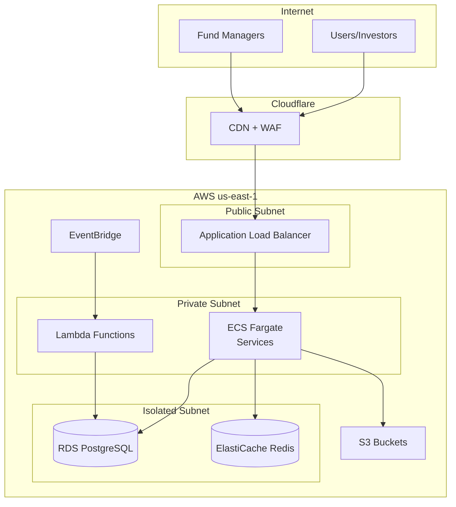
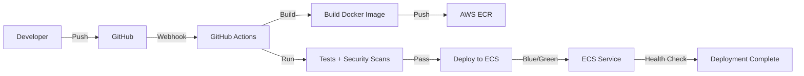

# Infrastructure Overview

TOSS infrastructure is designed for enterprise-grade reliability, scalability, and security using modern cloud-native technologies on AWS.

## Infrastructure Goals

1. **High Availability**: Multi-AZ deployment, auto-failover
2. **Scalability**: Auto-scaling based on demand
3. **Security**: Defense-in-depth, least-privilege access
4. **Observability**: Comprehensive monitoring and alerting
5. **Cost Efficiency**: Right-sized resources, spot instances where appropriate

## Architecture Overview



## Core Components

### Compute

**ECS Fargate**
- Serverless container platform
- No server management
- Auto-scaling based on CPU/memory
- Services: NAV Engine, Analytics Hub, Compliance Engine

**AWS Lambda**
- Serverless functions
- Event-driven execution
- Services: Trade Router, Event Processors

**Configuration**:
```yaml
NAV Engine:
  Type: ECS Fargate
  Task Definition:
    CPU: 2048 (2 vCPU)
    Memory: 4096 MB
    Container:
      Image: toss/nav-engine:latest
      Port: 3000
  Service:
    Desired Count: 2
    Min: 2
    Max: 10
    Auto Scaling:
      Metric: CPU > 70%
      Scale Out: +1 task
      Scale In: -1 task
```

### Networking

**VPC Layout**
```
VPC: 10.0.0.0/16

Subnets:
├── Public (10.0.1.0/24, 10.0.2.0/24)
│   └── Load Balancers, NAT Gateways
├── Private (10.0.10.0/24, 10.0.11.0/24)
│   └── ECS Tasks, Lambda Functions
└── Isolated (10.0.20.0/24, 10.0.21.0/24)
    └── Databases, Cache

Availability Zones: us-east-1a, us-east-1b
```

**Security Groups**:
```yaml
ALB Security Group:
  Inbound:
    - Port: 443, Source: 0.0.0.0/0 (HTTPS)
  Outbound:
    - All traffic to ECS Security Group

ECS Security Group:
  Inbound:
    - Port: 3000-3010, Source: ALB Security Group
  Outbound:
    - Port: 5432, Destination: RDS Security Group
    - Port: 6379, Destination: Redis Security Group
    - Port: 443, Destination: 0.0.0.0/0 (AWS APIs)

RDS Security Group:
  Inbound:
    - Port: 5432, Source: ECS Security Group
  Outbound: None
```

### Data Layer

**RDS PostgreSQL**
```yaml
Engine: PostgreSQL 15
Instance: db.r6g.xlarge
Storage: 100GB SSD (auto-scaling to 1TB)
Multi-AZ: Yes
Backups:
  Retention: 30 days
  Window: 03:00-04:00 UTC
Encryption: AES-256
Read Replicas: 1 (us-east-1c)
```

**ElastiCache Redis**
```yaml
Engine: Redis 7.0
Node: cache.r6g.large
Cluster Mode: Enabled
Replicas: 1 per shard
Shards: 2
Backups: Daily
Encryption: In-transit + At-rest
```

**S3 Buckets**
```yaml
toss-data-lake:
  Purpose: Analytics data
  Versioning: Enabled
  Lifecycle: Archive to Glacier after 90 days
  
toss-backups:
  Purpose: Database backups
  Versioning: Enabled
  Replication: Cross-region to us-west-2
  
toss-logs:
  Purpose: Application logs
  Lifecycle: Delete after 30 days
  
toss-artifacts:
  Purpose: Build artifacts, contract ABIs
  Versioning: Enabled
```

## Deployment Pipeline

### CI/CD Architecture



### GitHub Actions Workflow

```yaml
name: Deploy to Production

on:
  push:
    branches: [main]

jobs:
  build-and-deploy:
    runs-on: ubuntu-latest
    steps:
      - uses: actions/checkout@v3
      
      - name: Configure AWS credentials
        uses: aws-actions/configure-aws-credentials@v1
        with:
          aws-access-key-id: ${{ secrets.AWS_ACCESS_KEY_ID }}
          aws-secret-access-key: ${{ secrets.AWS_SECRET_ACCESS_KEY }}
          aws-region: us-east-1
      
      - name: Login to Amazon ECR
        id: login-ecr
        uses: aws-actions/amazon-ecr-login@v1
      
      - name: Build and push Docker image
        env:
          ECR_REGISTRY: ${{ steps.login-ecr.outputs.registry }}
          ECR_REPOSITORY: toss-nav-engine
          IMAGE_TAG: ${{ github.sha }}
        run: |
          docker build -t $ECR_REGISTRY/$ECR_REPOSITORY:$IMAGE_TAG .
          docker push $ECR_REGISTRY/$ECR_REPOSITORY:$IMAGE_TAG
      
      - name: Deploy to ECS
        run: |
          aws ecs update-service \
            --cluster toss-production \
            --service nav-engine \
            --force-new-deployment
```

## Infrastructure as Code

### Terraform Structure

```
infrastructure/
├── environments/
│   ├── dev/
│   │   ├── main.tf
│   │   └── variables.tf
│   ├── staging/
│   └── production/
├── modules/
│   ├── networking/
│   ├── compute/
│   ├── database/
│   └── monitoring/
└── terraform.tfvars
```

### Example: ECS Service Module

```hcl
# modules/compute/ecs-service/main.tf
resource "aws_ecs_service" "main" {
  name            = var.service_name
  cluster         = var.cluster_id
  task_definition = aws_ecs_task_definition.main.arn
  desired_count   = var.desired_count
  launch_type     = "FARGATE"

  network_configuration {
    subnets          = var.private_subnet_ids
    security_groups  = [aws_security_group.ecs_tasks.id]
    assign_public_ip = false
  }

  load_balancer {
    target_group_arn = var.target_group_arn
    container_name   = var.container_name
    container_port   = var.container_port
  }

  depends_on = [var.alb_listener]
}

resource "aws_appautoscaling_target" "ecs" {
  max_capacity       = var.max_capacity
  min_capacity       = var.min_capacity
  resource_id        = "service/${var.cluster_name}/${aws_ecs_service.main.name}"
  scalable_dimension = "ecs:service:DesiredCount"
  service_namespace  = "ecs"
}

resource "aws_appautoscaling_policy" "ecs_cpu" {
  name               = "${var.service_name}-cpu-autoscaling"
  policy_type        = "TargetTrackingScaling"
  resource_id        = aws_appautoscaling_target.ecs.resource_id
  scalable_dimension = aws_appautoscaling_target.ecs.scalable_dimension
  service_namespace  = aws_appautoscaling_target.ecs.service_namespace

  target_tracking_scaling_policy_configuration {
    predefined_metric_specification {
      predefined_metric_type = "ECSServiceAverageCPUUtilization"
    }
    target_value = 70.0
  }
}
```

## Monitoring & Observability

### CloudWatch Dashboards

```yaml
Dashboards:
  Service Health:
    - ECS Task Count
    - Task CPU/Memory
    - Request Rate
    - Error Rate
    - Response Time (p50, p95, p99)
  
  Database:
    - RDS CPU/Memory
    - Connection Count
    - Query Performance
    - Replication Lag
  
  Cost:
    - Daily Spend by Service
    - Compute Costs
    - Data Transfer
    - Storage Costs
```

### Alarms

```yaml
Critical:
  - ECS Task Failure Rate > 10%
  - RDS CPU > 90% for 5 minutes
  - API Error Rate > 5%
  - Lambda Throttling
  Notification: PagerDuty + Slack

Warning:
  - ECS Task Count < Desired
  - RDS Storage > 80%
  - Cache Hit Rate < 70%
  - High Response Latency (p95 > 500ms)
  Notification: Slack
```

### Logging

```yaml
Log Groups:
  /aws/ecs/nav-engine:
    Retention: 30 days
    Insights: Enabled
  
  /aws/lambda/trade-router:
    Retention: 14 days
    Insights: Enabled
  
  /aws/rds/postgresql:
    Retention: 7 days

Log Aggregation:
  Tool: BetterStack
  Features:
    - Real-time log streaming
    - Full-text search
    - Saved queries
    - Alerting
```

## Disaster Recovery

### Backup Strategy

```yaml
Databases:
  RDS:
    Automated Backups: Daily
    Retention: 30 days
    Point-in-Time Recovery: Yes
    Cross-Region Copy: us-west-2
  
  S3:
    Versioning: Enabled
    Cross-Region Replication: Yes
    Glacier Archive: 90 days
```

### Recovery Procedures

**RTO (Recovery Time Objective)**: 1 hour  
**RPO (Recovery Point Objective)**: 5 minutes

```bash
# Database Recovery
aws rds restore-db-instance-to-point-in-time \
  --source-db-instance-identifier toss-prod-db \
  --target-db-instance-identifier toss-prod-db-restored \
  --restore-time 2024-01-01T12:00:00Z

# Service Rollback
aws ecs update-service \
  --cluster toss-production \
  --service nav-engine \
  --task-definition nav-engine:previous-version
```

## Security

### IAM Roles & Policies

```yaml
ECS Task Role:
  Permissions:
    - Read/Write to specific S3 buckets
    - Read from Secrets Manager
    - Publish to CloudWatch
  
Lambda Execution Role:
  Permissions:
    - Read from DynamoDB
    - Write to CloudWatch Logs
    - Invoke other Lambda functions
```

### Secrets Management

```typescript
// Retrieve secrets from AWS Secrets Manager
import { SecretsManagerClient, GetSecretValueCommand } from '@aws-sdk/client-secrets-manager';

const client = new SecretsManagerClient({ region: 'us-east-1' });

async function getSecret(secretName: string) {
  const command = new GetSecretValueCommand({ SecretId: secretName });
  const response = await client.send(command);
  return JSON.parse(response.SecretString);
}

const dbCreds = await getSecret('toss/production/database');
const apiKeys = await getSecret('toss/production/api-keys');
```

### Network Security

```yaml
WAF Rules:
  - Rate Limiting: 1000 req/5min per IP
  - SQL Injection Protection
  - XSS Protection
  - Geo-blocking (configurable)

SSL/TLS:
  Certificate: AWS ACM
  Minimum Version: TLS 1.2
  Cipher Suites: Strong only
```

## Cost Optimization

### Estimated Monthly Costs (Production)

```yaml
Compute:
  ECS Fargate: $800
  Lambda: $200
  
Databases:
  RDS PostgreSQL: $600
  ElastiCache Redis: $300
  
Storage:
  S3: $50
  EBS: $100
  
Networking:
  Data Transfer: $150
  Load Balancer: $25
  
Monitoring:
  CloudWatch: $100
  BetterStack: $50

Total: ~$2,375/month
```

### Optimization Strategies

- Use Spot Instances for non-critical workloads
- Right-size instances based on metrics
- Enable S3 Intelligent-Tiering
- Use CloudFront for static assets
- Reserved Instances for predictable workloads

## Next Steps

Explore specific infrastructure components:

- **[Off-Chain Services](/technical/offchain/overview)**: Off-chain components
- **[Testing Overview](/technical/testing/overview)**: Testing infrastructure

---

*For deployment procedures, see [Getting Started](/technical/getting-started/prerequisites).*

