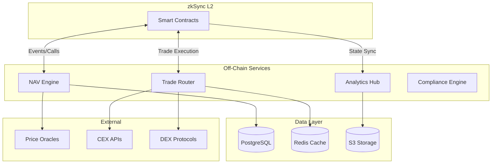

# Off-Chain Services Overview

TOSS off-chain services handle computationally intensive operations, real-time data processing, and external integrations that don't require on-chain execution.

## Architecture



## Core Services

### 1. NAV Engine

**Purpose**: Real-time fund valuation

**Responsibilities**:
- Calculate Net Asset Value every minute
- Aggregate prices from multiple sources
- Detect price anomalies
- Publish NAV hashes on-chain

**Technology Stack**:
- Node.js + TypeScript
- PostgreSQL for data storage
- EventBridge for orchestration
- Chainlink + CEX price feeds

**[Learn More →](/technical/offchain/nav-engine)**

### 2. Trade Router

**Purpose**: Execute trades across multiple venues

**Responsibilities**:
- Route orders to optimal exchanges
- Split large orders
- Monitor slippage
- Ensure RiskEngine validation

**Technology Stack**:
- Node.js + TypeScript
- DynamoDB for state
- Lambda for serverless execution
- CEX/DEX API integrations

**[Learn More →](/technical/offchain/trade-router)**

### 3. Analytics Hub

**Purpose**: Data warehousing and insights

**Responsibilities**:
- Store historical NAV and trades
- Generate performance metrics
- Create investor reports
- Power dashboards

**Technology Stack**:
- PostgreSQL + Redshift
- S3 Data Lake
- Apache Airflow for ETL
- GraphQL API

**[Learn More →](/technical/offchain/analytics-hub)**

### 4. Compliance Engine

**Purpose**: AML/KYC and risk screening

**Responsibilities**:
- Screen against sanctions lists
- Detect suspicious patterns
- Score wallet behavior
- Flag high-risk activity

**Technology Stack**:
- Node.js + Python (ML)
- Graph database for clustering
- ML models for pattern detection

**[Learn More →](/technical/offchain/compliance)**

## Service Communication

### Event-Driven Architecture

```typescript
// Example: NAV Engine subscribes to blockchain events
eventBridge.subscribe('FundTradeExecuted', async (event) => {
  const { fundId, asset, amount, price } = event;
  
  // Update fund holdings
  await updateHoldings(fundId, asset, amount);
  
  // Recalculate NAV
  const newNAV = await calculateNAV(fundId);
  
  // Publish to database
  await saveNAV(fundId, newNAV);
  
  // Emit event for other services
  await emit('NAVUpdated', { fundId, newNAV });
});
```

### API-Based Communication

```typescript
// Example: Trade Router calls NAV Engine
const currentNAV = await navEngineClient.get(`/funds/${fundId}/nav`);

if (tradeSize > currentNAV * 0.1) {
  throw new Error('Trade too large relative to NAV');
}
```

## Data Flow

### 1. Blockchain → Off-Chain

```
Smart Contract Event → EventBridge → Service Handler → Database
```

Example:
```typescript
// Listen for on-chain events
contract.on('NAVUpdate', (fundId, oldNAV, newNAV, timestamp) => {
  analyticsHub.recordNAVChange({
    fundId,
    oldNAV,
    newNAV,
    timestamp,
    source: 'on-chain'
  });
});
```

### 2. Off-Chain → Blockchain

```
Service Computation → Sign Transaction → Submit to RPC → Confirmation
```

Example:
```typescript
// NAV Engine publishes hash on-chain
const navHash = keccak256(JSON.stringify(navData));
const tx = await navRegistry.publishNAVHash(fundId, navHash);
await tx.wait();
```

### 3. Off-Chain → Off-Chain

```
Service A → Message Queue → Service B
```

Example:
```typescript
// Trade Router notifies NAV Engine
await messageQueue.publish('trade-executed', {
  fundId,
  asset,
  amount,
  price
});
```

## Deployment Architecture

### AWS Infrastructure

```yaml
Services:
  NAV Engine:
    Type: ECS Fargate
    CPU: 2 vCPU
    Memory: 4GB
    Autoscaling: 2-10 instances
    
  Trade Router:
    Type: Lambda Functions
    Memory: 1GB
    Concurrency: 100
    
  Analytics Hub:
    Type: ECS Fargate
    CPU: 4 vCPU
    Memory: 8GB
    Instances: 2 (HA)
    
  Compliance Engine:
    Type: ECS Fargate
    CPU: 2 vCPU
    Memory: 4GB
    GPU: Optional for ML
```

### High Availability

```
Region: us-east-1
├── AZ 1
│   ├── NAV Engine (instance 1)
│   ├── Analytics Hub (instance 1)
│   └── RDS Primary
├── AZ 2
│   ├── NAV Engine (instance 2)
│   ├── Analytics Hub (instance 2)
│   └── RDS Standby
└── AZ 3
    ├── NAV Engine (standby)
    └── RDS Read Replica
```

## Monitoring & Observability

### Key Metrics

```typescript
const metrics = {
  navEngine: {
    'nav-calculation-time': 'p50, p95, p99 latency',
    'price-feed-failures': 'count per minute',
    'nav-deviation-alerts': 'count',
  },
  tradeRouter: {
    'trade-execution-time': 'p50, p95, p99',
    'slippage-incidents': 'count',
    'venue-failures': 'count per venue',
  },
  analyticsHub: {
    'query-performance': 'p50, p95, p99',
    'data-freshness': 'seconds behind',
    'etl-job-failures': 'count',
  },
};
```

### Alerting

```yaml
Critical Alerts:
  - NAV calculation failure
  - Trade execution error
  - Database connection lost
  - Price feed deviation > 5%
  
Warning Alerts:
  - High latency (>500ms)
  - Cache miss rate > 20%
  - Queue depth > 1000
  - Disk usage > 80%
```

## Security

### API Authentication

```typescript
// JWT-based authentication
const token = jwt.sign(
  { service: 'nav-engine', permissions: ['read', 'write'] },
  process.env.JWT_SECRET,
  { expiresIn: '1h' }
);

// API calls include token
const response = await fetch(apiUrl, {
  headers: {
    'Authorization': `Bearer ${token}`,
  },
});
```

### Secret Management

```typescript
// Secrets stored in AWS Secrets Manager
const secrets = await secretsManager.getSecretValue({
  SecretId: 'toss/production/database',
});

const dbConfig = JSON.parse(secrets.SecretString);
```

### Network Security

```
VPC Configuration:
├── Public Subnet (Load Balancers only)
├── Private Subnet (Services)
└── Isolated Subnet (Databases)

Security Groups:
├── ALB: Allow 443 from internet
├── Services: Allow from ALB only
└── DB: Allow from services only
```

## Development

### Local Development

```bash
# Start all services
docker-compose up -d

# Start individual service
cd offchain/nav-engine
yarn dev

# Run tests
yarn test

# Build for production
yarn build
```

### Service Template

```typescript
// offchain/template/src/index.ts
import express from 'express';
import { connectDB } from './db';
import { logger } from './logger';

const app = express();
const PORT = process.env.PORT || 3000;

// Middleware
app.use(express.json());
app.use(logger.middleware);

// Health check
app.get('/health', (req, res) => {
  res.json({ status: 'healthy' });
});

// Start server
async function start() {
  await connectDB();
  app.listen(PORT, () => {
    logger.info(`Service started on port ${PORT}`);
  });
}

start();
```

## Testing

### Unit Tests

```typescript
describe('NAV Calculation', () => {
  it('should calculate NAV correctly', async () => {
    const holdings = [
      { asset: 'USDC', amount: 10000, price: 1.0 },
      { asset: 'ETH', amount: 10, price: 2000 },
    ];
    
    const nav = calculateNAV(holdings);
    expect(nav).toBe(30000);
  });
});
```

### Integration Tests

```typescript
describe('Trade Router Integration', () => {
  it('should execute trade end-to-end', async () => {
    const trade = {
      fundId: 1,
      asset: 'ETH',
      amount: 1,
      side: 'buy',
    };
    
    const result = await tradeRouter.executeTrade(trade);
    expect(result.status).toBe('completed');
    expect(result.executedPrice).toBeDefined();
  });
});
```

## Next Steps

Explore each service in detail:

- **[NAV Engine](/technical/offchain/nav-engine)**: Fund valuation system
- **[Trade Router](/technical/offchain/trade-router)**: Order execution
- **[Analytics Hub](/technical/offchain/analytics-hub)**: Data warehouse
- **[Compliance](/technical/offchain/compliance)**: AML/KYC systems

---

*For infrastructure deployment, see [Infrastructure Overview](/technical/infrastructure/overview).*

